# Introducción a Big Data


## Libros de la Clase - Modulo 3


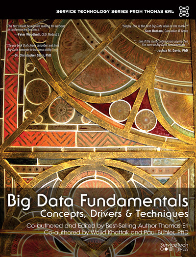{width="30%"} 
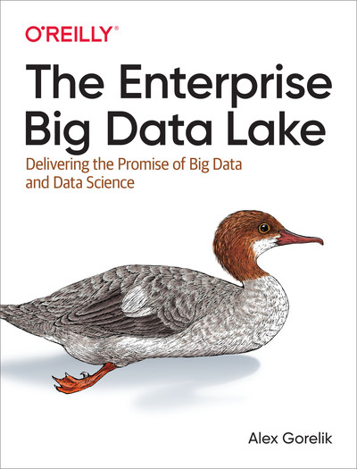{width="30%"} 
{width="30%"} 


## ¿Qué es Big Data?

- No hay una definición estandarizada.
- Se refiere a conjuntos de datos tan grandes y complejos que las herramientas tradicionales de procesamiento de datos son insuficientes.
- Los principales retos incluyen la captura, gestión, almacenamiento, búsqueda, compartición, transferencia, análisis y visualización de los datos.


## Las 4 Vs de Big Data

:::: {.columns}

::: {.column width="55%"}
- **Volumen (Volume):** Se refiere a la gran cantidad de datos, desde terabytes hasta zettabytes.
- **Velocidad (Velocity):** Rapidez de generación y procesamiento, de lotes a flujos en tiempo real.
- **Variedad (Variety):** Diversidad de structures (tabulares, multimedia, grafos libres).
- **Veracidad (Veracity):** La incertidumbre, inconsistencia y baja calidad inherente de fuentes crudas ruidosas.
:::

::: {.column width="40%"}
{width="90%"}
:::

::::


## Volumen (Escala)

:::: {.columns}

::: {.column width="55%"}
- El volumen de datos está creciendo exponencialmente.
- Se proyectó un aumento de 44 veces en el universo digital entre 2009 y 2020, pasando de 0.8 a 35.2 zettabytes.
- Ejemplos como el crecimiento de tweets diarios en Twitter ilustran este aumento exponencial en la recolección y generación de datos.
:::

::: {.column width="40%"}
{width="90%"}
:::

::::


## Fuentes Masivas de Generación de Datos


:::: {.columns}


::: {.column width="55%"}

- **Plataformas Digitales:** Se generan más de **147 Zettabytes** de datos al día, impulsados por plataformas como Meta y Google.

- **Dispositivos Conectados (IoT):**
  - Más de **30 mil millones** de dispositivos IoT activos.
  - Más de **7.5 mil millones** de smartphones con múltiples sensores (GPS, cámara).
  - Superados los **1,2 mil millones** de medidores inteligentes.
  - [Fuente Statista](https://www.statista.com/statistics/1183457/iot-connected-devices-worldwide/)


:::


::: {.column width="40%"}
{width="90%"}
:::


::::


# El Hilo Evolutivo: Década por Década


## Era 1990s: El Sistema Monolítico Relacional (RDBMS)

:::: {.columns}

::: {.column width="50%"}
- **Arquitectura:** Crecimiento Vertical (Acoplada y dependiente de un hardware central físico gigantesco).
- **Costos:** Storage **Extremo** | Compute **Ineficiente** (Sin paralelismo).
- **Datos:** Estructurada (SQL transaccional). Máx. Gigabytes.
:::

::: {.column width="45%"}
\begin{center}
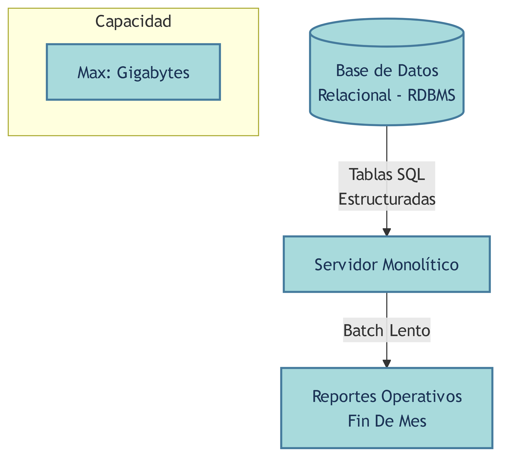{width="100%"}
\end{center}
:::

::::


## Modelamiento 1990s: Relacional y Normalizado

- **Paradigma:** Reglas Codd y formas normales (1NF a 3NF) para evitar redundancia de disco a toda costa. El modelamiento E-R rige el ciclo.
- **Transaccionalidad:** Tolerancia cero a errores. Todo se agrupa en operaciones altamente consistentes, aisladas y atómicas (Garantías ACID).
- **Estructura:** Filas estrictas con tipos de datos fijos. Las analíticas requerían barrer el sistema mediante *JOINs* pesados matando el servidor productivo.


## Era 2000s: Data Warehouse y OLAP

\begin{center}
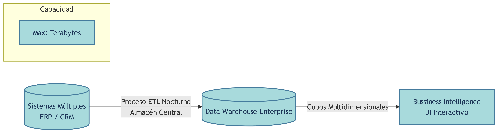{width="60%"}
\end{center}
- **Arquitectura:** Integración de silos en cubos interactivos para "Business Intelligence" (Procesamiento Batch tipo ETL sobre redes locales).
- **Costos:** Storage **Moderado** (SAN) | Compute **Caro** para consultas bajo demanda.
- **Capacidad:** Tablas pre-calculadas semi-complejas de hasta cientos de Terabytes operativos.


## Modelamiento 2000s: Dimensional (Estrella/Copo Nieve)

:::: {.columns}

::: {.column width="50%"}
- **Paradigma:** Reglas de Kimball vs Inmon. Se aplastan y desnormalizan los datos deliberadamente creando esquemas de Estrella para consultas analíticas ultra veloces.
- **Estructura:** División filosófica total entre *Tablas de Hechos* (Métricas/Eventos masivos) y *Tablas de Dimensiones* (Contexto/Atributos estáticos).
:::

::: {.column width="45%"}
\begin{center}
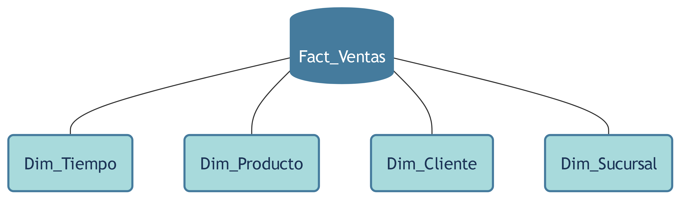{width="100%"}
\end{center}
:::

::::


## Desafíos de la Escalabilidad Horizontal (Distribuir)

Antes de introducir clústeres modernos (2010s+), abandonar el Hardware acoplado presentaba enormes retos de ingeniería informática pura:
- **Paralelización:** Cómo fragmentar un solo algoritmo gigantesco en cientos de pedazos lógicos.
- **Saturación de Red (Comunicación):** La transferencia innecesaria de archivos masivos ahoga cualquier fibra óptica comercial.
- **Balanceo de Carga:** Evitar que un "Nodo" procese todo el trabajo mientras otros duermen por desbalances estadísticos en la fila.
- **Manejo de Fallos:** Certeza matemática: un rack uniendo 5,000 computadoras "baratas" quemará discos duros y memorias físicas cada hora. El sistema general debe ser resiliente 24/7.


## Era 2010s: Hadoop, Data Lake y el Big Data Batch

:::: {.columns}

::: {.column width="50%"}
- **Arquitectura:** Adiós super-computador. Granja de nodos. Se manda "el código" al disco del dato. Nace el primer DataLake.
- **Costos:** Storage **Baratísimo** | Compute **Lento** (I/O intensivo).
- **Capacidad:** Petabytes de logs web y multimedia.
:::

::: {.column width="45%"}
\begin{center}
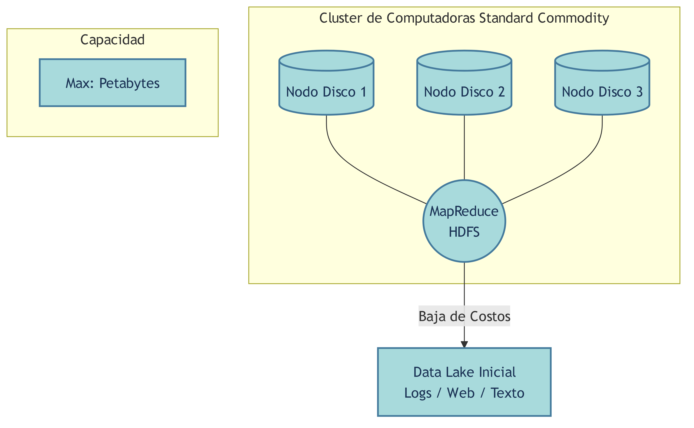{width="100%"}
\end{center}
:::

::::


## Solución Era 2010s: Cómputo Cerca al Disco {.smaller}

```python
def mapper(linea):
    # Procesa fragmento local
    for log in linea.split():
        yield (log.categoria, 1)

def reducer(categoria, conteos):
    # Combina y suma resultados
    yield (categoria, sum(conteos))
```


## Deep Dive 2010s: Hadoop Distributed File System (HDFS)


:::: {.columns}


::: {.column width="55%"}
- **Partición por Bloques:** Un archivo inmenso (`mydata.txt`) es fragmentado logísticamente por el NameNode en bloques de **64 MB** (o 128 MB).
- **Tolerancia a Fallos:** Cada bloque se copia **3 veces** por defecto en distintos DataNodes asegurando Alta Disponibilidad.
- **Data Locality:** Se obliga a procesar código en la misma CPU de la máquina física que aloja el bloque de texto para evadir cuellos de red de los viejos NAS/SAN.
:::


::: {.column width="40%"}
\begin{center}
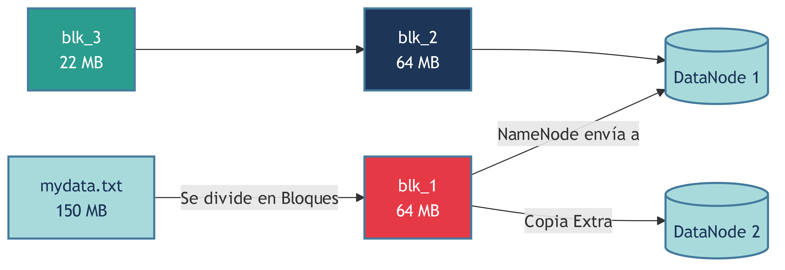{width="90%"}
\end{center}
:::

::::


## Madurez y Modelamiento en los 2010s

- **Paradigma NoSQL y Schema-on-Read:** Se elimina la norma de estructurar datos antes de guardar. Todo aterriza crudo en el *Landing Zone* (Data Puddle) y la estructura se infiere al momento de analizarlos visualmente (Ej. Tablas Virtuales Hive).
- Transición de caos de archivos sueltos a **Lagos Empresariales Múltiples Zonas**.
\begin{center}
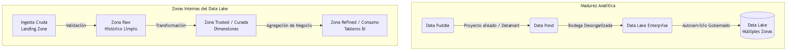{width="55%"}
\end{center}


## Fundamentos Prácticos: Modelos de Nube (Cloud)

El cambio histórico en el hardware permitió la delegación total:

:::: {.columns}


::: {.column width="50%"}
**Servicios Big Data:**
- **IaaS (Infraestructura):** Alquilar CPUs/Discos virtuales en blanco (Ej. Amazon EC2).
- **PaaS (Plataforma):** Ofrecen el motor de datos gestionado, tú montas tu código Spark analítico allí (Ej. Databricks, BigQuery).
- **SaaS (Software):** Solución integral 100\% frontal al usuario final.
:::


::: {.column width="50%"}
**Modelos de Despliegue:**
- **Pública:** 100\% en centros de datos del proveedor Amazon/Google.
- **Privada:** Granjas internas "On-Premise" seguras.
- **Híbrida:** Bases nucleares privadas, y cargas experimentales / elásticas derivadas a la Nube.
:::

::::


## Era 2015s: Spark, Polars In-Memory, y la Era Cloud

\begin{center}
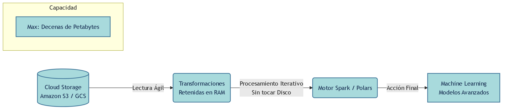{width="70%"}
\end{center}
- **Arquitectura:** Algoritmos *In-Memory* enfocados a evitar tocar el disco reteniendo DataSets transitorios (RDD) en Memoria RAM y evaluando perezosamente.
- **Costos Analíticos:** Storage **Ultra Barato** (S3 Nube) | Compute **Balanceado** (hasta *100x de velocidad*).
- **Datos y Capacidad:** Machine Learning iterativo sobre decenas de Petabytes.


## Modelamiento 2015s: Almacenamiento Columnar

:::: {.columns}

::: {.column width="55%"}
- **El Paradigma Columnar:** Guardar archivos masivos en filas (`CSV`) quema I/O al escanear campos inútiles.
- **Tecnología:** Los formatos abiertos como **Apache Parquet** u **ORC** agrupan los datos por columnas y los comprimen nativamente.
- **Impacto:** Un *DataFrame* algorítmico leerá solo el bloque físico de "Costos", esquivando cargar millones de "Nombres", ahorrando 95\% de memoria RAM.
:::

::: {.column width="40%"}
\begin{center}
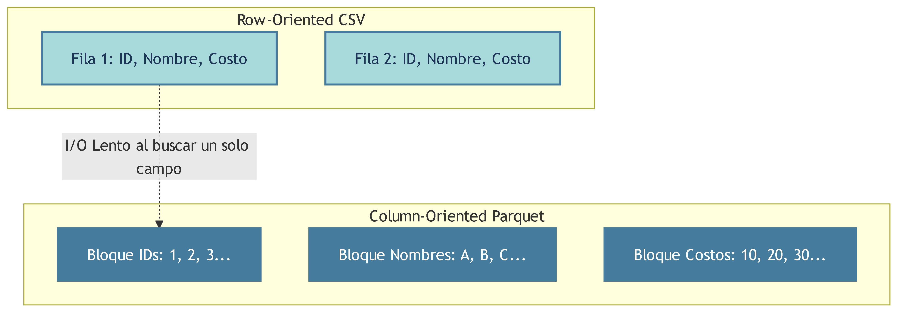{width="90%"}
\end{center}
:::

::::


## Solución Era 2015s: Streaming Perezoso (Lazy Eval) {.smaller}

```python
import polars as pl

plan = (
    pl.scan_csv("gigante_500_gb.csv")
    .filter(pl.col("costo") > 100)
    .groupby("categoria").agg(pl.col("id").count())
)
df = plan.collect(streaming=True)
```


## Era 2020s+: Nube Serverless, Eventos y Streaming

:::: {.columns}

::: {.column width="55%"}
- **Arquitectura:** Fusión Lake y Warehouse (Lakehouse). Modelos en Stream persistente. "Serverless" Oculta el Hardware.
- **Costos:** Storage **Despreciable**. Compute **Pago Instantáneo** elástico.
- **Capacidad:** Exabytes listos para Data Apps (BigQuery/Databricks).
:::

::: {.column width="40%"}
\begin{center}
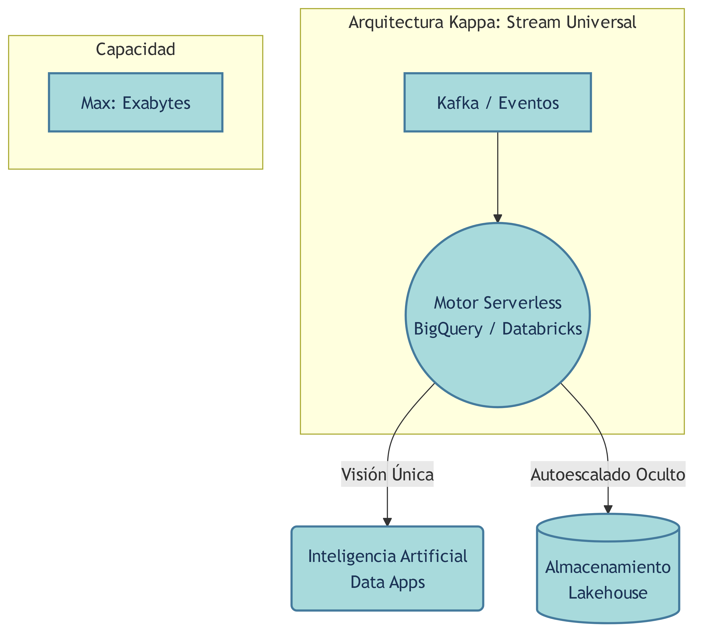{width="90%"}
\end{center}
:::

::::


## Deep Dive 2020s: Arquitectura Lambda vs Kappa

\begin{center}
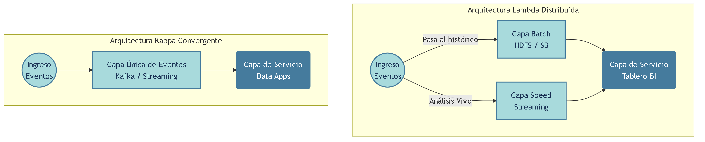{width="70%"}
\end{center}
- **Arquitectura Lambda:** Bifurcaba la estrategia. Usaba Hadoop clásico para recalcular los históricos globales (Capa Batch, exacto pero lento) y un canal vivo (Capa Speed) para la ventana urgente.
- **Arquitectura Kappa:** Evolución unificadora dictada por el Lakehouse. Anula la necesidad del *Batch*; todo el historial es tratado perpetuamente como un *Stream* infinito.


## Modelamiento 2020s: Arquitectura Medallón (Lakehouse)

:::: {.columns}

::: {.column width="55%"}
- **Paradigma Tabla Delta:** Formatos de Lakehouse añaden la capa transaccional ACID del RDBMS antiguo a los datos sueltos de S3.
- **Zonas de Curado:** Ingestión lógica depurada en 3 niveles de pureza:
- *Bronce* (Datos Crudos $\rightarrow$ *Plata* (Filtros y Limpieza) $\rightarrow$ *Oro* (Agregado final Dimensional/BI).
:::

::: {.column width="40%"}
\begin{center}
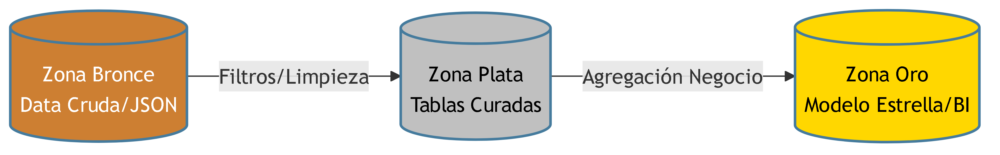{width="90%"}
\end{center>
:::

::::


## El Ecosistema Productivo Actual (AWS vs GCP)

Los servicios en Nube encapsulan las piezas Lakehouse y Big Data:

:::: {.columns}

::: {.column width="50%"}
\begin{center}
**Amazon Web Services (AWS)**
{S3 (Lake) $\rightarrow$ Glue (Ingesta) $\rightarrow$ Athena (Serverless)}<br>
{width="80%"}
\end{center}
:::

::: {.column width="50%"}
\begin{center}
**Google Cloud Analytics (GCP)**
{GCS (Lake) $\rightarrow$ Dataflow (Streaming) $\rightarrow$ BigQuery (Analytics)}<br>
{width="65%"}
\end{center}
:::

::::


## Solución Era 2020s+: Serverless Transparente {.smaller}

```sql
SELECT country_name, COUNT(1) as total_visitas
FROM `bigquery-public-data.google_analytics_sample.ga_sessions_*`
WHERE device.browser = 'Chrome'
GROUP BY country_name
ORDER BY 1 DESC LIMIT 10;
```


# Referencias


## Referencias

- **Spark:** https://spark.apache.org/
- **Hadoop:** http://hadoop.apache.org/
- **Cloudera:** https://www.cloudera.com/
- **Databricks:** https://databricks.com/


## References

::: {#refs}
:::


