# Introducción a Big Data

## Libros de la Clase - Modulo 3

{width="30%"} 
{width="30%"} 
{width="30%"} 

## ¿Qué es Big Data?

- No hay una definición estandarizada.
- Se refiere a conjuntos de datos tan grandes y complejos que las herramientas tradicionales de procesamiento de datos son insuficientes.
- Los principales retos incluyen la captura, gestión, almacenamiento, búsqueda, compartición, transferencia, análisis y visualización de los datos.

## Las 3 Vs de Big Data

:::: {.columns}

::: {.column width="50%"}

- **Volumen (Volume):** Se refiere a la gran cantidad de datos, desde terabytes hasta zettabytes.
- **Velocidad (Velocity):** Alude a la rapidez con la que se generan y procesan los datos, desde lotes (batch) hasta flujos en tiempo real (streaming).
- **Variedad (Variety):** Describe los diferentes tipos de datos, tanto estructurados como no estructurados.

:::

::: {.column width="50%"}
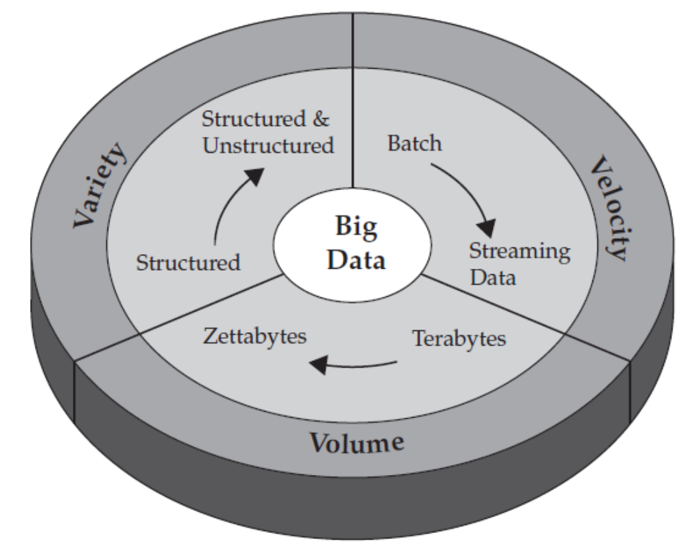{width="100%"}
:::

::::

## Volumen (Escala)

:::: {.columns}

::: {.column width="50%"}

- El volumen de datos está creciendo exponencialmente.
- Se proyectó un aumento de 44 veces en el universo digital entre 2009 y 2020, pasando de 0.8 a 35.2 zettabytes.
- Ejemplos como el crecimiento de tweets diarios en Twitter ilustran este aumento exponencial en la recolección y generación de datos.

:::

::: {.column width="50%"}
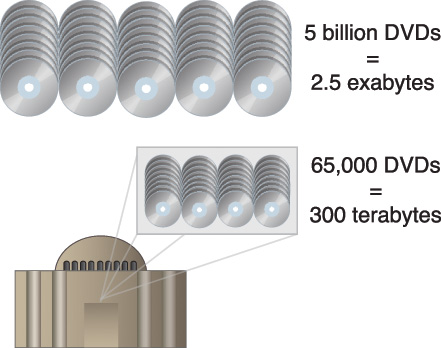{width="100%"}
:::

::::

## Fuentes Masivas de Generación de Datos

:::: {.columns}

::: {.column width="50%"}

- **Plataformas Digitales:** Se generan más de **147 Zettabytes** de datos al día, impulsados por plataformas como Meta y Google.
- **Dispositivos Conectados (IoT):**
  - Más de **30 mil millones** de dispositivos IoT activos.
  - Más de **7.5 mil millones** de smartphones con múltiples sensores (GPS, cámara).
  - Superados los **1,2 mil millones** de medidores inteligentes.
  - [Fuente Statista](https://www.statista.com/statistics/1183457/iot-connected-devices-worldwide/)

:::

::: {.column width="50%"}
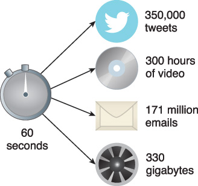{width="100%"}
:::

::::

## Variedad

:::: {.columns}

::: {.column width="50%"}

- **Datos Relacionales:** Tablas, transacciones, datos heredados (legacy).
- **Datos de Texto:** Contenido web.
- **Datos Semiestructurados:** Como archivos XML.
- **Datos de Grafos:** Redes sociales, web semántica (RDF).
- **Datos en Streaming:** Datos que se analizan una sola vez a medida que llegan.

:::

::: {.column width="50%"}
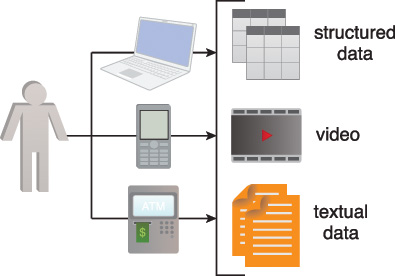{width="100%"}
:::

::::

## Las 4 Vs del Big Data

- **Volumen:** Datos en reposo (Data at Rest). Terabytes a exabytes de datos existentes.
- **Velocidad:** Datos en movimiento (Data in Motion). Datos en streaming que requieren respuestas en milisegundos.
- **Variedad:** Datos en múltiples formas (Data in Many Forms). Estructurados, no estructurados, texto, multimedia.
- **Veracidad (Veracity):** Datos en duda (Data in Doubt). Incertidumbre debido a inconsistencias, datos incompletos, ambigüedades y latencia.

# Impulsores y Evolución

## Visión Única del Cliente

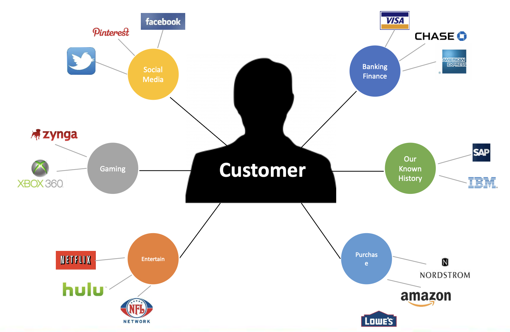{width="70%"}

## Velocidad y Requerimientos en Tiempo Real

- Los datos deben procesarse a gran velocidad para ser útiles; las decisiones tardías conllevan la pérdida de oportunidades.
- **Ejemplos de aplicación:**
  - **Promociones en tiempo real:** Enviar ofertas basadas en la ubicación y el historial.
  - **Monitoreo de salud:** Reacción inmediata ante mediciones anormales de sensores.
- **Objetivos de la Analítica en Tiempo Real:**
  - Influir en el comportamiento del cliente, mejorar el marketing, prevenir el fraude y retener clientes.

## Aprovechando el Big Data: Evolución de Procesamiento

- **OLTP (Online Transaction Processing):** Análisis de datos históricos y transacciones.
- **OLAP (Online Analytical Processing):** Análisis de datos actuales, basado en Data Warehousing.
- **RTAP (Real-Time Analytics Processing):** Procesamiento analítico en tiempo real para mejorar la respuesta del negocio.

## La Evolución de la Inteligencia de Negocios (BI)

- **1990s - BI Tradicional:** Enfoque en Reporting y OLAP.
- **2000s - BI Interactivo:** Mayor velocidad con RDBMS en memoria (In-memory).
- **2010s - Big Data:**
  - **Procesamiento por lotes (Batch):** Mayor escala con Hadoop/Spark.
  - **Tiempo Real:** Mayor velocidad con bases de datos de grafos y streaming.

## ETL

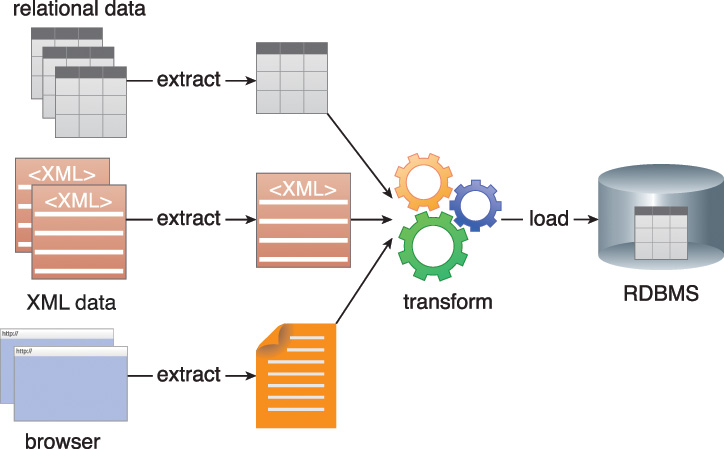{width="70%"}

## Data Warehouse

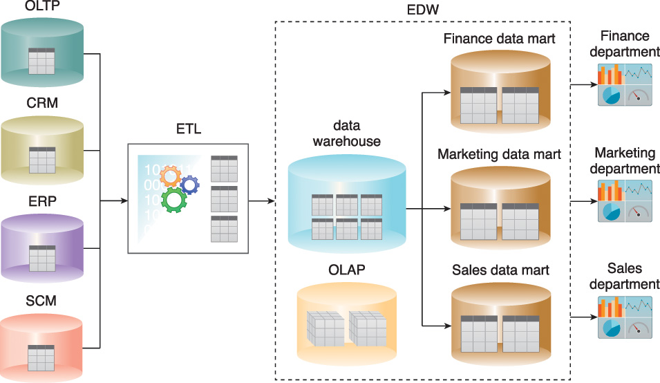{width="70%"}

## Data Warehouse Next-Gen

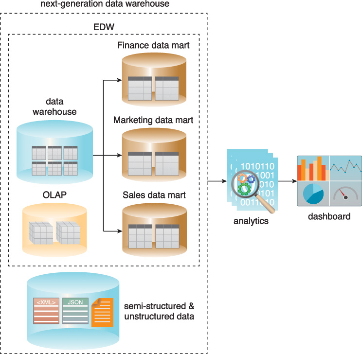{width="50%"}

# Arquitecturas de Datos

## Data Lake

:::: {.columns}

::: {.column width="50%"}

- Es un repositorio centralizado para almacenar grandes cantidades de datos **crudos** en su formato nativo.
- Almacena datos estructurados y no estructurados.
- Utiliza un modelo **Schema-on-Read**: el esquema se aplica al leer los datos, no al escribirlos.
- Sirve como fuente para múltiples tareas: ETL, machine learning, visualización, etc.

:::

::: {.column width="50%"}
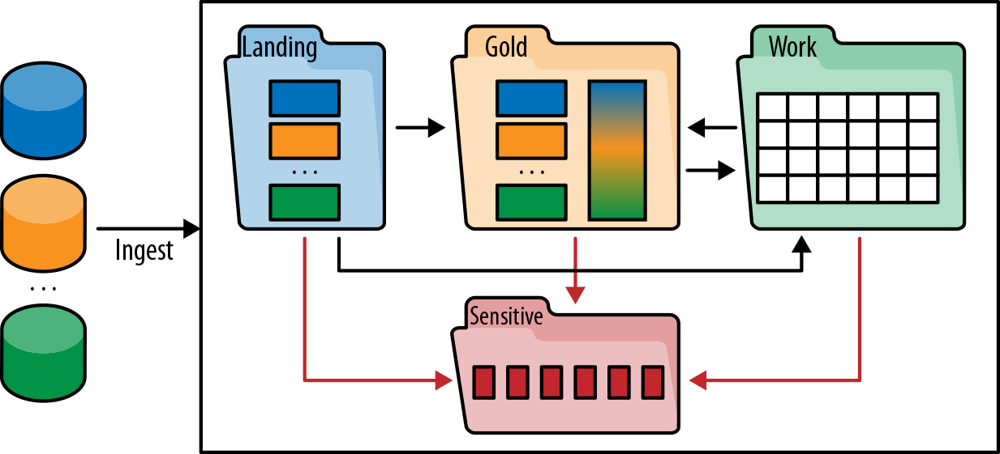{width="100%"}
:::

::::

## Data Warehouse vs. Data Lake

- **Data Warehouse (DWH):**
  - Almacena datos limpios y transformados (proceso ETL).
  - Basado en tecnología de bases de datos relacionales (RDBMS).
  - Esquema predefinido y estricto (Schema-on-Write).
- **Data Lake:**
  - Almacena datos en su estado crudo, limpio y curado (proceso ELT).
  - Basado en sistemas de archivos distribuidos y NoSQL.
  - Esquema flexible y aplicado en la lectura (Schema-on-Read).

## Zonas del Data Lake Empresarial

:::: {.columns}

::: {.column width="50%"}

- **Landing Zone (Ingesta):** Datos crudos. Gobernanza mínima.
- **Gold Zone (Curada):** Datos confiables y de alta calidad. Fuerte gobernanza.
- **Work Zone (Trabajo):** Espacio para experimentación de Científicos de Datos.
- **Sensitive Zone (Sensible):** Datos con acceso restringido y gobernanza estricta.

:::

::: {.column width="50%"}
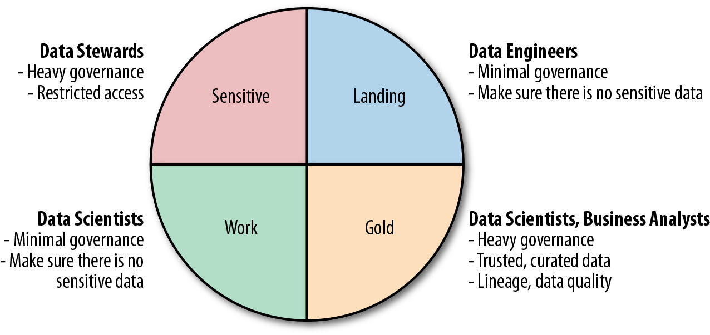{width="100%"}
:::

::::

## Ecosistema AWS

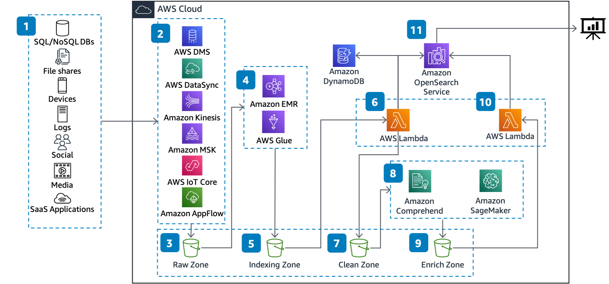{width="90%"}

Fuente: \href{}{https://aws.amazon.com/blogs/architecture/text-analytics-on-aws-implementing-a-data-lake-architecture-with-opensearch/}

## Ecosistema GCP

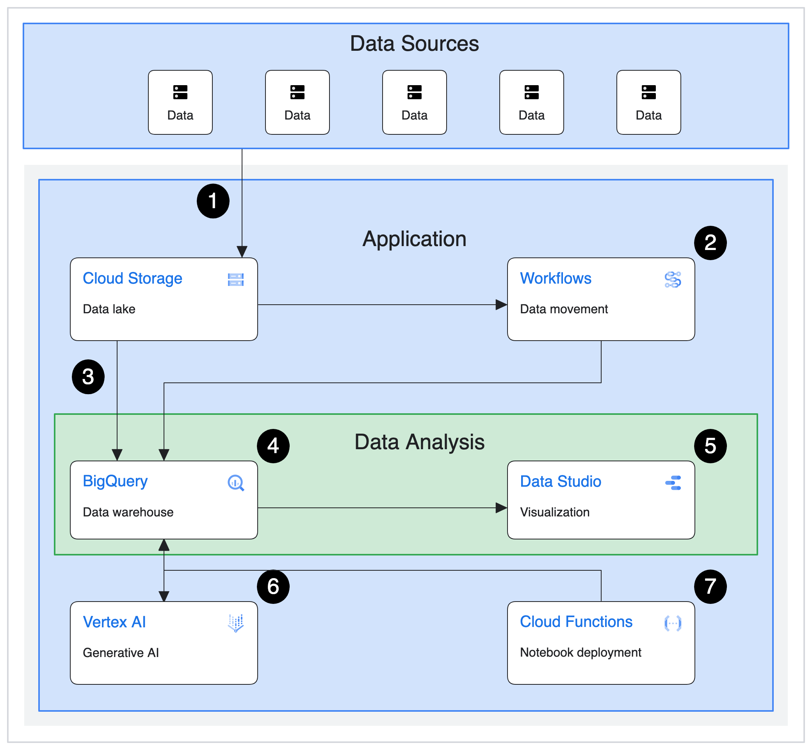{width="50%"}

Fuente: \href{}{https://cloud.google.com/architecture/big-data-analytics/data-warehouse}

# Información sin estructura

## Motivación

Con las bases de datos que ya viste, ¿cómo responderías las siguientes consultas:
- Dame todos los nombres de empleados que se parezcan a Juan
- Cuáles imágenes tienen un tamaño en bytes entre 100kb y 1mb
- Cuántas palabras en promedio tienen los libros de Stephen King

## Motivación

Ahora, ¿cómo responderías las siguientes consultas:
- ¿Cuáles son las 10 novelas más parecidas a Cien años de soledad?
- Dame 5 imágenes similares a esta imagen de un colibrí?
- ¿Cuál es el usuario con las características de compra más parecidas a las de este adulto de 53 años?
- ¿Cuáles de las llamadas de Call Center corresponden a clientes furiosos o no satisfechos con el servicio?

**A este tipo de consultas se les llama Búsquedas Semánticas**

## Motivación

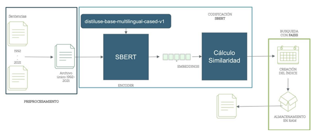{width="80%"}

Martínez Pinilla, M. F. (2023). Búsqueda semántica de sentencias judiciales usando técnicas actuales del NLP y métodos de recuperación de información.

## Motivación

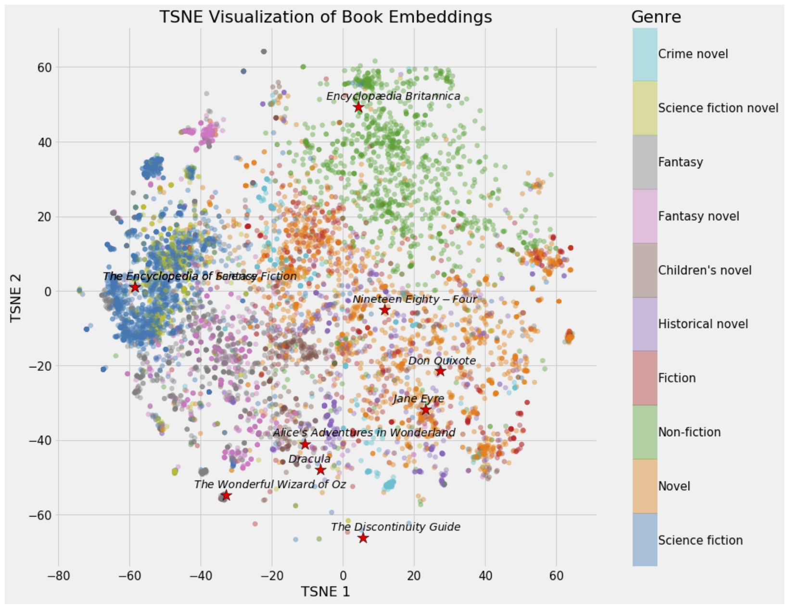{width="60%"}
\vfill
 Fuente: https://towardsdatascience.com/neural-network-embeddings-explained-4d028e6f0526

## 

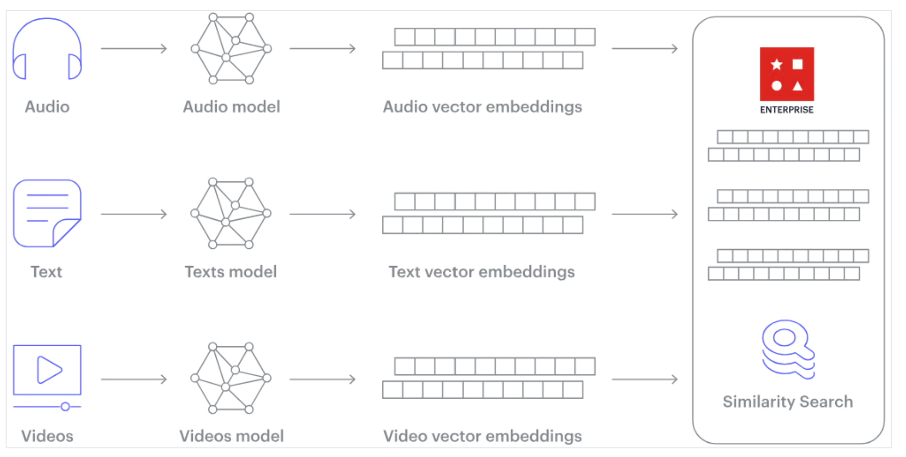{width="80%"}
\vfill
 Fuente: https://www.datacamp.com/blog/the-top-5-vector-databases

## Arquitectura de Referencia

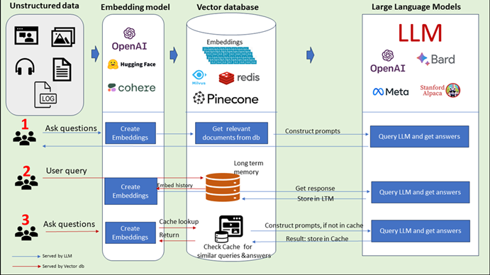{width="80%"}
\vfill
 Fuente: https://www.datacamp.com/blog/the-top-5-vector-databases

## Arquitectura de Referencia

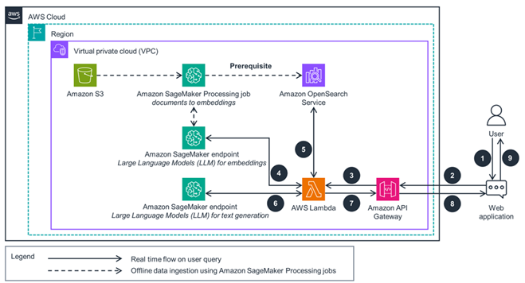{width="80%"}
\vfill
 Fuente: https://aws.amazon.com/solutions/guidance/chatbots-with-vector-databases-on-aws/

## Procesamiento del lenguaje natural

El procesamiento de lenguaje natural (PLN) es una subdisciplina de la inteligencia artificial que se enfoca en la interacción entre las computadoras y los lenguajes humanos.

Implica el desarrollo de algoritmos y modelos para comprender, interpretar y generar lenguaje humano.

## Procesamiento del lenguaje natural

:::: {.columns}

::: {.column width="30%"}

**Indice Invertido**
:::

::: {.column width="70%"}

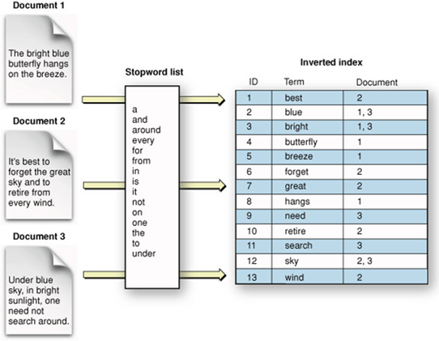{width="80%"}
:::

::::

## Procesamiento del lenguaje natural

\begin{verbatim}
from sklearn.feature_extraction.text import CountVectorizer
def build_inverted_index(documents, stopwords):
vectorizer = CountVectorizer(stop_words=stopwords)
X = vectorizer.fit_transform(documents)
return {term: set(X[:, i].nonzero()[0]) for i, term in
enumerate(vectorizer.get_feature_names_out())}
documents = [
"el gato corre por el tejado en una noche estrellada",
"un perro ladra mientras la luna brilla",
"las estrellas iluminan el cielo nocturno"
]
stopwords = ["el", "un", "la", "en", "por", "mientras"]
inverted_index = build_inverted_index(documents, stopwords)
for word, doc_ids in inverted_index.items():
print(f"{word}: {sorted(doc_ids)}")
\end{verbatim}

## Procesamiento del leguaje Natural

## Procesamiento del leguaje Natural

\begin{verbatim}
from sklearn.feature_extraction.text import CountVectorizer
def build_inverted_index(documents, stopwords):
vectorizer = CountVectorizer(stop_words=stopwords, ngram_range=(3, 3))
X = vectorizer.fit_transform(documents)
return {term: set(X[:, i].nonzero()[0]) for i, term in
enumerate(vectorizer.get_feature_names_out())}

documents = [
"el gato corre por el tejado en una noche estrellada",
"un perro ladra mientras la luna brilla",
"las estrellas iluminan el cielo nocturno"
]
stopwords = ["el", "un", "la", "en", "por", "mientras"]
inverted_index = build_inverted_index(documents, stopwords)
for word, doc_ids in inverted_index.items():
print(f"{word}: {sorted(doc_ids)}")
\end{verbatim}

## Procesamiento del leguaje Natural

\vfill
 https://www.bbc.com/mundo/articles/cpqejezdgl7o

## Procesamiento del leguaje Natural

## Procesamiento del leguaje Natural

## Procesamiento del leguaje Natural

\begin{verbatim}
import requests
from bs4 import BeautifulSoup
import matplotlib.pyplot as plt
from wordcloud import WordCloud
import nltk
from nltk.corpus import stopwords

nltk.download('stopwords')
stopwords_es = set(stopwords.words("spanish"))
url = "https://www.bbc.com/mundo/articles/cpqejezdgl7o"
soup = BeautifulSoup(requests.get(url).text, "html.parser")
texto = " ".join([p.get_text() for p in soup.find_all("p")])
nube = WordCloud(stopwords=stopwords_es, width=800,
height=400).generate(texto)
plt.imshow(nube), plt.axis("off"), plt.show()
\end{verbatim}

## Procesamiento del leguaje Natural

Lexicones

## Procesamiento del leguaje Natural

Análisis de Sentimientos

## Procesamiento del leguaje Natural

Extraer un texto del PDF:
- Utiliza herramientas como pdftotext (en Linux/macOS) o aplicaciones en línea.
- Guarda el texto extraído en un archivo .txt.

Limpiar el texto:
- Elimina caracteres especiales, números y palabras comunes (stop words).
- Puedes usar scripts en Python con librerías como nltk.

Generar la nube de palabras:
- Puedes usar librerías de Python como wordcloud.

**Cómo leer un libro en PDF en Segundos**

## Procesamiento del leguaje Natural

\begin{verbatim}
import matplotlib.pyplot as plt
from wordcloud import WordCloud
import nltk
from nltk.corpus import stopwords
from pypdf import PdfReader

nltk.download('stopwords')
stopwords_es = set(stopwords.words("spanish"))

def extraer_texto_pdf(ruta_pdf):
texto = ""
with open(ruta_pdf, 'rb') as archivo_pdf:
lector_pdf = PdfReader(archivo_pdf)
for pagina in lector_pdf.pages:
texto += pagina.extract_text() or ""
return texto

ruta_pdf = "cienañossoledad.pdf"
texto = extraer_texto_pdf(ruta_pdf)
nube = WordCloud(stopwords=stopwords_es, width=800,
height=400).generate(texto)
plt.imshow(nube), plt.axis("off"), plt.show()
\end{verbatim}

## Procesamiento del leguaje Natural

Embeddings

## Procesamiento del leguaje Natural

Embeddings
\vfill
 https://developers.google.com/machine-learning/crash-course/embeddings/motivation-from-collaborative-filtering

## Procesamiento del leguaje Natural

\begin{verbatim}
from sentence_transformers import SentenceTransformer, util
import torch

model = SentenceTransformer('all-mpnet-base-v2')

words = ["cat", "kitten", "man", "woman", "queen",
"king", "princess", "duchess", "empress"]
embeddings = model.encode(words, convert_to_tensor=True)
print("Similitud entre palabras:")

for i in range(len(words)):
for j in range(i + 1, len(words)):
sim = util.pytorch_cos_sim(embeddings[i],
embeddings[j]).item()
print(f"{words[i]} - {words[j]}: {sim:.4f}")
\end{verbatim}

## Embeddings

Embeddings
- Aplica para imágenes, sonido, texto, entre otras
- Generado mediante técnicas de Deep Learning

## Embeddings

\vfill
 https://www.datacamp.com/blog/the-top-5-vector-databases

## Embeddings

## Embeddings

## Procesamiento de Imágenes

\begin{verbatim}
import tensorflow_hub as hub
import tensorflow as tf
import numpy as np
from PIL import Image

model = hub.load("https://tfhub.dev/google/tf2-preview/mobilenet_v2/feature_vector/4")

def get_image_embedding(image_path):
image = np.array(Image.open(image_path).convert("RGB").resize((224, 224))) / 255.0
image = tf.convert_to_tensor(image, dtype=tf.float32)
image = tf.expand_dims(image, axis=0)  # Agregar dimensión de batch
return np.squeeze(model(image))

embedding = get_embedding("imagen.jpg") # Corregido de acuerdo al código original en PPT
print("Embedding shape:", embedding.shape)
print("Embedding vector:", embedding)
\end{verbatim}

## Similaridad de Objetos

\vfill
 https://developers.google.com/machine-learning/crash-course/embeddings/motivation-from-collaborative-filtering

## Similaridad de Objetos

## Similaridad de Objetos

\vfill
 https://weaviate.io/blog/distance-metrics-in-vector-search

## Implementación en Chroma

\begin{verbatim}
https://docs.trychroma.com/getting-started
import chromadb

chroma_client = chromadb.Client()
collection = chroma_client.create_collection(name="my_collection")
\end{verbatim}

## Implementación en Chroma

\begin{verbatim}
collection.add(
documents=[
"The dog is a domesticated mammal of the Canidae family.",
"The cat is a small domesticated feline mammal.",
"The lion is a carnivorous mammal of the Felidae family.",
"The elephant is the largest terrestrial mammal that exists.",
"The whale is the largest mammal in the ocean.",
"The eagle is a large diurnal bird of prey.",
"The shark is a predatory cartilaginous fish.",
"The snake is a limbless crawling reptile.",
"The bear is a large omnivorous mammal.",
"The monkey is a primate that inhabits mainly in jungles."
],
ids=["dog", "cat", "lion", "elephant", "whale", "eagle", "shark",
"snake", "bear", "monkey"]
)
https://docs.trychroma.com/getting-started
\end{verbatim}

## Implementación en Chroma

\begin{verbatim}
results = collection.query(
query_texts=["pet"],
n_results=2
)
results
https://docs.trychroma.com/getting-started
{
"ids":[ ["dog", "cat"] ],
"distances":[ [ 1.077420949935913, 1.149003505706787 ] ],
"metadatas":[ [ "None", "None" ] ],
"embeddings":"None",
"documents":[
[
"The dog is a domesticated mammal of the Canidae family.",
"The cat is a small domesticated feline mammal."
]
],
"uris":"None", "data":"None"
}
\end{verbatim}

## 

# Referencias

## Referencias

- **Spark:** https://spark.apache.org/
- **Hadoop:** http://hadoop.apache.org/
- **Cloudera:** https://www.cloudera.com/
- **Databricks:** https://databricks.com/

## References

::: {#refs}
:::

