# La arquitectura conocida

## Dos herramientas conocidas

| Cuando el dato... | Usamos... | Para... |
|---|---|---|
| Tiene filas regulares | Tablas | Filtrar, unir y agregar |
| Tiene niveles y listas | Árboles | Navegar, extraer y normalizar |

::: {.question-strip}
¿Qué ocurre cuando llegan **millones de archivos** y no sabemos de antemano qué forma tiene su contenido?
:::

## El mundo del Data Warehouse

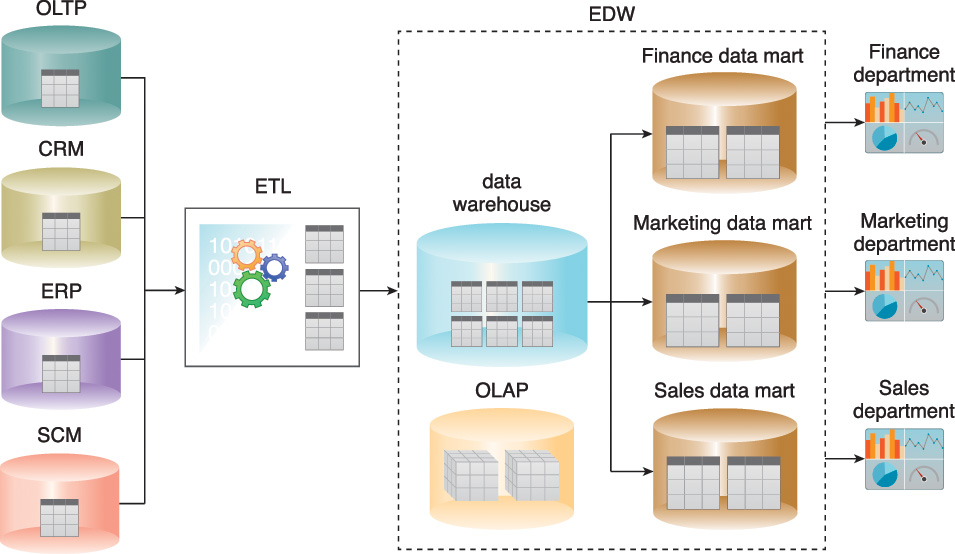{height="490px" fig-align="center"}

<p class="source-note">Fuente: Erl, Khattak y Buhler (2016), figura 4.5. Representación clásica de Data Warehouse empresarial. [@erl2016big]</p>

## ¿Qué supone esta arquitectura?

- Las fuentes conocidas producen datos previsibles.
- ETL transforma los datos antes de analizarlos.
- El modelo objetivo está definido.
- Las preguntas se responden con atributos y métricas.

::: {.question-strip}
¿Seguiría funcionando igual si el insumo principal fueran contratos, correos, fotografías y grabaciones?
:::

## El archivo de Nova Seguros

Cada reclamación puede incluir:

::: {.card-grid}
<div class="mini-card"><strong>Transacción</strong><br>Fecha, valor, cliente y estado.</div>
<div class="mini-card"><strong>Documentos</strong><br>Formulario, contrato y dictamen.</div>
<div class="mini-card"><strong>Evidencia</strong><br>Fotos, audios y correos.</div>
:::

Pasó de **10.000 expedientes** a **1.000.000**.

## Dos problemas rectores

::: {.question-strip}
**1. Volumen:** ¿cómo procesamos el archivo completo antes de que la decisión pierda valor?
:::

::: {.question-strip}
**2. Representación:** aunque podamos procesarlo, ¿cómo consultamos lo que no cabe naturalmente en columnas?
:::

La primera solución abrirá el segundo problema.

## Una cifra que envejeció

:::: {.columns}
::: {.column width="42%"}
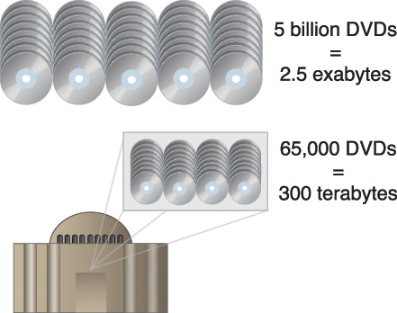{height="380px" fig-align="center"}
:::
::: {.column width="54%"}
<div class="historical-note">Cifra histórica · 2016</div>

La figura comparaba 2,5 EB diarios con una Library of Congress de 300 TB.

¿Puede una cantidad fija definir para siempre qué es “Big”?
:::
::::

<p class="source-note">Fuente histórica: Erl, Khattak y Buhler (2016), figura 1.12. [@erl2016big]</p>

## “Grande” depende del problema

La Library of Congress hoy describe colecciones dinámicas y una escala cercana a **200 PB**. [@locDigital2026]

NIST evita un umbral universal: importan los requisitos de almacenamiento, manipulación y análisis. [@nistBigData2022]

::: {.question-strip}
Big Data aparece cuando **volumen, velocidad, variedad o variabilidad** exigen una arquitectura escalable.
:::

# Primer problema: volumen

## ¿Cuánto tardaría una máquina?

```python
archivos = 1_000_000
segundos_por_archivo = 0.35

horas = archivos * segundos_por_archivo / 3600
dias = horas / 24
round(horas, 1), round(dias, 1)
```

```text
(97.2, 4.1)
```

La pregunta no es solo cuánto almacenamos, sino **cuándo necesitamos el resultado**.

## Hipótesis: una máquina más grande

::: {.card-grid .two}
<div class="mini-card"><strong>Escalar verticalmente</strong><br>Más CPU, memoria o disco en una máquina.</div>
<div class="mini-card"><strong>Lo que compra</strong><br>Tiempo y simplicidad, hasta encontrar otro límite.</div>
:::

::: {.question-strip}
Si el archivo vuelve a multiplicarse por diez, ¿reemplazamos nuevamente la máquina?
:::

## Particionar: dividir el trabajo

::: {.partition-grid}
<div><strong>Archivo completo</strong><br>1.000.000</div>
<span>→</span>
<div class="partition"><strong>P1</strong><br>250.000</div>
<div class="partition"><strong>P2</strong><br>250.000</div>
<div class="partition"><strong>P3</strong><br>250.000</div>
<div class="partition"><strong>P4</strong><br>250.000</div>
:::

- Cada elemento se asigna a una partición.
- Varios trabajadores pueden procesarlas simultáneamente.
- El resultado final combina resultados parciales.

## Particionar con Python

```python
rutas = [f"exp_{i:03}.pdf" for i in range(12)]
n = 4

particiones = [rutas[i::n] for i in range(n)]
[len(p) for p in particiones]
```

```text
[3, 3, 3, 3]
```

Dividimos cantidades; aún no sabemos si dividimos bien el **trabajo**.

## ¿El tiempo se divide por cuatro?

```python
tiempos = [2, 3, 1, 4, 2, 3, 1, 4]
partes = [tiempos[i::4] for i in range(4)]

sum(tiempos), max(map(sum, partes))
```

```text
(20, 8)  # secuencial, paralelo idealizado
```

La coordinación, la lectura y los fallos también consumen tiempo.

## La trampa del reparto uniforme

| Partición | Archivos | Tamaño total |
|---|---:|---:|
| P1 | 250.000 | 90 GB |
| P2 | 250.000 | 94 GB |
| P3 | 250.000 | 88 GB |
| P4 | 250.000 | **730 GB** |

::: {.question-strip}
¿Cuándo termina el proceso: cuando terminan tres trabajadores o cuando termina el último?
:::

## Particionar cambia el problema

::: {.card-grid .two}
<div class="mini-card"><strong>Balance</strong><br>Repartir carga, no solo elementos.</div>
<div class="mini-card"><strong>Partición caliente</strong><br>Una concentra tráfico o trabajo.</div>
<div class="mini-card"><strong>Coordinación</strong><br>Asignar, combinar y reintentar.</div>
<div class="mini-card"><strong>Fallo parcial</strong><br>Una parte puede fallar sin detener todas.</div>
:::

Distribuir capacidad también distribuye decisiones.

## Escalar horizontalmente

| Una máquina | Varias máquinas |
|---|---|
| Recursos compartidos | Recursos por nodo |
| Un fallo dominante | Fallos parciales esperados |
| Capacidad con techo | Capacidad incremental |
| Operación más simple | Coordinación explícita |

Hadoop, Spark y los servicios cloud son implementaciones de estas ideas, no la definición de Big Data. [@kleppmann2026designing]

## Solución parcial

::: {.pipeline}
<span class="step">Archivo</span><span class="arrow">→</span>
<span class="step">Particiones</span><span class="arrow">→</span>
<span class="step">Trabajadores</span><span class="arrow">→</span>
<span class="step">Resultados</span>
:::

Ahora podemos procesar el millón de expedientes oportunamente.

::: {.question-strip}
Pero ¿qué operación aplicamos a un PDF, una fotografía o una grabación?
:::

# Segundo problema: variedad

## ¿Son categorías excluyentes?

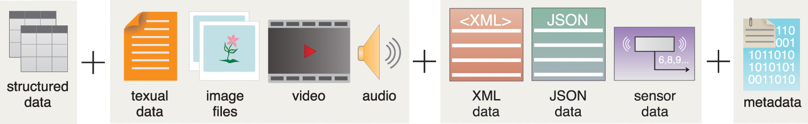{height="350px" fig-align="center"}

::: {.question-strip}
¿Un correo es texto, dato semiestructurado o ambas cosas? ¿Un sensor siempre produce la misma estructura?
:::

<p class="source-note">Fuente: Erl, Khattak y Buhler (2016), figura 1.14. La clasificación se discutirá, no se adoptará literalmente. [@erl2016big]</p>

## Cuatro ideas que no son iguales

| Pregunta | Ejemplo |
|---|---|
| ¿En qué viene? | PDF, JPEG, JSON |
| ¿Cómo se organiza? | Tabla, árbol, secuencia |
| ¿Qué comunica? | Texto, imagen, audio |
| ¿Qué lo describe? | Autor, fecha, origen |

- XML y JSON son formatos semiestructurados.
- Un sensor puede emitir una tabla, JSON o datos binarios.
- Los metadatos pueden describir cualquier modalidad.

## Un expediente, muchas formas

::: {.card-grid}
<div class="mini-card"><strong>Tabla</strong><br>Valor y estado de la reclamación.</div>
<div class="mini-card"><strong>JSON</strong><br>Eventos enviados por la aplicación.</div>
<div class="mini-card"><strong>PDF</strong><br>Contrato y dictamen técnico.</div>
<div class="mini-card"><strong>Correo</strong><br>Encabezados y cuerpo libre.</div>
<div class="mini-card"><strong>Imagen</strong><br>Fotografía del daño.</div>
<div class="mini-card"><strong>Audio</strong><br>Llamada al centro de atención.</div>
:::

Almacenar los archivos no equivale a poder analizarlos.

## Primero hay que abrirlos

::: {.pipeline}
<span class="step">Archivo</span><span class="arrow">→</span>
<span class="step">Lector</span><span class="arrow">→</span>
<span class="step">Contenido derivado</span><span class="arrow">→</span>
<span class="step">Metadatos</span>
:::

| Modalidad | Representación posible |
|---|---|
| PDF o correo | Texto extraído |
| Imagen | OCR, descripción o rasgos visuales |
| Audio | Transcripción o rasgos acústicos |

## Elegir el lector

```python
from pathlib import Path

lectores = {".pdf": "extraer_texto",
            ".jpg": "leer_imagen",
            ".wav": "transcribir_audio"}

archivos = ["contrato.pdf", "foto.jpg", "llamada.wav"]
[(a, lectores[Path(a).suffix]) for a in archivos]
```

```text
[('contrato.pdf', 'extraer_texto'),
 ('foto.jpg', 'leer_imagen'),
 ('llamada.wav', 'transcribir_audio')]
```

## Una salida común, no idéntica

```python
{
  "id": "rec-023-p17",
  "fuente": "contrato_023.pdf",
  "tipo": "texto",
  "contenido": "La terminación anticipada...",
  "pagina": 17
}
```

- El contenido depende de la modalidad.
- Los metadatos conservan contexto y procedencia.
- La fuente original sigue siendo la evidencia.

## Buscar palabras no siempre basta

```python
consulta = set("cancelar antes".split())
clausula = set("terminación anticipada del contrato".split())

consulta & clausula
```

```text
set()
```

Las expresiones pueden ser equivalentes para una persona y diferentes para una búsqueda literal.

## El problema que queda

> Ya podemos abrir cada archivo y procesar muchos en paralelo.

::: {.question-strip}
¿Cómo convertimos el contenido en una representación que permita encontrar **significados cercanos**?
:::

Necesitamos conservar algo más que palabras coincidentes.

# Tercer problema: significado

## Una representación aprendida

Un **embedding** convierte contenido en una lista de números.

::: {.pipeline}
<span class="step">Contenido</span><span class="arrow">→</span>
<span class="step">Modelo</span><span class="arrow">→</span>
<span class="step">Vector</span>
:::

El objetivo no es interpretar cada número, sino comparar posiciones:

- Contenidos semejantes quedan cerca.
- Contenidos diferentes tienden a separarse.
- La cercanía depende del modelo y su entrenamiento.

## La misma palabra, otro contexto

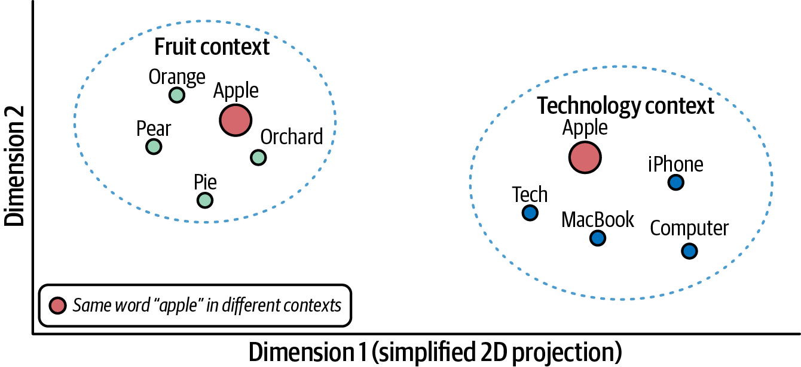{height="480px" fig-align="center"}

<p class="source-note">Fuente: Borwankar (2026), figura 1-4. Proyección bidimensional simplificada. [@borwankar2026vector]</p>

## Comparar tres frases

```python
frases = [
  "cancelar el contrato antes del vencimiento",
  "terminación anticipada del acuerdo",
  "fotografía del vehículo asegurado"
]

vectores = modelo.encode(frases, normalize_embeddings=True)
similitudes = vectores @ vectores.T
```

```text
                         1       2       3
1 cancelar antes       1.00    0.84    0.12
2 terminación          0.84    1.00    0.09
3 fotografía           0.12    0.09    1.00
```

<p class="source-note">Salida ilustrativa: los valores exactos cambian con el modelo y su versión.</p>

## La idea sirve para más modalidades

| Contenido | Modelo posible | Vector representa... |
|---|---|---|
| Texto | Modelo de lenguaje | Uso y contexto textual |
| Imagen | Modelo visual | Patrones visuales |
| Audio | Modelo acústico | Voz, sonido o transcripción |

::: {.callout-warning}
Dos vectores solo son comparables si pertenecen a espacios compatibles. “Ser números” no basta.
:::

## ¿Un vector por contrato?

Un contrato de 200 páginas puede contener:

- Coberturas.
- Exclusiones.
- Renovación.
- Terminación.
- Tratamiento de datos.

::: {.question-strip}
Si todo el documento se convierte en un punto, ¿qué tema representará ese punto?
:::

## Fragmentar sin perder la fuente

```python
def fragmentar(palabras, tamaño=8, solape=2):
    paso = tamaño - solape
    return [palabras[i:i+tamaño]
            for i in range(0, len(palabras), paso)]

fragmentos = fragmentar(texto.split())
```

Cada fragmento conserva `documento`, `página` y `posición`.

::: {.question-strip}
Muy grande mezcla temas; muy pequeño pierde contexto.
:::

## Indexar una vez, consultar muchas

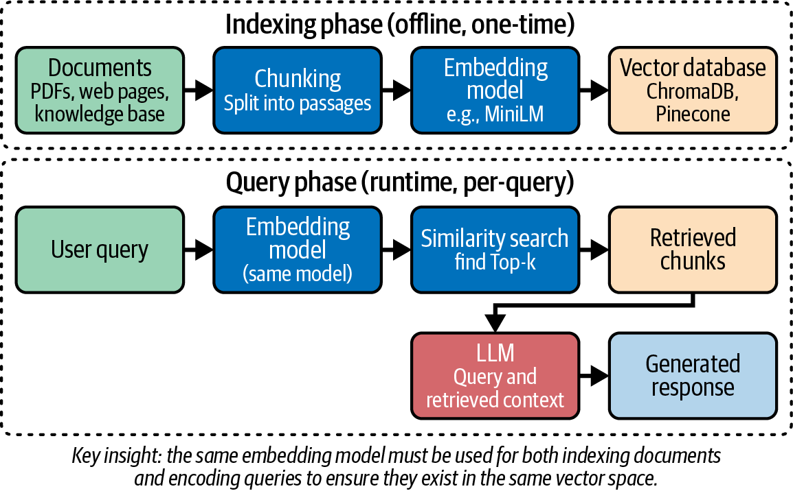{height="485px" fig-align="center"}

<p class="source-note">Fuente: Borwankar (2026), figura 2-6. El mismo modelo debe representar documentos y consultas. [@borwankar2026vector]</p>

## Buscar los fragmentos cercanos

```python
consulta = "¿Puedo cancelar antes del vencimiento?"
q = modelo.encode([consulta], normalize_embeddings=True)

puntajes = vectores_documentos @ q[0]
top = puntajes.argsort()[::-1][:3]
[(metadatos[i]["pagina"], round(puntajes[i], 2))
 for i in top]
```

```text
[(17, 0.86), (42, 0.71), (8, 0.43)]
```

El resultado debe llevarnos de vuelta al texto y a su fuente.

## ¿Por qué construir un índice?

Con pocos fragmentos podemos compararlos todos.

Con millones, cada consulta volvería a recorrer el corpus completo.

::: {.question-strip}
Un índice vectorial organiza vecinos probables para evitar empezar desde cero en cada búsqueda.
:::

Intercambia recursos, velocidad y aproximación; los detalles quedan en el apéndice.

## La tabla no desaparece

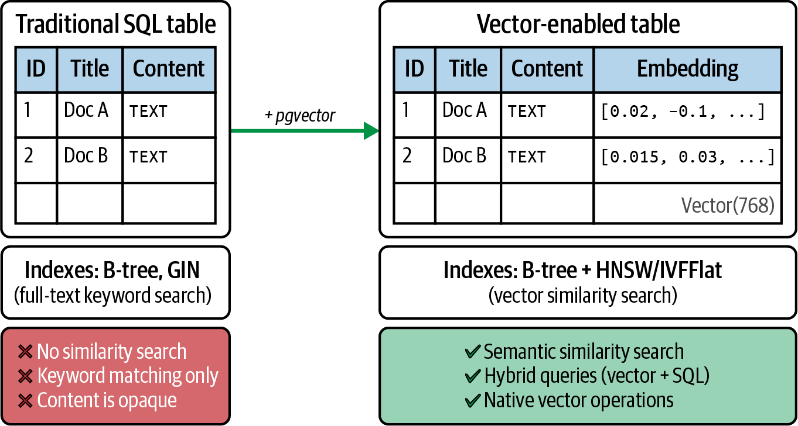{height="475px" fig-align="center"}

<p class="source-note">Fuente: Borwankar (2026), figura 1-9. La tabla vectorizada combina contenido, metadatos e índices especializados. [@borwankar2026vector]</p>

## Cada representación responde algo

| Pregunta | Representación útil |
|---|---|
| ¿Reclamaciones de 2026 por más de $5 millones? | Columnas e índices tradicionales |
| ¿Expedientes con listas y eventos anidados? | Documentos jerárquicos |
| ¿Cláusulas parecidas aunque cambien las palabras? | Vectores e índice semántico |

::: {.question-strip}
La solución no reemplaza lo aprendido: **lo combina**.
:::

# Soluciones que envejecen

## “Próxima generación” en 2016

:::: {.columns}
::: {.column width="46%"}
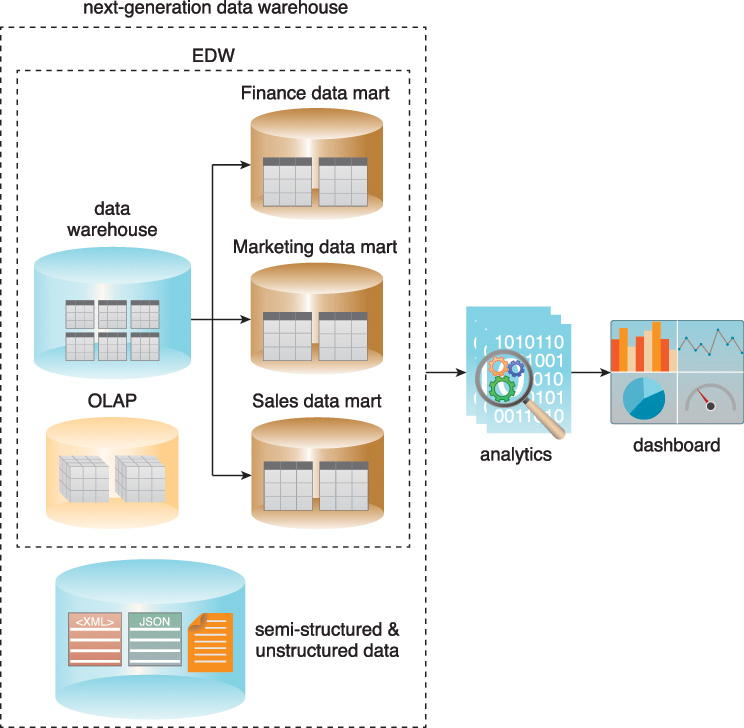{height="420px" fig-align="center"}
:::
::: {.column width="50%"}
<div class="historical-note">Arquitectura de transición · 2016</div>

- Admite datos más allá de tablas.
- Separa almacenamiento y analítica.
- Almacenar no revela significado.
- “Próxima generación” fue una etiqueta temporal.
:::
::::

<p class="source-note">Fuente: Erl, Khattak y Buhler (2016), figura 4.9. [@erl2016big]</p>

## La arquitectura que construimos

::: {.pipeline}
<span class="step">Fuentes</span><span class="arrow">→</span>
<span class="step">Particiones</span><span class="arrow">→</span>
<span class="step">Lectores</span><span class="arrow">→</span>
<span class="step">Contenido</span><span class="arrow">→</span>
<span class="step">Vectores</span><span class="arrow">→</span>
<span class="step">Índice</span>
:::

- El archivo original conserva la evidencia.
- Los metadatos mantienen contexto y trazabilidad.
- Las representaciones derivadas pueden regenerarse.

# Síntesis

## Dos problemas, dos respuestas

| Problema rector | Respuesta | Nuevo compromiso |
|---|---|---|
| Procesar a tiempo | Particionar y distribuir | Balancear y coordinar |
| Consultar significado | Representar e indexar | Elegir modelo y medir calidad |

::: {.question-strip}
Big Data no es una herramienta: aparece cuando nuestras representaciones o arquitecturas dejan de satisfacer el problema.
:::

## Lo que un vector no resuelve

- Similitud no significa verdad.
- Una mala extracción produce una mala representación.
- Los vectores también pueden revelar información sensible.
- Cambios y eliminaciones deben propagarse al índice.
- Siempre necesitamos regresar a la evidencia original.

::: {.callout-warning}
Recuperar un fragmento plausible no demuestra que una respuesta sea correcta.
:::

## Ticket de salida

1. ¿Qué problema resuelve el particionamiento y cuál deja intacto?
2. ¿Por qué el formato no determina por sí solo la estructura?
3. ¿Qué habilita una representación vectorial?
4. ¿Por qué conservar texto, metadatos y fuente?

> Dividir permite procesar; representar permite comparar; la trazabilidad permite verificar.

# Apéndice técnico

## Una cifra por minuto

:::: {.columns}
::: {.column width="39%"}
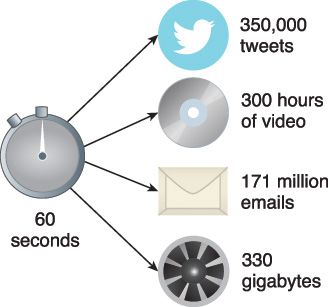{height="390px" fig-align="center"}
:::
::: {.column width="57%"}
<div class="historical-note">Auditoría de cifras · 2016</div>

- Las plataformas y sus métricas cambian.
- Algunas cifras no tienen una fuente primaria recuperable.
- YouTube ya reportaba más de 500 horas por minuto en 2021. [@youtubeInfrastructure2021]
- La idea de velocidad permanece; los números deben fecharse.
:::
::::

<p class="source-note">Fuente histórica: Erl, Khattak y Buhler (2016), figura 1.13. [@erl2016big]</p>

## ETL: vigente, pero no único

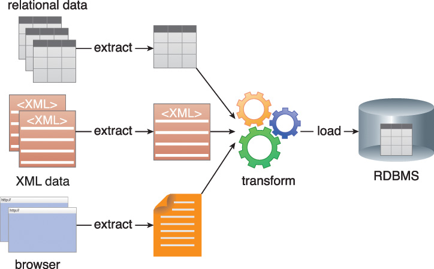{height="455px" fig-align="center"}

- ETL sigue siendo un patrón válido.
- El destino puede ser una base, un warehouse, un lake o almacenamiento de objetos.
- Un navegador es un medio de acceso, no un tipo de dato.

<p class="source-note">Fuente histórica: Erl, Khattak y Buhler (2016), figura 4.3. [@erl2016big]</p>

## La intuición del coseno

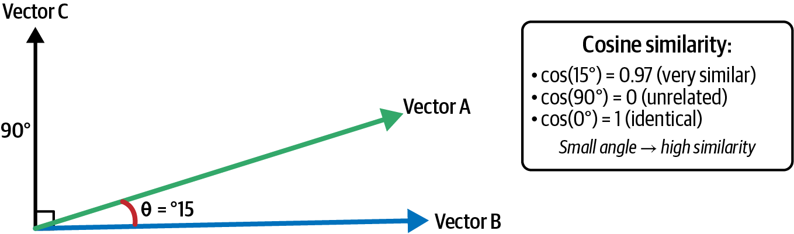{height="420px" fig-align="center"}

- Un ángulo pequeño indica direcciones parecidas.
- El puntaje no es una probabilidad.
- La interpretación depende del modelo.

<p class="source-note">Fuente: Borwankar (2026), figura 1-5. [@borwankar2026vector]</p>

## Exacta o aproximada

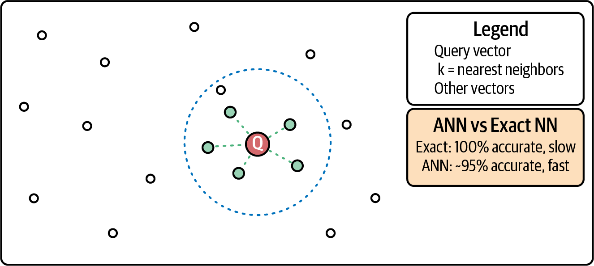{height="440px" fig-align="center"}

- La búsqueda exacta compara todos los candidatos.
- ANN reduce el trabajo explorando candidatos prometedores.
- Menor latencia puede implicar omitir algún vecino real.

<p class="source-note">Fuente: Borwankar (2026), figura 1-6. Los porcentajes son ilustrativos, no garantías universales. [@borwankar2026vector]</p>

## Una arquitectura híbrida

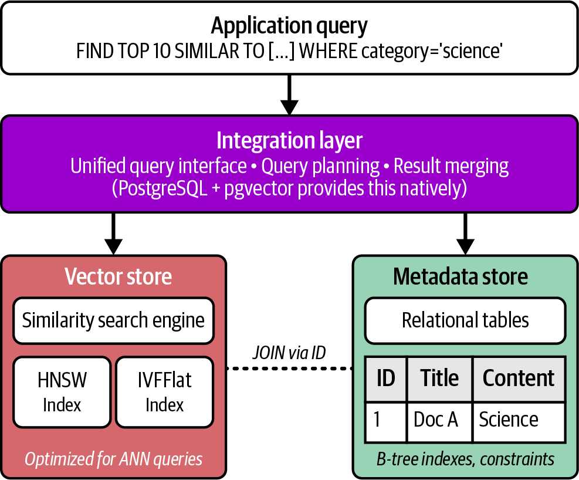{height="505px" fig-align="center"}

<p class="source-note">Fuente: Borwankar (2026), figura 1-8. SQL filtra metadatos; el índice vectorial recupera por similitud. [@borwankar2026vector]</p>

## Referencias

::: {#refs}
:::

::: {.notes}
Distribución sugerida para una sesión de 120 minutos:

- Arquitectura conocida: 15 minutos.
- Volumen y particionamiento: 30 minutos.
- Variedad y extracción: 30 minutos.
- Embeddings y recuperación: 30 minutos.
- Síntesis: 10 minutos.
- Margen para interacción y contingencias: 5 minutos.

Las salidas de embeddings son deliberadamente ilustrativas: deben regenerarse y reemplazarse si se fija un modelo concreto para una demostración futura.
:::
