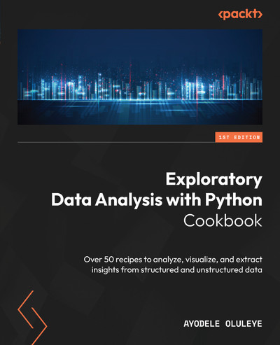
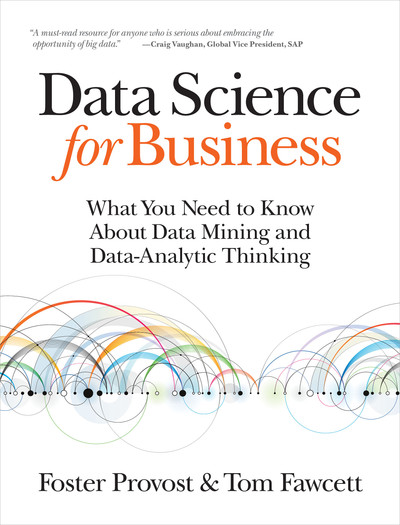
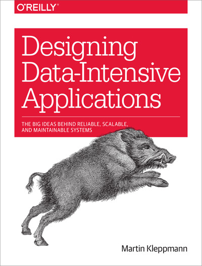
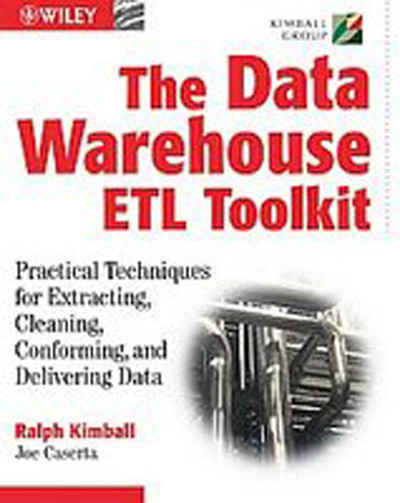
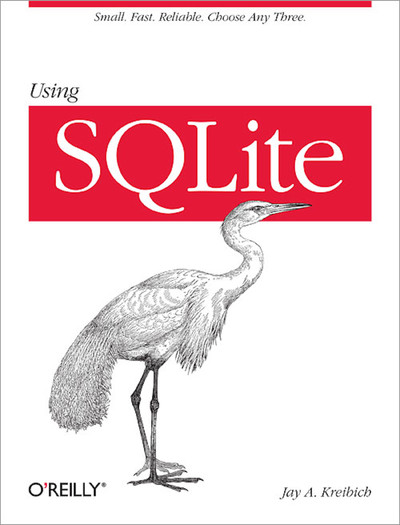
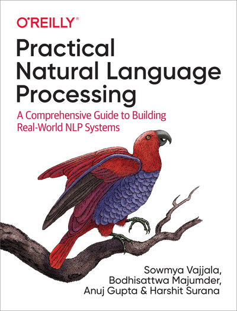
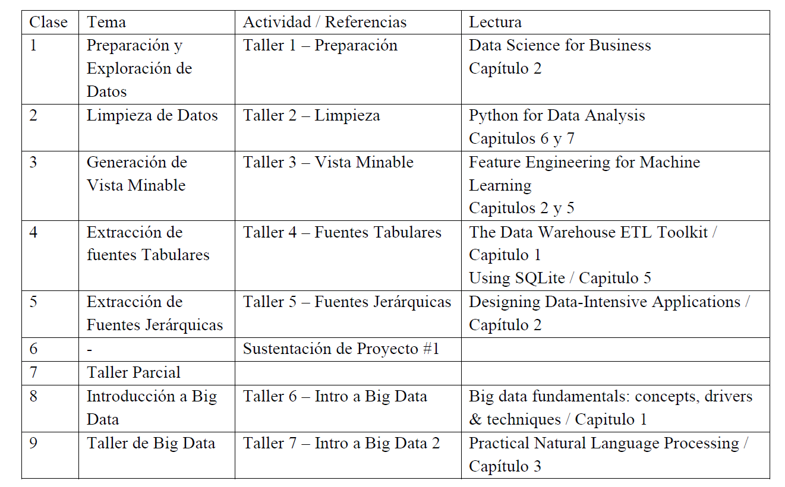
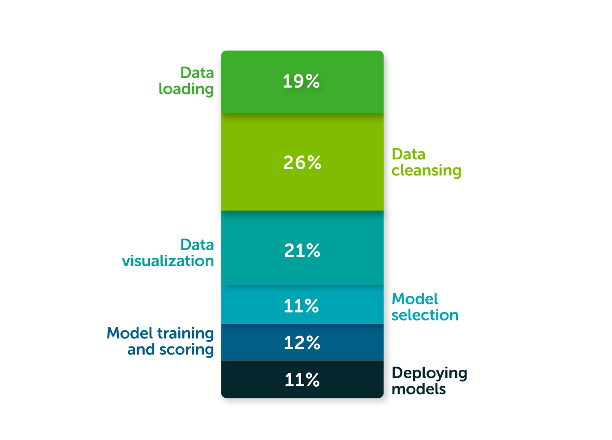
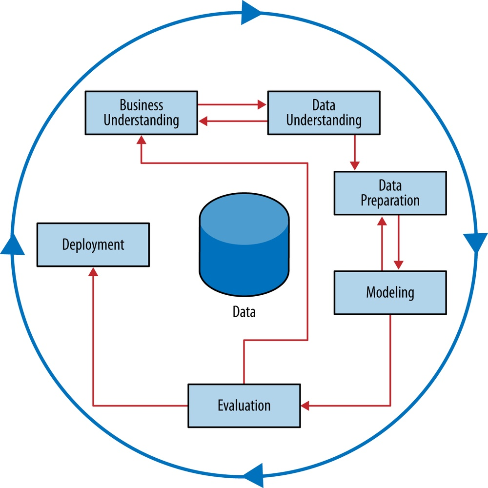

<style>
.reveal figcaption {
  text-align: center !important;
}
.smaller-text {
  font-size: 0.75em !important;
}
</style>

# Bienvenidos y Presentación

## ¡Conozcámonos!

¡Hola a todos!

::: {.callout-tip title="Dinámica Inicial"}
Comparte tu **Nombre**, **profesión**, **dónde trabajas**, **maestría** y tus **expectativas** sobre el uso de datos en tu vida laboral.
:::

## El Docente

:::: {.columns}

::: {.column width="70%"}
- **Oscar Bustos**

- Ing. Mecatrónico, PhD. (c) en Ingeniería - PUJ

- Docente Javeriano

- Tech Manager en Mercado Libre

- Apasionado por resolver problemas reales con IA y Analítica
:::

::: {.column width="30%"}
{width="100%"}
:::

::::

# Reglas del Curso y Logística

## Estructura del Curso

El curso se divide en 3 módulos principales:

- **Módulo 1: Preparación de datos**

  - Talleres prácticos (20%)

- **Módulo 2: Integración de datos**

  - Talleres (20%)

  - Proyecto en grupo (20%)

  - Parcial Taller Individual (20%)

- **Módulo 3: Herramientas de Big Data**

  - Talleres prácticos (20%)

## Reglas del Curso

Pautas clave para el desarrollo de las actividades:

- **Talleres prácticos**: Uno por clase, entrega antes de la siguiente sesión.

- **Parejas**: Se resuelven y entregan en parejas.

- **Proyecto de curso**: Desarrollado en grupos de 4 personas (2 parejas).

- **Entregas**: Exclusivamente a través del Campus Virtual.

## Dinámica de Clase y Uso de IA

- **Presencialidad**: Clases presenciales (transmisión virtual opcional).

- **Horario**: Inicia a las 6:10pm. Descanso de 15 min a las 7:30pm.

- **IA como Herramienta**:

  - **Apoyo técnico**: Se promueve para la generación de código Python.

  - **Pensamiento Crítico**: La IA no reemplaza su capacidad analítica. ¡La interpretación de datos, decisiones y conclusiones deben ser 100% propias!

## Bibliografía y Lecturas

- **Lecturas obligatorias**: Cada clase tiene lecturas asociadas.

- **Acceso digital**: Todos los libros están en la plataforma O'Reilly.

- **Biblioteca Javeriana**: Accede gratis con tus credenciales en:
  [javeriana.libguides.com/az.php?a=o](https://javeriana.libguides.com/az.php?a=o)

- Las referencias bibliográficas se listan al final de la presentación.

## Libros de la Clase - Módulo 1

::: {layout-ncol=3}
{height=300px}

{height=300px}

{height=300px}
:::

## Libros de la Clase - Módulo 2

::: {layout-ncol=3}
{height=300px}

{height=300px}

{height=300px}
:::

## Libros de la Clase - Módulo 3

::: {layout-ncol=2}
{height=300px}

{height=300px}
:::

## Cronograma General

::: {.r-stretch}
{fig-align="center"}
:::

# Motivación y Metodología CRISP-DM

## Tarea / Asignación

**Actividades a desarrollar:**

1. Leer capítulos 1 y 2 del libro *Data Science for Business*.

2. Explorar el [Cuaderno de Google NotebookLM](https://notebooklm.google.com/notebook/f7f29dfb-70df-4b77-ba81-40ebfa242c51):
   - Revisar la infografía.
   - Realizar los quices incluidos.
   - Escuchar el podcast.

## Motivación: ¿A qué dedicamos tiempo?

::: {.callout-note title="Pregunta a la clase"}
En el día a día de un científico de datos, ¿en qué actividades creen que se invierte la mayor parte del tiempo?
:::

*(Piensen en carga, limpieza, modelado, visualización, etc.)*

## Motivación: ¿A qué dedicamos tiempo?

:::: {.columns}

::: {.column width="60%"}
Estudio de Anaconda (2020) sobre el tiempo en Ciencia de Datos:

- **Carga y preparación**: Cerca del 45%.

- **Limpieza de datos**: Cerca del 26%.

- *¡Más del 70% del tiempo se va en preparación de datos!*

:::

::: {.column width="40%"}
{fig-align="center" width="100%"}
:::

::::

## Objetivos de Formación

Al finalizar el curso serás capaz de:

- **Recolección y consolidación**: Extraer información de múltiples fuentes.

- **Preparación de datos**: Limpiar y tratar datos atípicos o perdidos.

- **Entendimiento de Big Data**: Comprender tecnologías para grandes volúmenes.

- **Garbage in, Garbage out**: Si los datos son basura, el modelo dará basura.

## Introducción a CRISP-DM

- **Definición**: *Cross-Industry Standard Process for Data Mining*.

- **Propósito**: Estructurar proyectos analíticos para evitar pérdidas.

- Es un proceso **cíclico e iterativo**, no lineal.

- Conecta directamente el negocio con los datos y el modelado.

## Las Fases de CRISP-DM

:::: {.columns}

::: {.column width="55%"}
1. **Comprensión del Negocio**

2. **Entendimiento de los Datos**

3. **Preparación de los Datos**

4. **Modelamiento**

5. **Evaluación**

6. **Despliegue**
:::

::: {.column width="45%"}
{width="100%"}
:::

::::

## CRISP-DM: Comprensión del Negocio

Fase inicial: definir objetivos comerciales y traducirlos a minería.

- **Preguntas esenciales**:

  - ¿Qué problema queremos resolver exactamente?

  - ¿Cómo se usará la solución en el negocio?

  - ¿Qué constituye un éxito para el proyecto?

- Basado en la toma de decisiones guiada por datos (DDD).

## Pensamiento Analítico: Caso Walmart

Walmart analizó sus ventas históricas previas al huracán Frances (2004) para anticipar picos de demanda.

::: {.callout-note title="Pregunta a la clase"}
¿Qué productos inusuales descubrió Walmart que se vendían 7 veces más?
:::

::: {.fragment .fade-in}
**Respuesta**: Cerveza y Pop-Tarts de fresa. Llenaron los camiones y maximizaron ventas.
:::

## Pensamiento Analítico: Caso Target

Target deseaba detectar si una cliente estaba embarazada meses antes de dar a luz para enviarle cupones anticipados de pañales.

::: {.callout-note title="Pregunta a la clase"}
¿Cómo lograrías esta predicción usando solo datos históricos de compra?
:::

::: {.fragment .fade-in}
**Respuesta**: Detectaron cambios en el consumo (vitaminas prenatales, lociones sin aroma, etc.) y estimaron la fecha del parto.
:::

## Datos como Activo: Capital One

Signet Bank quería crear modelos predictivos de riesgo para ofrecer tarjetas de crédito a finales de los 80.

::: {.callout-note title="Pregunta a la clase"}
Si careces de datos de clientes riesgosos (porque siempre fueron rechazados), ¿cómo entrenas el modelo?
:::

::: {.fragment .fade-in}
**Respuesta**: Otorgaron tarjetas aleatoriamente a pérdida. *Compraron los datos* y lideraron el mercado.
:::

## El Reto de los Datos

Queremos entrenar robots para aceras, lo que exige millones de fotos actualizadas.

- *Limitación:* Los vehículos de mapeo tradicionales no acceden a zonas peatonales, y mapearlas con flota propia es inviable.

::: {.callout-note title="Pregunta a la clase"}
¿Cómo capturar estos datos espaciales masivos sin desplegar una flota propia?
:::

## Solución: Gamificación (Pokémon GO)

::: {.columns}
::: {.column width="40%"}
{fig-align="center" height="300px"}
:::

::: {.column width="60%"}
<br>
Crear el juego es costoso, pero su modelo de **crowdsourcing** es brillante. 

Millones de jugadores mapean el entorno físico por diversión. El producto (juego) incentiva y financia la captura de datos.
:::
:::

## Tareas de Minería: Caso Netflix

Netflix recopila tu historial de reproducción y valoraciones para sugerirte nuevas películas y series.

::: {.callout-note title="Pregunta a la clase"}
Si Netflix te agrupa con usuarios de gustos similares para recomendarte títulos, ¿es una tarea supervisada o no supervisada?
:::

::: {.fragment .fade-in}
**Respuesta**: Es una combinación, pero la agrupación es **No Supervisada** (Clustering / Co-occurrence Grouping).
:::

## CRISP-DM: El Fracaso Analítico

Diseñas un modelo de Machine Learning con 99% de precisión matemática. Sin embargo, el proyecto no genera retorno y el negocio lo descarta.

::: {.callout-note title="Pregunta a la clase"}
¿En qué fase de la metodología CRISP-DM se falló fundamentalmente?
:::

::: {.fragment .fade-in}
**Respuesta**: En **Business Understanding** (definición del problema) o en la **Evaluación** (no alineada a KPIs del negocio).
:::


## ¡Pausa! 🍕

Tomemos 15 minutos de descanso para recargar energías antes de continuar con la siguiente fase.

# CRISP-DM - Entendimiento de los Datos & EDA

## CRISP-DM: Entendimiento de los Datos

Esta fase consiste en familiarizarse con los datos para identificar su calidad y descubrir insights preliminares.

**Actividades clave**:

- Recopilación inicial de datos de diversas fuentes.

- Descripción del volumen, formato y variables.

- Verificación de la calidad (errores, vacíos).

- **Análisis Exploratorio de Datos (EDA)**.

## ¿Qué es el EDA (Exploratory Data Analysis)?

Es la aproximación para analizar bases de datos resumiendo sus características principales, frecuentemente usando métodos visuales.

**Objetivos**:

- Entendimiento de la estructura y propiedades de los datos.

- Detectar problemas de calidad y anomalías.

- Probar supuestos iniciales antes de crear modelos.

## Caso de Estudio: Titanic

::: {.columns}
::: {.column width="40%"}
{width="100%"}
:::

::: {.column width="60%" .smaller-text}
**Objetivo:** Predecir la supervivencia de pasajeros con datos reales de la tragedia (1912).

**Preguntas de reflexión:**

- ¿Cuáles creen que son las variables más importantes para predecir la supervivencia?

- ¿Qué problemas de calidad de datos esperan?

- ¿Qué sesgos históricos podrían existir?
:::
:::

## Google Colab: Entorno de Trabajo

**Google Colab** es un entorno en la nube basado en Jupyter Notebooks.

- No requiere instalación ni configuración local.

- Permite ejecutar código **Python** paso a paso.

- Combina texto, código y visualizaciones, ideal para análisis de datos.

## ¿Por qué Python en lugar de Excel?

Excel es el software empresarial por excelencia, pero tiene limitaciones críticas:

- **Automatización**: Python asegura repetibilidad, automatización y auditoría del proceso.

- **Volumen**: Capacidad para manejar grandes volúmenes de datos sin interrupciones.

- **Ecosistema**: Amplio conjunto de librerías (*Pandas*, *Numpy*, *Scikit-Learn*).

## 2. Visión General (Carga y Exploración)

```python
import pandas as pd
import numpy as np

url = "https://raw.githubusercontent.com/datasciencedojo/datasets/master/titanic.csv"
df = pd.read_csv(url)

print(f"Tamaño: {df.shape}")
print(df.info())
print(df.head())
```

::: {.smaller-text}
Primer acercamiento a la materia prima.

- **`shape`**: Dimensiones del dataset.
- **`info()`**: Tipos de datos y memoria.
- **`head()`**: Vistazo a los datos reales.
:::

## 3.1 Limpieza: Datos Faltantes

```python
# Conteo de nulos por columna
print("Nulos antes de imputar:")
print(df.isnull().sum())

# Imputar con la media
media = df['Age'].mean()
df['Age'] = df['Age'].fillna(media)

# Eliminar nulos restantes
df.dropna(inplace=True)

print("\nNulos después de limpiar:")
print(df.isnull().sum())
```

::: {.smaller-text}
Valores `NaN` pueden distorsionar los análisis.

- **Eliminación**: Borrar filas (pérdida de datos).
- **Imputación**: Rellenar con media, mediana o usando modelos predictivos.
:::

## 3.2 Limpieza: Valores Atípicos

```python
# Filtro por rango (IQR)
Q1 = df['Fare'].quantile(0.25)
Q3 = df['Fare'].quantile(0.75)
IQR = Q3 - Q1

lim_sup = Q3 + 1.5 * IQR
outliers = df[df['Fare'] > lim_sup]
print(f"Número de outliers en Fare: {len(outliers)}")
```

::: {.smaller-text}
Observaciones que se desvían significativamente.

- Pueden ser errores o fenómenos reales.
- **Detección**: Puntaje Z o Rango Intercuartílico (IQR).
:::

## 3.3 Limpieza: Control de Calidad

```python
# Conteo de duplicados
dups = df.duplicated().sum()
print(f"Duplicados encontrados: {dups}")

# Eliminar duplicados
df.drop_duplicates(inplace=True)

# Validar reglas lógicas
invalid = df[df['Age'] < 0]
print(f"Edades negativas encontradas: {len(invalid)}")
```

::: {.smaller-text}
Asegurar la confiabilidad de la información.

- **Duplicados**: Filas idénticas repetidas.
- **Inconsistencias**: Errores tipográficos.
- **Valores Inválidos**: Fuera del dominio lógico (ej. edades negativas).
:::

## 4.1 Univariado: Distribución (Histogramas)

```python
# Histograma de edades
import matplotlib.pyplot as plt
df['Age'].hist(bins=20)
plt.title('Distribución de Edades')
plt.show()

# Gráfico de densidad de tarifa
df['Fare'].plot(kind='kde')
plt.title('Densidad de Tarifa')
plt.show()
```

::: {.smaller-text}
Entender la forma y extensión de las variables.

- **Asimetría (Skewness)**: Inclinación.
- **Curtosis**: Concentración en la media.
- **Dispersión**: Rango y variabilidad.
:::

## 4.2 Univariado: Estadísticas Descriptivas

```python
# Resumen general (Pandas)
print(df.describe())

# Estadísticas con Numpy
std_edad = np.std(df['Age'])
min_tarifa = np.min(df['Fare'])
print(f"\nDesviación estándar de Edad: {std_edad}")
print(f"Tarifa Mínima: {min_tarifa}")
```

::: {.smaller-text}
Resumen de tendencia central y dispersión.

- **Central**: Media, mediana.
- **Dispersión**: Desviación estándar, mínimo, máximo.
- **Posición**: Cuartiles (Q1, Q3).
:::

## 4.3 Univariado: Tipos Categóricos

```python
# Revisar tipos actuales
print("Tipos originales:")
print(df.dtypes)

# Convertir tipos
df['Survived'] = df['Survived'].astype('category')
df['Fare'] = pd.to_numeric(df['Fare'])

print("\nTipos después de conversión:")
print(df.dtypes)
```

::: {.smaller-text}
Identificar la naturaleza de cada columna para el análisis.

- **Numéricos**: `int`, `float`.
- **Categóricos**: Ordinales o nominales.
- **Otros**: Booleanos, fechas, textos.
:::

## 5.1 Bivariado: Correlación Numérica

```python
# Variables numéricas
num = df[['Age', 'Fare', 'Pclass']]

# Matriz de correlación
corr = num.corr(method='pearson')
print(corr)
```

::: {.smaller-text}
Relación lineal entre variables numéricas.

- **1**: Positiva perfecta.
- **-1**: Negativa perfecta.
- **0**: Sin relación lineal.
:::

## 5.2 Bivariado: Visualización de Relaciones

```python
# Barras: Pasajeros por puerto
df['Embarked'].value_counts().plot(kind='bar')
plt.title('Pasajeros por Puerto')
plt.show()

# Dispersión: Edad vs Tarifa
df.plot.scatter(x='Age', y='Fare')
plt.title('Edad vs Tarifa')
plt.show()
```

::: {.smaller-text}
Facilitan la identificación de patrones de forma intuitiva.

- **Histogramas**: Distribución.
- **Dispersión**: Relaciones mutuas.
- **Barras**: Frecuencia de categorías.
:::

## 5.3 Bivariado: Agrupaciones y Tablas

```python
# Agrupación y comparación
if df['Survived'].dtype == 'category':
    df['Survived'] = df['Survived'].astype(int)

agrup = df.groupby(['Sex', 'Pclass'])['Survived'].mean()
print("Tasa de supervivencia por Sexo y Clase:")
print(agrup)

# Tabla cruzada (Crosstab)
cruz = pd.crosstab(df['Sex'], df['Survived'])
print("\nTabla Cruzada (Sexo vs Supervivencia):")
print(cruz)
```

::: {.smaller-text}
Exploración multivariada de interacciones.

- **Agrupaciones**: Promedios por segmento cruzado.
- **Tablas cruzadas**: Frecuencias entre variables categóricas.
:::

## 5.4 Bivariado: Patrones y Tendencias

```python
# Supervivencia por clase
tend = df.groupby('Pclass')['Survived'].mean()

# Gráfico de línea
tend.plot(kind='line', marker='o')
plt.title('Tasa de Supervivencia por Clase')
plt.ylabel('Supervivencia Media')
plt.show()
```

::: {.smaller-text}
Identificar comportamientos a lo largo de una dimensión.

- Ayuda a visualizar relaciones no obvias.
- **Herramientas**: Gráficos de línea, agrupaciones secuenciales.
:::

## Flujo de Trabajo en EDA

Un proceso típico y estructurado:

1. **Entender negocio y datos**: Contexto del problema.

2. **Visión general**: Tamaño (`shape`), tipos/nulos (`info`) y vistazo real (`head`).

3. **Limpieza inicial**: Tratar faltantes, duplicados y atípicos.

4. **Análisis Univariado**: Explorar cada variable por separado.

5. **Análisis Bi/Multivariado**: Explorar interacciones y relaciones cruzadas.

6. **Reporte e Insights**: Extraer conclusiones y siguientes pasos (ej. Feature Eng.).

## Retos del Titanic: Datos Faltantes

Afrontando problemas prácticos en los datos del Titanic:

- **Edad Faltante (20%)**:

  - Si eliminamos, perdemos información de otras variables.

  - Si imputamos con la media general, sesgamos la varianza.

  - *Solución*: Imputar usando prefijos de nombres (Mr., Miss., Mrs.).

## Reto Titanic: Fugas de Información

Un modelo de supervivencia alcanza un 99% de precisión al incluir la variable *Número de Bote Salvavidas*.

::: {.callout-note title="Pregunta a la clase"}
¿Por qué este modelo es inútil para la toma de decisiones?
:::

::: {.fragment .fade-in}
**Respuesta**: Es *Data Leakage*. Al comprar el boleto (momento de la predicción) no se sabe quién abordará un bote salvavidas.
:::

## EDA Automatizado con ydata-profiling

Librerías modernas permiten generar reportes completos en segundos.

```python
# Instalar las librerias
!pip install -U fg-data-profiling[notebook] -q

import data_profiling
from data_profiling import ProfileReport

# Crear el reporte interactivo
profile = ProfileReport(df, title="Titanic Profile Report", explorative=True)

# Mostrar dentro de Google Colab o Jupyter
profile.to_notebook_iframe()
```

- **Advertencia**: *El reporte automatiza la tarea, pero no el análisis.* El criterio humano decide cómo resolver las alertas detectadas.

## Referencias

::: {#refs}
:::
