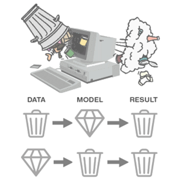
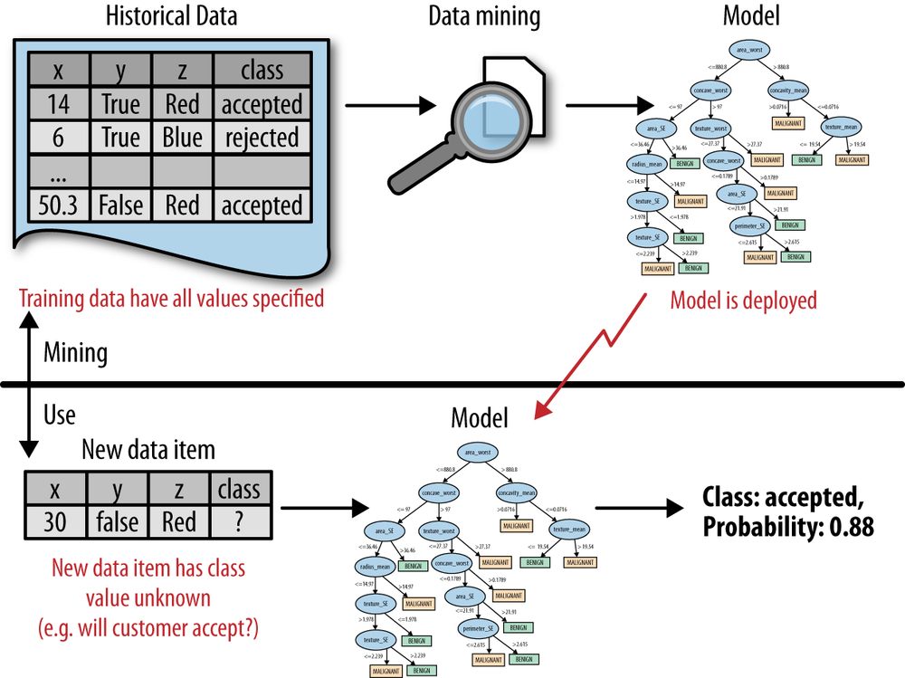
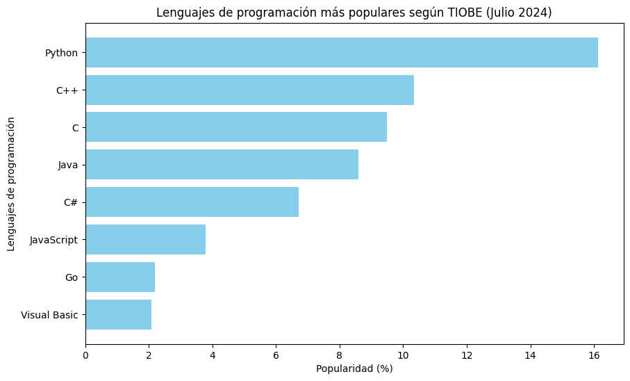
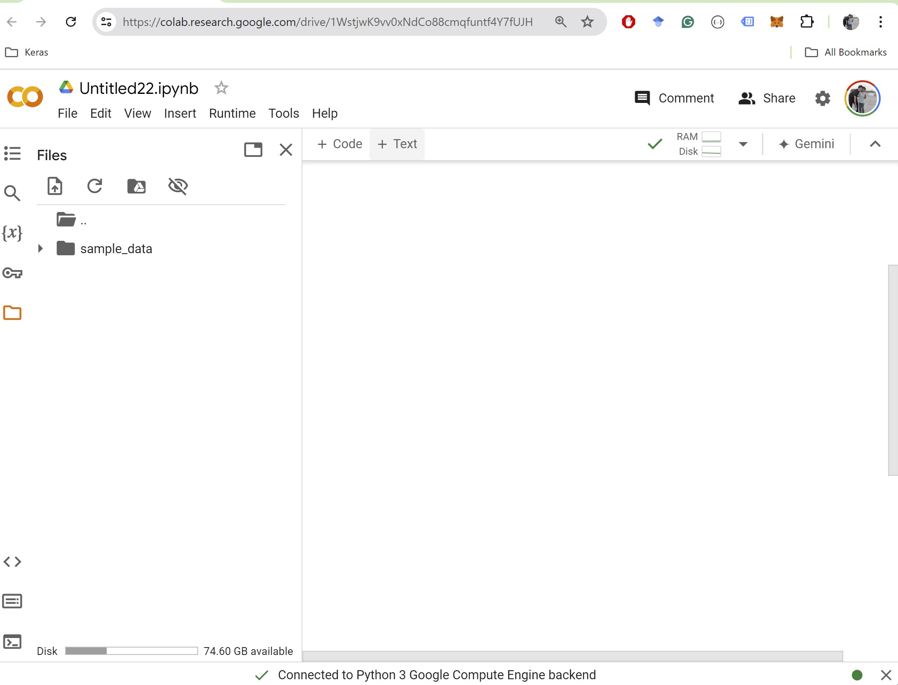
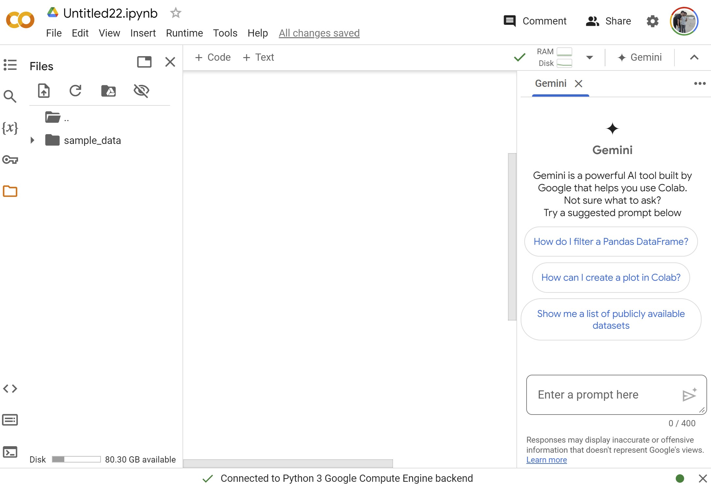
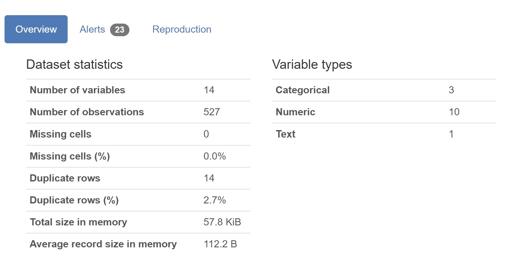

# Presentación


## ¡Conozcámonos!


¡Hola a todos!


¿Podrían compartir un poco sobre ustedes?


Digan su **Nombre**, su **profesión**, dónde **trabajan**, en qué **maestría** están y que les llama la **atención** sobre esta clase.


## ¡Conozcámonos!


:::: {.columns}


::: {.column width="70%"}
- Soy Oscar Bustos
- Ingeniero Metratrónico, PhD. (c) en Ingeniería - PUJ
- Docente Javeriano, Tech Manager en Mercadolibre
- Me gusta todo lo relacionado con IA / Advanced Analytics

:::


::: {.column width="30%"}
{width="100%"}
:::

::::


# Evaluación y Logística


## Estructura del Curso

- **Módulo 1 - Preparación de datos**
  - Talleres 20\%
- **Módulo 2 - Integración de datos**
  - Talleres 20\%
  - Parcial Taller Individual (Módulos 1 y 2) 20\%
  - Proyecto en Grupo 20\%
- **Módulo 3 - Herramientas de Big Data**
  - Talleres 20\%


## Reglas

- Todas las clases tienen un **taller práctico** asociado, para entregar antes de empezar la siguiente sesión
- Los talleres se resuelven y envían en **parejas**.<br>
- El proyecto en grupo debe ser integrado por **4 personas**, 2 parejas idealmente.<br>
- Todas las entregas se hacen a través del **Campus Virtual**<br>

## Reglas - Continuación

- Todas las clases son **presenciales**. No obstante, se pueden transmitir virtualmente a petición de algún estudiante.
- Las clases empiezan a las **6:10pm** y hay un descanso de 15 minutos a las **7:30pm**
- Esta es una clase **amigable con la IA**. Se promueve el uso de la IA para generación de código Python para que el estudiante se enfoque en el análisis de los datos.


## Lecturas

- Todas las clases tienen al menos una lectura asociada
- Todas los libros se encuentran en la plataforma de O'Reilly
- Se puede acceder a través de los recursos virtuales de la biblioteca en el siguiente enlace: [https://javeriana.libguides.com/az.php?a=o](https://javeriana.libguides.com/az.php?a=o)


## Libros de la Clase - Modulo 1


{width="30%"} 
{width="30%"} 
{width="30%"}


## Libros de la Clase - Modulo 2


{width="30%"} 
{width="30%"} 
{width="30%"} 


## Libros de la Clase - Modulo 3


{width="30%"} 
{width="30%"} 


# Motivación de la Clase


## Motivación


:::: {.columns}


::: {.column width="50%"}
Pensando en su trabajo actual, ¿cuánto de su tiempo dedica a cada una de las siguientes tareas?
:::


::: {.column width="40%"}
{width="100%"}
:::

::::


[https://www.anaconda.com/resources/whitepaper/state-of-data-science-2020](https://www.anaconda.com/resources/whitepaper/state-of-data-science-2020)


## Motivación


:::: {.columns}


::: {.column width="50%"}
Qué pasa si no se preparan los datos?
:::


::: {.column width="40%"}
{width="100%"}
:::

::::


## Objetivos de Formación


Aprender las técnicas clave para **extraer y preparar datos **con fines analíticos en entornos **organizacionales**.

- Aprender los mecanismos de **recolección y consolidación** de información de distintas fuentes (bases de datos empresariales, fuentes abiertas, fuentes web)
- Realizar **preparación** y análisis básico de datos, incluyendo transformación y visualización, y opciones de manejo de datos perdidos y atípicos
- Comprender las implicaciones del manejo de **grandes volúmenes de datos** y cómo las tecnologías de big data contribuyen a su manejo apropiado.


## Cronograma


{width="80%"}


# Metodologías en Analítica


## Minería de Datos


{width="60%"}
Tomado de: Data Science for Business


## CRISP-DM


:::: {.columns}


::: {.column width="50%"}
CRoss-Industry Standard Process for Data Mining.
:::


::: {.column width="40%"}
{width="100%"}
Tomado de: Data Science for Business
:::

::::


## CRISP-DM: Comprensión del Negocio

Se debe pensar detenidamente sobre el **problema a resolver** y  el **escenario de uso**. Para ello se deben resolver las siguientes preguntas clave:
- ¿Qué exactamente queremos hacer?
- ¿Cómo exactamente lo haríamos?
- ¿Qué partes de este escenario de uso constituyen posibles modelos de minería de datos?
Basado en el principio de Data-Driven Decision Making


## CRISP-DM: Comprensión del Negocio

{width="80%"}


## CRISP-DM: Entendimiento de los Datos

- **Recopilación inicial de Datos**: Reunir todos los datos necesarios provenientes de diversas fuentes relevantes.
- **Descripción de los Datos**: Resumir las principales características de los datos recopilados, incluyendo medidas de tendencia central y dispersión.
- **Explorar los Datos**: Realizar un análisis exploratorio inicial para identificar patrones, relaciones y anomalías en los datos.
- **Verificar la calidad de los datos**: Asegurarse de que los datos sean precisos, completos y consistentes para garantizar su idoneidad para el análisis.
*Si la información no es suficiente para el problema de analítica, se puede regresar al proceso anterior.*


## CRISP-DM


{width="60%"}

Actividades del proceso CRISP-DM


# Herramientas


## Popularidad de los lenguajes de programación


{width="60%"}
Tomado de [https://www.tiobe.com/tiobe-index/](https://www.tiobe.com/tiobe-index/)


## Herramientas Sugeridas

\begin{table}[h]


| **Nombre** | **Descripción** | **Enlace** |
| --- | --- | --- |
| Google Colab | Herramienta de ambiente de ejecución en la nube para documentar y ejecutar código Python | [https://colab.research.google.com](https://colab.research.google.com) |
| Google Gemini | Modelo LLM para aprendizaje de programación Python | [https://gemini.google.com/](https://gemini.google.com/) |
| N8N | Plataforma de desarrollo de workflows | [https://n8n.io/](https://n8n.io/) |

\caption{Herramientas de IA}
\end{table}


## Google Colab


:::: {.columns}


::: {.column width="40%"}
Ambiente de desarrollo en Python o R para el análisis de datos. Permite la ejecución en la nube de programas, con una cantidad generosa de recursos.
:::


::: {.column width="60%"}
{width="100%"}
:::

::::


## Google Colab con Gemini


:::: {.columns}


::: {.column width="40%"}
Cuenta con el chat de Gemini embebido en el ambiente de desarrollo. Asiste en la escritura de código.
:::


::: {.column width="60%"}
{width="100%"}
:::

::::


## Análisis Exploratorio de Datos


:::: {.columns}


::: {.column width="50%"}
**Prompt**: Haz un analisis exploratorio de datos del archivo de github datasciencedojo titanic.csv usando la librería ydata-profiling. Instala la ultima version disponible de la libreria.
:::


::: {.column width="50%"}
{width="100%"}
:::

::::


## Ejemplo de Código: EDA

```python
import pandas as pd

# Define the URL for the dataset
titanic_url = "https://raw.githubusercontent.com/datasciencedojo/datasets/master/titanic.csv"

# Read the CSV file into a pandas DataFrame
df = pd.read_csv(titanic_url)

# Display the first few rows of the DataFrame to verify it loaded correctly
print("Dataset loaded successfully. First 5 rows:")
print(df.head())
```


## Ejemplo de Código: EDA

```python
from ydata_profiling import ProfileReport

# Generate the profile report
profile = ProfileReport(df, title="Titanic Dataset Profile Report")

print("Profile report generated successfully.")
profile.to_notebook_iframe()
```


## Análisis Exploratorio de Datos


:::: {.columns}


::: {.column width="40%"}
**Prompt**: Haz un analisis exploratorio de datos del archivo de github datasciencedojo titanic.csv usando la librería ydata-profiling. Instala la ultima version disponible de la libreria.
:::


::: {.column width="60%"}
{width="100%"}
:::

::::


## References

::: {#refs}
:::


