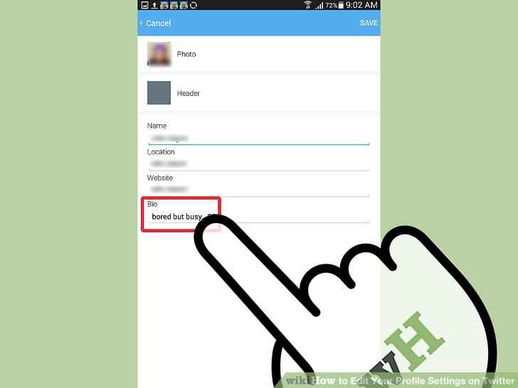
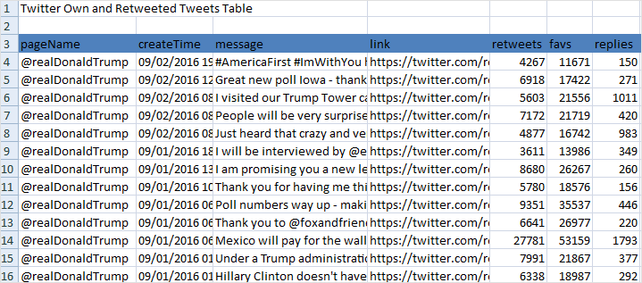
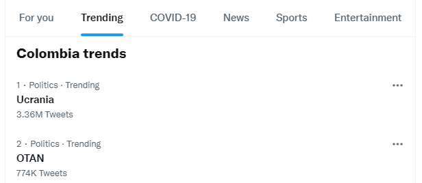
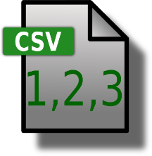
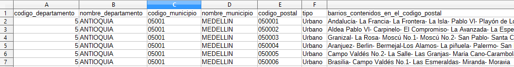
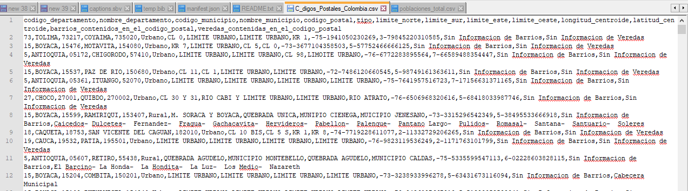
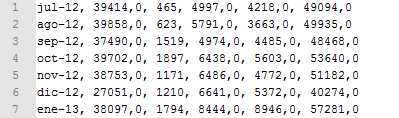
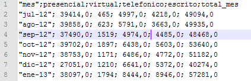
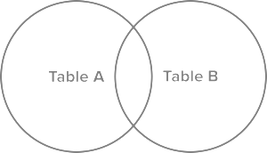

<style>
.reveal figcaption {
  text-align: center !important;
}
.smaller-text {
  font-size: 0.75em !important;
}
</style>

# Ciclo de Vida de Ingeniería de Datos

## ¿Qué es Ingeniería de Datos?

- **Definición:** Desarrollo e implementación de arquitecturas para transformar datos crudos en activos útiles.
- **Propósito:** Servir datos confiables para análisis, Machine Learning y toma de decisiones.
- **Enfoque actual:** Del software monolítico a ecosistemas modulares en la nube.
- **Principio clave:** La tecnología cambia rápido; los fundamentos del ciclo de vida perduran.

## El Ciclo de Vida de los Datos

- Movimiento continuo desde la generación hasta el consumo:
  1. **Generación:** Creación de datos en sistemas fuente.
  2. **Ingesta:** Captura y transporte inicial.
  3. **Almacenamiento:** Persistencia estructurada o cruda.
  4. **Transformación:** Limpieza, modelado y agregación.
  5. **Servicio:** Entrega para BI, analítica y ML.

## Subcorrientes (Undercurrents)

- Factores que cruzan transversalmente todas las etapas:

::: {.columns}
::: {.column width="50%"}
- **Seguridad y Privacidad**
- **Data Management**
- **DataOps**
:::
::: {.column width="50%"}
- **Arquitectura de Datos**
- **Orquestación (DAGs)**
- **Ingeniería de Software**
:::
:::

# Dominios de Datos

## Dominios en una Organización

- ¿Cuáles son los tipos de datos que habitan en la empresa?
- **Metadatos:** Contexto que da significado a los datos.
- **Datos Maestros (MDM):** Entidades clave del negocio.
- **Datos Operacionales:** Transacciones de soporte al día a día.
- **Datos No Estructurados:** Contenido enriquecido sin esquema fijo.
- **Datos Analíticos:** Información procesada para decisiones.

## El Rol de los Metadatos

- **Concepto central:** "Datos acerca de los datos".
- Permiten transformar datos crudos en información útil.
- **Oportunidad y actualización:** Deben reflejar la realidad del negocio en todo momento.
- **Puente Negocio-IT:** Aseguran un vocabulario común entre analistas e ingenieros.

## Clasificación de Metadatos

- **Metadatos Técnicos:**
  - Esquemas de bases de datos, tipos de datos e índices.
  - Diagramas Entidad-Relación y linaje de transformaciones.
- **Metadatos de Negocio:**
  - Glosario corporativo, definiciones de métricas y SLAs.
  - Asignación de responsables (*Data Stewards*).
- **Metadatos Operacionales:**
  - Logs de ejecución, tiempos de carga y volumen procesado.

## Metadatos Técnicos: Ejemplo

::: {.columns}
::: {.column width="50%"}
- Especificaciones de tablas y llaves.
- Tipos de datos por atributo (`VARCHAR`, `INT`).
- Restricciones de integridad y relaciones ER.
- Diccionario de datos del sistema.
:::
::: {.column width="50%"}
{height="320px" fig-align="center"}
:::
:::

## Metadatos de Negocio: Ejemplo

::: {.columns}
::: {.column width="50%"}
- Mapeo de procesos de negocio.
- Reglas operativas y validaciones de dominio.
- Definición formal de métricas (p.ej. *Customer Churn*).
- Alineación estratégica entre áreas.
:::
::: {.column width="50%"}
{height="320px" fig-align="center"}
:::
:::

## Datos Maestros (MDM)

- **Entidades centrales del negocio:**
  - Clientes, Productos, Proveedores, Ubicaciones.
- Representan los sustantivos clave de la organización.
- **La confianza es crítica:** Son el punto de unión de múltiples aplicaciones.
- *¿Qué sucede cuando los datos maestros no son confiables?*
  - Clientes duplicados, reportes inconsistentes y pérdidas financieras.

## Datos Operacionales

- Datos derivados de las transacciones directas del negocio.
- **Características:**
  - Estructurados y con alto nivel de granularidad.
  - Alcance típicamente local (*Line of Business*).
  - Volatilidad alta (inserciones y actualizaciones constantes).
- Su calidad determina la viabilidad de los datos analíticos.

## Datos No Estructurados

- Propósito operacional y documental:
  - Contratos en PDF, notas de CRM, imágenes y correos.
- Suelen ser "fotos instantáneas" estáticas de un proceso.
- **Desafío:** Pérdida de contexto o precisión en el tiempo.
- Requieren almacenamiento y procesamiento especializado.

## Datos Analíticos

- Se derivan de los datos operacionales y maestros.
- **Procesos clave para producirlos:**
  - Integración de fuentes heterogéneas.
  - Limpieza, deduplicación y estandarización.
  - Enriquecimiento con lógica de negocio.
- **Criterios de éxito:** Precisión, consistencia y oportunidad.

## Modelo de Referencia de Información

- **1. Metadatos:** Especifican reglas y definiciones.
- **2. Datos Maestros:** Creados según las reglas de metadatos.
- **3. Operacionales y No Estructurados:** Referencian a los maestros.
- **4. Datos Analíticos:** Consolidados a partir de los dominios anteriores.

# Caso de Estudio: Twitter / X

## Twitter: Metadatos y Datos Maestros

::: {.columns}
::: {.column width="50%"}
- **Metadatos:**
  - Estructura del JSON de un tweet.
  - Tipos de datos de cuenta y timestamp.
- **Datos Maestros:**
  - Identificadores de usuario (`user_id`).
  - Grafos de seguimiento (*followers/following*).
:::
::: {.column width="50%"}
{height="280px" fig-align="center"}
:::
:::

## Twitter: Operacionales y No Estructurados

::: {.columns}
::: {.column width="50%"}
- **Datos Operacionales:**
  - Registro de tweets publicados y retweets.
  - Logs de autenticación y peticiones API.
- **Datos No Estructurados:**
  - Texto libre del tweet.
  - Imágenes adjuntas, memes y videos.
:::
::: {.column width="50%"}
{height="280px" fig-align="center"}
:::
:::

## Twitter: Datos Analíticos

::: {.columns}
::: {.column width="50%"}
- **Productos analíticos derivados:**
  - Detección de *Trending Topics* en tiempo real.
  - Métricas de engagement y alcance publicitario.
  - Modelos de recomendación de contenido en el feed.
:::
::: {.column width="50%"}
{height="280px" fig-align="center"}
:::
:::

# Sistemas Fuente y Generación de Datos

## ¿Qué es un Sistema Fuente?

- Origen primario de los datos dentro del ciclo de vida.
- **Realidad técnica:** Generalmente fuera del control del ingeniero de datos.
- Aplicaciones web, móviles, ERPs, CRMs, dispositivos IoT y APIs SaaS.
- Su disponibilidad y estabilidad condicionan todo el pipeline.

## OLTP vs OLAP

::: {.columns}
::: {.column width="50%"}
**OLTP (Transaccional)**
- Consultas puntuales y rápidas.
- Alto volumen de lecturas y escrituras.
- Esquemas altamente normalizados.
- Prioriza baja latencia e integridad ACID.
:::
::: {.column width="50%"}
**OLAP (Analítico)**
- Consultas agregadas sobre millones de filas.
- Cargas en lote o micro-lote.
- Esquemas desnormalizados o dimensionales.
- Prioriza velocidad de escaneo y cómputo.
:::
:::

## CRUD vs Insert-Only

- **CRUD Tradicional:**
  - Permite modificar o borrar registros en sitio (*in-place update*).
  - Se pierde el historial de estados previos del registro.
- **Patrón Insert-Only:**
  - Cada cambio se almacena como un nuevo registro inmutable.
  - Facilita auditoría, análisis temporal y replicación confiable.

## Logs de Base de Datos y WAL

- **Write-Ahead Logging (WAL):**
  - Mecanismo que registra cada cambio antes de aplicarlo al almacenamiento.
- **Log Binario:**
  - Secuencia inmutable y ordenada de transacciones completadas.
- **Ventaja analítica:** Es la fuente más fidedigna para Change Data Capture.

## Change Data Capture (CDC)

- **Propósito:** Capturar cambios (inserciones, actualizaciones, borrados) en la BD fuente.
- **Batch CDC:** Consulta periódica por columna `updated_at`.
  - *Limitación:* Pierde estados intermedios entre ejecuciones.
- **Continuous CDC:** Lectura directa del log de transacciones (p.ej. Debezium + Kafka).
  - *Ventaja:* Transmisión en tiempo real sin impacto severo en la BD OLTP.

## Tipos de Tiempo en Datos

- Comprender el tiempo es crítico para analítica y streaming:
  - **Event Time:** Momento exacto en que ocurrió el evento en el mundo real.
  - **Ingestion Time:** Momento en que el evento entra al sistema de ingesta.
  - **Processing Time:** Momento en que el motor ejecuta la transformación.
- *Buenas prácticas:* Siempre basar la analítica en **Event Time**.

## APIs y Conectividad Externa

- **REST APIs:** Estándar HTTP sobre JSON; común en plataformas SaaS.
- **GraphQL:** Permite al cliente especificar exactamente los campos requeridos.
- **gRPC / Protobuf:** Alta eficiencia binaria sobre HTTP/2 para microservicios.
- **Desafíos:** Límites de peticiones (*rate limits*), paginación y esquemas volátiles.

## Webhooks (Reverse APIs)

- **Patrón basado en eventos:**
  - La fuente realiza una petición HTTP POST hacia nuestro endpoint al ocurrir un evento.
- **Ventajas:** No requiere sondeo periódico (*polling*); reduce latencia.
- **Arquitectura típica:**
  - Endpoint receptor → Buffer en Cola/Stream → Almacenamiento seguro.

## Colas de Mensajes y Event Streams

- **Message Queues (p.ej. RabbitMQ, AWS SQS):**
  - Paso de mensajes transitorios entre servicios; se eliminan tras consumo.
- **Event Streaming (p.ej. Apache Kafka, AWS Kinesis):**
  - Registro inmutable y persistente de eventos ordenados por partición.
  - Permite reproducción histórica (*replay*) y múltiples consumidores independientes.

## Data Contracts y SLAs Upstream

::: {.callout-note}
### Data Contract
Acuerdo formal entre el equipo dueño del sistema fuente y el equipo de ingeniería de datos sobre esquemas, tipos, frecuencias y calidad.
:::

- **SLA (Service Level Agreement):** Expectativas de disponibilidad y puntualidad.
- **SLO (Service Level Objective):** Métricas técnicas concretas (p.ej. 99.9% uptime).
- Previene roturas silenciosas por cambios de esquema inesperados.

# Almacenamiento y Plataformas de Datos

## El Rol Central del Almacenamiento

- El almacenamiento subyace a todas las fases del ciclo de vida.
- Los datos se almacenan múltiples veces: crudos, intermedios y servidos.
- La elección depende de latencia requerida, volumen, tasa de mutación y presupuesto.

## Jerarquía de Medios de Almacenamiento {.smaller}

| Tipo | Latencia Típica | Ancho de Banda | Costo |
|---|---|---|---|
| **Memoria RAM** | ~100 ns | ~100 GB/s | Muy Alto |
| **SSD (NVMe)** | ~0.1 ms | ~4 GB/s | Medio |
| **Disco Magnético (HDD)** | ~4 ms | ~250 MB/s | Bajo |
| **Object Storage (S3/GCS)** | ~100 ms | Ilimitado (teórico) | Muy Bajo |

## Temperatura de los Datos

- **Hot Data:**
  - Acceso continuo y milimétrico; alojado en RAM o SSDs.
- **Warm Data:**
  - Acceso periódico (semanal o mensual); alojado en object storage estándar.
- **Cold Data / Archival:**
  - Acceso esporádico (auditoría o legal); archivado en Glacier o Deep Archive.
- **Regla:** Automatizar políticas de ciclo de vida para abaratar costos.

## Block Storage vs Object Storage

- **Block Storage (EBS, discos locales):**
  - Modificación a nivel de bloques; ideal para bases de datos transaccionales.
- **Object Storage (AWS S3, Google Cloud Storage):**
  - Almacena objetos inmutables identificados por clave (*key-value*).
  - Alta durabilidad (11 nueves), escalabilidad elástica y bajo costo.
  - Base indiscutible de los Data Lakes modernos.

## Mapa General de Datos Analíticos

::: {.columns}
::: {.column width="45%"}
- **Flujo clásico:**
  - Sistemas fuente (ERP, CRM, archivos).
  - Bodega de datos centralizada.
  - Capa de consumo analítico (BI, OLAP, minería).
:::
::: {.column width="55%"}
{height="320px" fig-align="center"}
:::
:::

## Arquitectura de Bodegas de Datos

::: {.columns}
::: {.column width="40%"}
- Integración en múltiples capas:
  - **ODS:** Detalle operacional limpio.
  - **EDW:** Visión consolidada empresarial.
  - **Data Marts:** Orientados a áreas funcionales.
:::
::: {.column width="60%"}
{height="320px" fig-align="center"}
:::
:::

## ODS, EDW y Data Marts

- **Operational Data Store (ODS):**
  - Datos limpios, normalizados (3NF) y con máximo detalle.
  - Cubre ventanas cortas de tiempo; única fuente de verdad transaccional.
- **Enterprise Data Warehouse (EDW):**
  - Multidimensional e histórico; datos consolidados de toda la empresa.
- **Data Mart (DM):**
  - Subconjunto departamental (Ventas, Finanzas); optimizado para consultas rápidas.

## Del Data Warehouse al Data Lake

- **Data Warehouse Tradicional:**
  - Excelente para SQL sobre datos estructurados; costoso para escalar.
- **Data Lake (S3, HDFS):**
  - Repositorio central para datos estructurados, semi-estructurados y no estructurados.
  - Almacena datos en formato crudo sin esquema previo.
- **Riesgo:** Sin gobierno ni metadatos, se convierte en un *Data Swamp*.

## El Data Lakehouse

- Combina la flexibilidad del Data Lake con el gobierno del Data Warehouse.
- **Características clave:**
  - Almacenamiento en Object Storage con formatos abiertos (Parquet).
  - Capa de metadatos transaccional con soporte **ACID**.
  - Soporte para *time travel*, borrados selectivos y evolución de esquema.
- **Tecnologías:** Delta Lake, Apache Iceberg, Apache Hudi.

## Separación de Cómputo y Almacenamiento

- **Paradigma anterior:** Nodos con disco y procesador acoplados (Hadoop HDFS).
- **Paradigma moderno en la nube:**
  - Almacenamiento persistente y económico en Object Storage.
  - Cómputo elástico y efímero que se escala o apaga según la demanda.
- **Beneficio:** Reducción drástica de costos y escalabilidad independiente.

## Catálogo de Datos

- Repositorio centralizado de metadatos corporativos.
- **Funcionalidades esenciales:**
  - Búsqueda y descubrimiento de tablas y datasets.
  - Linaje de datos: rastreo del origen y transformaciones de cada campo.
  - Clasificación automática de datos sensibles (PII).
- **Herramientas:** Data Catalog (GCP), AWS Glue Catalog, OpenMetadata.

# Ingesta de Datos

## ¿Qué es la Ingesta de Datos?

- Proceso de mover datos desde los sistemas fuente hacia el almacenamiento.
- **Ingesta vs Integración:**
  - *Ingesta:* Transporte de datos de A hacia B.
  - *Integración:* Combinación y unificación semántica de múltiples fuentes.
- Es el punto de partida donde el ingeniero diseña los pipelines de datos.

## Datos Acotados vs No Acotados

- **Unbounded Data (No Acotados):**
  - Datos continuos que fluyen en tiempo real a medida que ocurren eventos.
- **Bounded Data (Acotados):**
  - Cortes finitos sobre los datos definidos por límites temporales o de volumen.
- *Mantra de ingeniería:* **Todo dato es no acotado hasta que decidimos acotarlo.**

## Frecuencia de Ingesta

- **Batch (Lotes):**
  - Ingesta programada (diaria, horaria) de grandes bloques de datos.
- **Micro-Batch:**
  - Ingesta en ventanas breves (cada pocos minutos o segundos).
- **Real-Time / Streaming:**
  - Procesamiento evento por evento con latencias sub-segundo.

## Ingesta Sincrónica vs Asincrónica

- **Ingesta Sincrónica:**
  - Dependencias lineales y acopladas; el paso B no inicia sin el paso A.
  - Si un lote falla, todo el pipeline se detiene.
- **Ingesta Asincrónica:**
  - Desacoplamiento mediante buffers y colas de eventos.
  - Cada etapa procesa mensajes a su propio ritmo con alta tolerancia a fallos.

## Patrones de Ingesta en Lote

- **Full Snapshot:**
  - Extrae el estado completo de la tabla en cada ejecución; simple pero costoso.
- **Extracción Diferencial (Incremental):**
  - Extrae únicamente los registros modificados o creados desde la última corrida.
- **Recomendación:** Preferir extracción incremental para tablas de gran volumen.

## Desafíos en Ingesta Streaming

- **Schema Evolution:** Campos nuevos, renombrados o tipos modificados.
- **Schema Registry:** Servicio central que valida la compatibilidad productor-consumidor.
- **Datos Tardíos (*Late-Arriving Data*):** Eventos que llegan desordenados por latencia de red.
- **Time to Live (TTL):** Período de retención de mensajes antes de ser descartados.

## Manejo de Errores: Dead-Letter Queue

::: {.callout-warning}
### Dead-Letter Queue (DLQ)
Cola secundaria donde se redirigen los mensajes corruptos o que no cumplen el esquema para evitar bloquear el flujo principal.
:::

- Permite aislar errores sin detener la ingesta de eventos válidos.
- Facilita la auditoría, análisis de causa raíz y posterior reprocesamiento.

## Mecanismos de Conexión

- **Conexiones directas a BD:** Protocolos JDBC / ODBC para extracción SQL.
- **Conectores Gestionados (ELT SaaS):** Airbyte, Fivetran, Meltano.
  - Externalizan el mantenimiento de cientos de APIs y conectores.
- **Intercambio de archivos:** Carga directa a Object Storage vía SFTP o HTTPS.

# Extracción y Formatos de Archivo

## Fuentes de Datos Tabulares {.smaller}

| **Formato** | **Open Source** | **Tipos Complejos** | **Optimizado para** |
| --- | --- | --- | --- |
| **CSV** | Sí | No | Intercambio general y lectura humana |
| **EXCEL** | No (xlsx sí) | Sí | Análisis en hojas de cálculo |
| **PARQUET** | Sí | Sí | Analítica Big Data, compresión columnar |
| **ORC** | Sí | Sí | Ecosistemas Hadoop / Hive |
| **FEATHER / ARROW** | Sí | Sí | Cero-copia en memoria, alto rendimiento |
| **SQL** | Estándar | No | Extracción relacional |

## Fuentes de Datos Jerárquicas {.smaller}

| **Formato** | **Open Source** | **Tipos Complejos** | **Optimizado para** |
| --- | --- | --- | --- |
| **JSON** | Sí | Sí | Intercambio web y APIs REST |
| **XML** | Sí | Sí | Intercambio corporativo estructurado |
| **AVRO** | Sí | Sí | Streaming de datos con esquema binario |
| **HDF5** | Sí | Sí | Datos científicos y matriciales masivos |
| **PICKLE** | Sí | Sí | Serialización nativa de objetos Python |

## Formato CSV (Comma-Separated Values)

- Archivo de texto plano organizado en filas y columnas delimitadas.
- **Estructura básica:**
  - La primera fila suele contener los encabezados de columna.
  - Cada línea debe mantener el mismo número de campos.
- **Herramientas de inspección:** Notepad++, VS Code, LibreOffice.
- *Nota:* Evitar Excel para validar CSVs en producción por alteración de tipos.

## CSV: Inspección Visual

::: {.columns}
::: {.column width="50%"}
**Notepad++ (Texto Plano)**
{height="280px" fig-align="center"}
:::
::: {.column width="50%"}
**LibreOffice Calc (Estructura)**
{height="280px" fig-align="center"}
:::
:::

## Opciones Críticas de Formato CSV

- **Separadores:** Coma (`,`), punto y coma (`;`), tabulador (`\t`).
- **Encabezados:** Opcionales pero altamente recomendados.
- **Comillas (*Quoting*):**
  - Permiten incluir el caracter delimitador dentro de un texto.
  - Preservan ceros a la izquierda en identificadores (p.ej. `"01800"`).
  - Evitan conversiones erróneas a valores numéricos.

## CSV: Comparativa de Opciones

::: {.columns}
::: {.column width="50%"}
- Delimitador `;` con comillas.
- Conserva textos limpios y cabecera.
{height="220px" fig-align="center"}
:::
::: {.column width="50%"}
- Delimitador `,` sin comillas.
- Riesgo de fragmentación de columnas.
{height="220px" fig-align="center"}
:::
:::

## Almacenamiento por Filas vs Columnar

- **Row-Oriented (CSV, PostgreSQL):**
  - Registros contiguos en disco; óptimo para consultas `SELECT * WHERE id=1`.
- **Column-Oriented (Parquet, BigQuery, Snowflake):**
  - Cada columna se almacena en bloques separados.
  - Lee únicamente las columnas consultadas; altísima compresión.
  - Ideal para analítica: `SELECT AVG(price), SUM(qty) FROM sales`.

## Formatos Modernos: Parquet, Avro, Arrow

- **Apache Parquet:** Formato columnar binario; estándar para analítica y Data Lakes.
- **Apache Avro:** Formato por filas basado en esquemas JSON; estándar para Kafka.
- **Apache Arrow:** Formato columnar en memoria para intercambio ultrarrápido sin serialización.

## Destinos de Carga (L)

- **CSV:**
  - *Ventajas:* Texto plano universal e interoperable.
  - *Desventajas:* Sin tipos nativos; pesado y propenso a errores de parseo.
- **Excel:**
  - *Ventajas:* Fácil de consumir por usuarios finales.
  - *Desventajas:* Tamaño grande, límites de filas (1M) y formato cerrado.
- **Parquet / Cloud Storage:**
  - *Ventajas:* Tipado estricto, compresión superior y lectura selectiva.

## Schema on Write vs Schema on Read

- **Schema on Write (Data Warehouse):**
  - El esquema se define antes de cargar los datos; rechaza datos no conformes.
  - *Ventaja:* Máxima consistencia y calidad garantizada.
- **Schema on Read (Data Lake):**
  - Los datos crudos se cargan sin validación; el lector aplica el esquema al consultar.
  - *Ventaja:* Gran agilidad de ingesta a costa de mayor complejidad de consulta.

# Bases de Datos y Consultas SQL

## ¿Qué es un DBMS?

- **Database Management System:** Software que gestiona el almacenamiento, consulta y seguridad de los datos.
- Actúa como intermediario estructurado entre usuarios y almacenamiento físico.
- Garantiza propiedades ACID en entornos transaccionales.
- **SQL:** Lenguaje declarativo estándar universal para interactuar con motores relacionales.

## Familias de Comandos SQL

- **DDL (Data Definition):** Define estructuras (`CREATE`, `ALTER`, `DROP`).
- **DML (Data Manipulation):** Opera sobre registros (`SELECT`, `INSERT`, `UPDATE`, `DELETE`).
- **DCL (Data Control):** Administra permisos (`GRANT`, `REVOKE`).
- **TCL (Transaction Control):** Gestiona transacciones (`COMMIT`, `ROLLBACK`).

## El Ciclo de Vida de una Consulta

- Cuando enviamos una consulta SQL al motor:
  1. **Parsing & Validación:** Revisa sintaxis, tablas y permisos.
  2. **Generación de Bytecode:** Traduce la consulta a un plan lógico.
  3. **Optimización:** El optimizador reordena filtros y elige índices.
  4. **Ejecución:** Escanea los datos y devuelve el conjunto de resultados.

## El Optimizador y el Explain Plan

- El optimizador busca el plan de ejecución de menor costo computacional.
- **Comando `EXPLAIN`:** Muestra la ruta física elegida por el motor.
- **Métricas clave a monitorear:**
  - Volumen de datos escaneados vs datos devueltos.
  - Uso de índices vs escaneos completos de tabla (*Sequential Scan*).
  - Cantidad de datos transferidos entre nodos (*Shuffle*).

## Operaciones JOIN en SQL

::: {.columns}
::: {.column width="50%"}
- **Inner Join:** Coincidencias en ambas tablas.
- **Left Join:** Toda la izquierda + coincidencias.
- **Right Join:** Toda la derecha + coincidencias.
- **Full Join:** Unión total de registros.
:::
::: {.column width="50%"}
{height="280px" fig-align="center"}
:::
:::

## Selección y Filtrado: SELECT / WHERE

- **Sintaxis:** `SELECT <columnas> FROM <tabla> WHERE <condicion>`
- **Operadores compuestos:** `AND`, `OR`, `IN`, `BETWEEN`

```sql
SELECT Company, Product
FROM consumercomplaints
WHERE `Zip Code` = 19145
  AND `Submitted via` = 'Phone';
```

## Agrupaciones: GROUP BY

- Genera una fila por cada combinación única de columnas agrupadas.
- `SELECT` solo admite columnas del `GROUP BY` y funciones de agregación.

```sql
SELECT Company, COUNT(*) AS total_quejas
FROM consumercomplaints
GROUP BY Company
ORDER BY total_quejas DESC;
```

## Optimización: Pruning y Evitar Scans

- **Evitar `SELECT *`:** En motores columnares lee columnas innecesarias y multiplica el costo.
- **Partition Pruning:** Filtrar por la columna de partición (p.ej. fecha) evita leer particiones ajenas.
- **Clustering:** Ordena físicamente los datos dentro de cada partición para búsquedas ultra-rápidas.
- **Uso de Caché:** Reutilizar resultados de consultas frecuentes sin volver al disco.

# Modelado de Datos

## ¿Qué es el Modelado de Datos?

- Estructuración deliberada de los datos para reflejar la lógica del negocio.
- Asegura definiciones unificadas en toda la organización (p.ej. *¿qué es un cliente activo?*).
- Reduce inconsistencias y optimiza el rendimiento de las consultas.
- Es el puente entre los requerimientos analíticos y las bases de datos físicas.

## Niveles de Modelado

- **Conceptual:**
  - Entidades principales y relaciones de alto nivel (Diagrama ER básico).
- **Lógico:**
  - Detalle de atributos, tipos de datos, llaves primarias y foráneas.
- **Físico:**
  - Implementación concreta en el motor: tipos nativos, particiones e índices.
- **Grano:** Nivel de máxima resolución de un registro (p.ej. ítem por orden).

## Normalización y Objetivos de Codd

- Técnica para eliminar redundancias y garantizar integridad referencial.
- **1NF (Primera Forma Normal):** Atributos atómicos; sin listas ni campos anidados.
- **2NF (Segunda Forma Normal):** Cumple 1NF y elimina dependencias parciales de llave compuesta.
- **3NF (Tercera Forma Normal):** Cumple 2NF y elimina dependencias transitivas entre columnas no llave.

## Ejemplo de Normalización (1NF a 3NF)

- **Tabla Desnormalizada:**
  - `OrderID`, `OrderItems` (JSON anidado), `CustomerName`, `OrderDate`.
- **Paso a 1NF:** Extraer elementos a filas con llave `(OrderID, LineItem)`.
- **Paso a 2NF:** Separar en tabla `Orders` y tabla `OrderLineItem`.
- **Paso a 3NF:** Separar catálogo de productos a tabla `Products` (eliminar dependencia de `ProductName` respecto a `SKU`).

## Enfoque Inmon (Top-Down)

- Creado por Bill Inmon ("Padre del Data Warehouse").
- **Definición de Data Warehouse:**
  - *Sujeto-orientado, integrado, no volátil y variante en el tiempo.*
- **Estructura:**
  - Almacén central corporativo altamente normalizado en **3NF**.
  - Distribución downstream hacia **Data Marts** departamentales.
- Enfoque riguroso que prioriza una única versión de la verdad.

## Enfoque Kimball (Bottom-Up)

- Creado por Ralph Kimball; orientado a la usabilidad del negocio.
- Modela los datos directamente en esquemas dimensionales:
  - **Tablas de Hechos (Facts):** Eventos numéricos e inmutables (métricas).
  - **Tablas de Dimensiones:** Contexto descriptivo (quién, cuándo, dónde).
- **Star Schema (Esquema Estrella):** Una tabla de hechos central rodeada de dimensiones.

## Hechos y Dimensiones

::: {.columns}
::: {.column width="50%"}
**Tabla de Hechos**
- Claves foráneas + métricas numéricas.
- Estrecha y muy larga (millones de filas).
- Granularidad atómica e inmutable.
:::
::: {.column width="50%"}
**Tabla de Dimensiones**
- Atributos descriptivos y textos.
- Ancha y relativamente corta.
- Desnormalizada para evitar joins complejos.
:::
:::

## Dimensiones de Cambio Lento (SCD)

- Mecanismos para gestionar la evolución de atributos en el tiempo:
  - **SCD Tipo 1:** Sobrescribe el valor anterior; no guarda histórico.
  - **SCD Tipo 2:** Inserta una nueva fila con fechas de validez (`start_date`, `end_date`, `is_current`).
  - **SCD Tipo 3:** Añade una nueva columna para el valor previo y actual.
- *Uso común:* **SCD Tipo 2** es el estándar de la industria.

## Enfoque Data Vault

- Diseñado para máxima agilidad, trazabilidad e ingesta distribuida.
- Modelo 100% **Insert-Only** compuesto por tres entidades:
  - **Hubs:** Contienen las llaves de negocio únicas y hashes.
  - **Links:** Mapean las relaciones entre múltiples Hubs.
  - **Satellites:** Contienen atributos descriptivos y contexto temporal.
- Permite cambios en fuentes sin reestructurar el modelo global.

## Tablas Anchas y Desnormalizadas

- En almacenes analíticos modernos (BigQuery, Snowflake), el almacenamiento es económico.
- **Wide Tables (One Big Table - OBT):**
  - Consolida hechos y dimensiones en una sola tabla ancha con campos anidados.
- **Ventaja:** Elimina operaciones de JOIN y acelera escaneos masivos.
- **Desventaja:** Pérdida de modularidad y mayor costo en mutaciones complejas.

# Transformaciones y Procesamiento

## ¿Qué es una Transformación?

- Proceso de convertir datos crudos en conjuntos estructurados y enriquecidos.
- **Diferencia con una consulta:**
  - Una *consulta* recupera datos temporalmente.
  - Una *transformación* **persiste** los resultados para consumo downstream.
- Implica limpieza, unión, enriquecimiento, agregación y modelado.

## Patrones: ETL vs ELT

- **ETL Tradicional:**
  - Extrae → Transforma en servidor externo → Carga en el Data Warehouse.
  - Impuesto históricamente por límites de almacenamiento en la BD destino.
- **ELT Moderno:**
  - Extrae → Carga datos crudos al Data Lake/Warehouse → Transforma con SQL en el motor.
  - Aprovecha el poder de cómputo elástico de la nube.

## Joins Distribuidos: Broadcast Join

- Ocurre cuando una tabla grande se cruza con una **tabla pequeña**.
- El motor replica (*broadcast*) la tabla pequeña a **todos los nodos**.
- Cada nodo une localmente su porción de la tabla grande con la copia local.
- **Resultado:** No se mueven datos masivos por la red; es el join más eficiente.
- *Estrategia:* Aplicar filtros antes del join para reducir el tamaño de la tabla grande.

## Joins Distribuidos: Shuffle Hash Join

- Se utiliza cuando **ambas tablas son masivas** y no caben en memoria.
- El motor aplica una función hash sobre la llave de cruce.
- Redistribuye filas con el mismo hash al mismo nodo a través de la red (*Shuffle*).
- Es una de las operaciones más costosas en cómputo distribuido (Spark / Trino).

## Consultas Streaming: Ventanas de Tiempo

- En datos continuos, las agregaciones se calculan sobre ventanas:
  - **Tumbling / Fixed Window:** Ventanas fijas sin solapamiento (p.ej. cada 5 min).
  - **Sliding Window:** Ventanas de duración fija que avanzan con mayor frecuencia.
  - **Session Window:** Agrupa eventos por actividad y cierra tras periodos de inactividad.

## Watermarks y Datos Tardíos

::: {.callout-note}
### Watermark
Límite temporal que define hasta cuándo el motor esperará eventos rezagados antes de dar por cerrada una ventana de procesamiento.
:::

- Permite emitir resultados consistentes frente a latencias de red en IoT y móviles.
- Los eventos que llegan después del watermark se descartan o desvían a DLQ.

## Vistas Materializadas y Virtualización

- **Vista Estándar:** Consulta guardada que se ejecuta en caliente cada vez.
- **Vista Materializada:** Precomputa y almacena físicamente el resultado de la consulta.
  - Se actualiza periódicamente o de forma incremental.
- **Virtualización de Datos:** Permite consultar múltiples motores federados sin mover los datos.

## Herramientas Modernas de Transformación

- **SQL Declarativo:** Estándar universal para expresar transformaciones analíticas.
- **dbt (data build tool):** Orquestación modular de transformaciones SQL con control de versiones y tests.
- **Apache Spark / PySpark:** Motor de procesamiento distribuido para grandes volúmenes y lógica procedimental compleja.

# Referencias y Recursos

## Recursos y Datasets Públicos

- **Portales de Datos Abiertos:**
  - [Datos Abiertos Colombia](https://www.datos.gov.co/)
  - [Data.gov (Estados Unidos)](https://www.data.gov/)
  - [Awesome Public Datasets (GitHub)](https://github.com/caesar0301/awesome-public-datasets)
- **Recursos SQL y Práctica:**
  - [W3Schools SQL Tutorial](https://www.w3schools.com/sql/default.asp)
  - [SQL Join Visualizer](https://joins.spathon.com/)

## Bibliografía Principal

- **Reis, J. & Housley, M.** (2022). *Fundamentals of Data Engineering*. O'Reilly Media.
- **Kimball, R. & Ross, M.** (2013). *The Data Warehouse Toolkit* (3rd ed.). Wiley.
- **Inmon, W. H.** (2005). *Building the Data Warehouse* (4th ed.). Wiley.
- **Beaulieu, A.** (2020). *Learning SQL* (3rd ed.). O'Reilly Media.
- **Kleppmann, M.** (2017). *Designing Data-Intensive Applications*. O'Reilly Media.
- **Giordano, A.** (2011). *Data Integration Blueprint and Modeling Techniques*. IBM Press.
