<style>
.reveal figcaption {
  text-align: center !important;
}
.smaller-text {
  font-size: 0.75em !important;
}
.tiny-text {
  font-size: 0.55em !important;
}
</style>

# Repaso y Contexto

## ¿Dónde estamos en el Camino?

:::: {.columns}

::: {.column width="45%"}
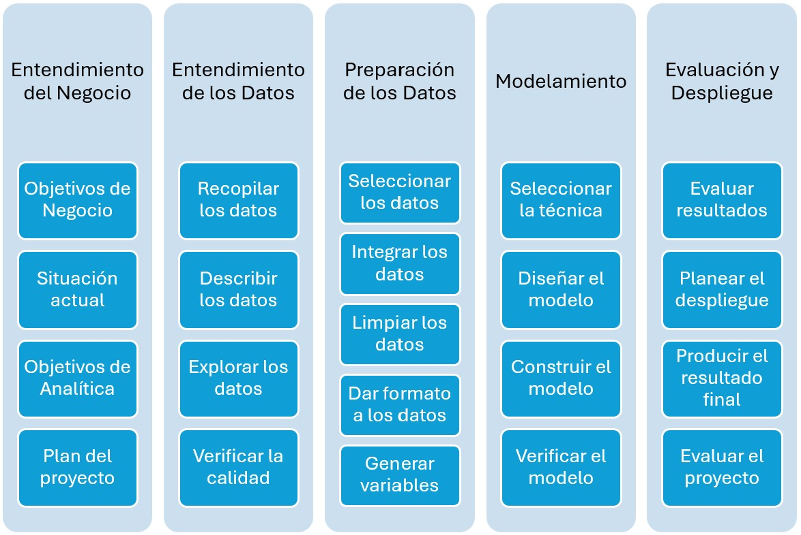{height="360px" fig-align="center"}
:::

::: {.column width="55%"}
- **Sesión 1:** Metodologías y EDA.
- **Sesión 2:** Limpieza Niveles I, II y III.
- **Sesión 3:** Preparación de la *Vista Minable*.
- **Hoy (Sesión 4):** Fundamentos de Ingeniería y Extracción Tabular.
:::

::::

## De la Vista Minable a la Ingeniería

:::: {.columns}

::: {.column width="55%"}
**Del consumo a la infraestructura:**

- La **Vista Minable** prepara datos para algoritmos y analítica.
- En producción: ¿de dónde vienen los datos y cómo se transportan?
- La **Ingeniería de Datos** diseña el flujo integral del dato.
:::

::: {.column width="45%"}
::: {.callout-tip}
### El Ecosistema
- **Vista Minable:** Transformación y Serving.
- **Data Engineering:** Ciclo de vida completo.
:::
:::

::::

## Tarea / Asignación

:::: {.columns}

::: {.column width="60%"}
1. Leer el Capítulo 2 (*The Data Engineering Lifecycle*) del libro *Fundamentals of Data Engineering* @reis2022fundamentals.
2. Explorar el [Cuaderno de Google NotebookLM](https://notebook.google.com/notebook/e264194c-f040-4edc-a1b7-1872f181a0bf):
   - Revisar los conceptos y preguntas clave.
   - Completar los quices interactivos y podcast resumen.
:::

::: {.column width="40%"}
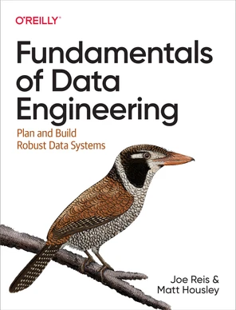{height="400px" fig-align="center"}
:::

::::

# 1. El Ciclo de Vida de los Datos

## El Lifecycle en una Imagen

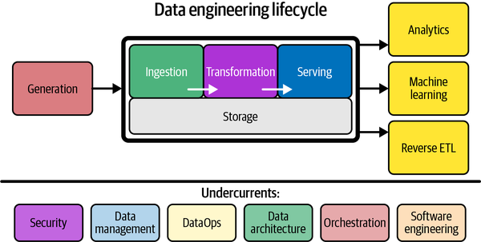{height="420px" fig-align="center"}

## Las 5 Etapas del Lifecycle

- **Generación:** El dato nace en sistemas fuente (apps, IoT, APIs).
- **Almacenamiento:** Persiste en distintas capas según su uso.
- **Ingesta:** Se mueve hacia el sistema analítico.
- **Transformación:** Se limpia, modela y enriquece.
- **Serving:** Se consume: dashboards, ML, Reverse ETL.

::: {.callout-note}
Storage es transversal: aparece en todas las etapas del ciclo.
:::

## Los Undercurrents

Factores que sostienen *todas* las etapas del ciclo de vida.

- **Seguridad:** Principio de mínimo privilegio, encriptación.
- **Data Management:** Gobierno, calidad y metadatos.
- **DataOps:** Automatización, testing y observabilidad.
- **Data Architecture:** Diseño de sistemas escalables.
- **Orquestación:** Coordina cuándo y cómo se ejecuta cada proceso.
- **Ingeniería de Software:** Fundamentos para construir pipelines robustos.

# 2. Data Management y Metadatos

## ¿Qué es Data Management?

Según DAMA (DMBOK) [@dama2017dmbok], data management es:

> *El desarrollo, ejecución y supervisión de planes y prácticas que controlan, protegen y mejoran el valor de los datos a lo largo de su ciclo de vida.*

- Cubre: gobierno, modelado, linaje, calidad, privacidad.
- El data engineer opera como un **gestor del ciclo de vida** del dato.
- Sin un marco de gestión, el dato queda inerte o es indigno de confianza.

## Metadatos: Datos sobre Datos

Los metadatos proveen **contexto** para descubrir, entender y gobernar datos.

DMBOK identifica cuatro categorías principales:

1. **Business Metadata:** Definiciones de negocio (apoyado por el **Catálogo de Datos**).
2. **Technical Metadata:** Esquemas, pipelines y **Linaje de Datos**.
3. **Operational Metadata:** Logs de ejecución, job IDs, errores.
4. **Reference Metadata:** Códigos internos, geográficos, calendarios.

## Business Metadata

::: {.columns}
::: {.column width="45%"}
- Responde a: ¿Qué es un "cliente"? ¿Qué define una "venta"?
- Incluye: definiciones, reglas, propietarios.
- Su ausencia causa interpretaciones incorrectas.
- **Herramientas:** Data dictionaries, data catalogs.
:::
::: {.column width="55%"}
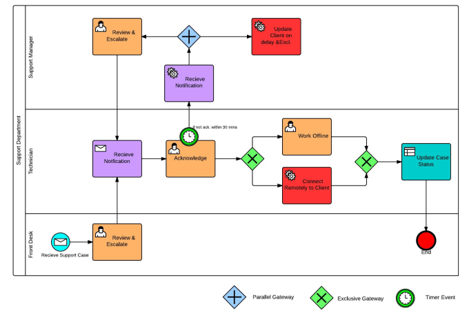{height="340px" fig-align="center"}
:::
:::

## Business Metadata: Catálogo de Datos

- Repositorio centralizado de metadatos de toda la organización.
- Permite buscar, descubrir y documentar datasets.
- Integra linaje, descripciones editables y escaneo automático.

## Technical Metadata

::: {.columns}
::: {.column width="45%"}
- Describe la **estructura y el flujo** del dato en los sistemas.
- **Esquemas:** tipos de columnas, relaciones (ERD), constraints.
- **Pipeline:** schedules, dependencias.
- Generado automáticamente por orquestadores.
:::
::: {.column width="55%"}
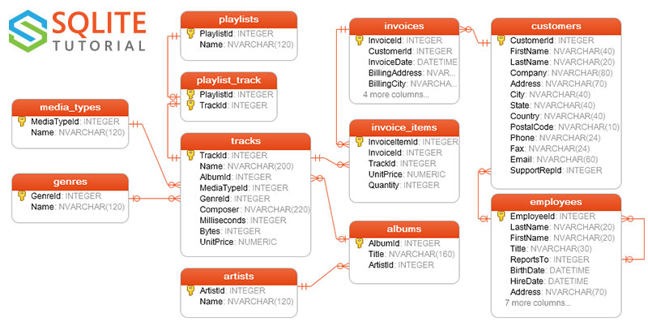{height="340px" fig-align="center"}
:::
:::

## Ejercicio: Diagrama ER con IA

Diseña un esquema relacional con [dbdiagram.io](https://dbdiagram.io/home) y un LLM:

1. **Prompt en ChatGPT / Gemini:**
   > *"Genera el código DBML para dbdiagram.io de un modelo de fútbol simple con tablas: Equipo, Jugador, Partido y Cancha con sus claves primarias y foráneas."*
2. **Visualización:**
   - Copia el código DBML generado por la IA.
   - Pégalo en [dbdiagram.io](https://dbdiagram.io/home) para explorar el diagrama interactivo.

## Technical Metadata: Linaje de Datos

::: {.columns}
::: {.column width="40%"}
- Audit trail del dato a través del ciclo de vida.
- Si falla una fuente, revela qué dashboards estarán afectados.
- Facilita cumplimiento de regulaciones (ej. GDPR).
:::
::: {.column width="60%"}
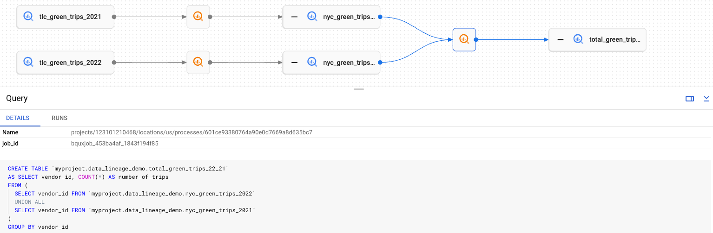{height="340px" fig-align="center"}
:::
:::

## Ejercicio: Linaje de Datos con IA

Modela el linaje de unificación de ligas con [dbdiagram.io](https://dbdiagram.io/home):

1. **Prompt en ChatGPT / Gemini:**
   > *"Genera código DBML para dbdiagram.io que represente el linaje de 3 ligas de fútbol origen (Premier League en inglés, Serie A en italiano y LaLiga en español con columnas en su idioma) conectadas a una tabla destino unificada (unified_matches). https://docs.dbdiagram.io/release-notes/2026-08-data-lineage/"*
2. **Visualización:**
   - Copia el código DBML y pégalo en [dbdiagram.io](https://dbdiagram.io/home) para explorar el linaje.

## Operational Metadata

- **Estadísticas de procesos:** duración, registros procesados, errores.
- Esencial para observabilidad y prácticas de DataOps.
- Aún suele estar disperso en múltiples sistemas.

## Reference Metadata

::: {.columns}
::: {.column width="50%"}
- **Tablas de lookup:** datos para clasificar otros datos.
- Cambian lentamente en el tiempo.
- Ejemplos: países, monedas, unidades.
:::
::: {.column width="50%"}
| ISO | País | Moneda |
|:---|:---|:---|
| CO | Colombia | COP |
| MX | México | MXN |
| AR | Argentina | ARS |
| ES | España | EUR |
:::
:::

# 3. Arquitectura de Datos

## Arquitecturas Analíticas

- Los sistemas operacionales (OLTP) no están optimizados para analítica.
- Necesitamos arquitecturas separadas para procesar y servir datos.
- **Evolución:**
  - ETL clásico → Data Warehouse centralizado.
  - ELT moderno → Data Warehouse + staging en la nube.
  - Data Lakehouse → combina lago y warehouse.
  - Data Mesh → descentralización por dominios.

## Data Warehouse: ETL Clásico

::: {.columns}
::: {.column width="45%"}
- Datos de múltiples fuentes pasan por un **ETL system**.
- La transformación ocurre *antes* de cargar al warehouse.
- Genera **Data Marts** especializados por departamento.
:::
::: {.column width="55%"}
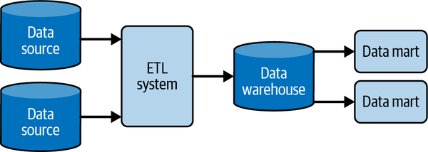{height="340px" fig-align="center"}
:::
:::

## Data Warehouse: ELT Moderno

::: {.columns}
::: {.column width="45%"}
- Los datos se cargan *primero* en un área de **Staging**.
- La transformación ocurre *dentro* del warehouse con SQL.
- Estándar en la nube (BigQuery, Snowflake, Redshift).
:::
::: {.column width="55%"}
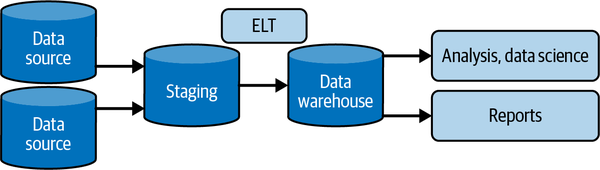{height="340px" fig-align="center"}
:::
:::

## Data Warehouse + Data Marts

::: {.columns}
::: {.column width="42%"}
- El warehouse centraliza todos los datos.
- Los **Data Marts** son subconjuntos para áreas específicas.
- ETL o ELT alimentan el mismo flujo base.
- Combina gobierno central con acceso especializado.
:::
::: {.column width="58%"}
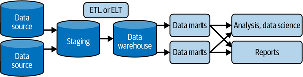{height="340px" fig-align="center"}
:::
:::

## Data Mesh

::: {.columns}
::: {.column width="38%"}
- Paradigma **sociotécnico descentralizado**.
- Dominios dueños de sus datos (*Data as a Product*).
- **Gobierno federado.**
- Self-serve platform para evitar cuellos de botella.
:::
::: {.column width="62%"}
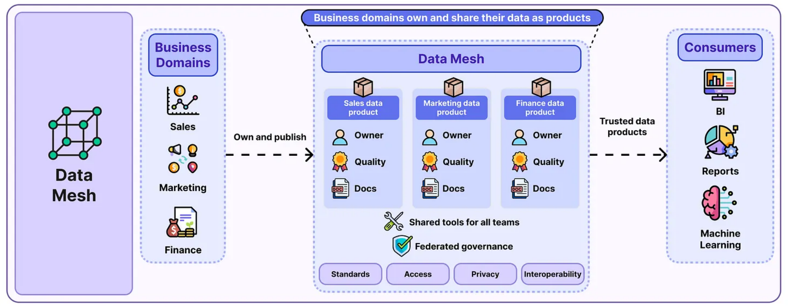{height="360px" fig-align="center"}
:::
:::

# 4. Fundamentos de Storage

## Atributos No Funcionales: Capacidad

::: {.columns}
::: {.column width="50%"}
::: {.smaller-text}
| Unidad | Tamaño | Ejemplo práctico |
|:---|:---|:---|
| **Byte** | 1 B | Un caracter |
| | 10 B | Una palabra |
| **Kilobyte** | 1 KB | Párrafo corto |
| | 100 KB | Fotografía de baja resolución |
| **Megabyte** | 1 MB | Novela corta |
| | 700 MB | Capacidad de un CD-ROM |
| **Gigabyte** | 1 GB | 7 minutos de video HD |
| | 4.7 GB | Capacidad de un DVD-R |
:::
:::
::: {.column width="50%"}
::: {.smaller-text}
| Unidad | Tamaño | Ejemplo práctico |
|:---|:---|:---|
| **Terabyte** | 1 TB | 50,000 árboles impresos en papel |
| | 10 TB | Biblioteca del Congreso de EE.UU. |
| **Petabyte** | 1 PB | 20 millones de archivadores de texto |
| | 50 PB | Todas las obras escritas de la humanidad |
:::
:::
:::
## Jerarquía: Velocidad vs Costo

| Tipo de Storage | Latencia de acceso | Costo aprox. |
|---|---|---|
| CPU Cache | ~1 nanosegundo | N/A |
| RAM | ~0.1 microsegundos | ~$10/GB |
| SSD | ~0.1 milisegundos | ~$0.20/GB |
| HDD | ~4 milisegundos | ~$0.03/GB |
| Object Storage (S3) | ~100 milisegundos | ~$0.02/GB/mes |
| Archival (Glacier) | ~12 horas | ~$0.004/GB/mes |

*Fuente:* @reis2022fundamentals

## Temperatura de los Datos

- **Hot:** Consultas múltiples por segundo. Perfil de usuario activo, sesiones. → **RAM / Caché (Redis)**
- **Warm:** Consultas semanales o mensuales. Reportes recientes. → **SSD / Data Warehouse**
- **Cold:** Acceso esporádico. Logs de auditoría, backups legales. → **Object Storage / Glacier**

*Regla práctica:* Mover datos fríos al tier más barato reduce costos de nube sin sacrificar rendimiento operacional.

# 5. Generación — Sistemas Fuente

## Monolito vs Microservicios

::: {.columns}
::: {.column width="42%"}
- **Monolito:** una sola aplicación y una sola BD.
- **Microservicios:** cada servicio tiene su propia BD.
- Los microservicios son la fuente típica del data engineer moderno.
- Generan múltiples fuentes heterogéneas que hay que integrar.
:::
::: {.column width="58%"}
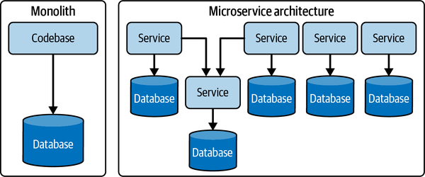{height="360px" fig-align="center"}
:::
:::

## Fuentes IoT: Del Dispositivo al Dato

::: {.columns}
::: {.column width="42%"}
- Los dispositivos envían datos al **IoT Gateway**.
- El gateway alimenta un **Stream Processor**.
- El stream escribe a **Storage**.
- Downstream: ML y reportes analíticos.
:::
::: {.column width="58%"}
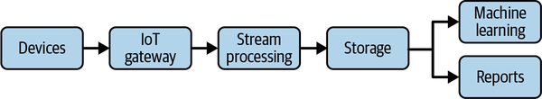{height="320px" fig-align="center"}
:::
:::

## Transacciones ACID

*ACID garantiza que el dato en la fuente es confiable antes de ingestarlo.* Los sistemas fuente OLTP se basan en transacciones con estas propiedades:

::: {.columns}
::: {.column width="50%"}
- **Atomicity:** La transacción es todo-o-nada. No hay estados a medias.
- **Consistency:** El estado de la BD siempre es válido según sus reglas.
:::
::: {.column width="50%"}
- **Isolation:** Las transacciones concurrentes no se interfieren entre sí.
- **Durability:** Los datos confirmados no se pierden, ni ante falla de energía.
:::
:::

## Fuentes de Datos Tabulares

::: {.tiny-text}
| Formato | Open Source | Tabular o Jerárquico | Binario o Plano | Tipos Complejos | Optimizado para |
|---|---|---|---|---|---|
| **EXCEL** | No | Tabular | Binario | Sí | Análisis en hojas de cálculo, informes financieros. (.xlsx es abierto) |
| **FEATHER** | Sí | Tabular | Binario | No | Rápido intercambio de datos entre Python y R. |
| **ORC** | Sí | Tabular | Binario | Sí | Análisis de big data con Hadoop. Soporta compresión. |
| **PARQUET** | Sí | Tabular | Binario | Sí | Almacenamiento eficiente de big data. Soporta compresión. |
| **SAS** | No | Tabular | Binario | No | Análisis estadístico, grandes datasets en SAS. |
| **SPSS** | No | Tabular | Binario | No | Investigación social, análisis en SPSS. |
| **STATA** | No | Tabular | Binario | No | Análisis econométrico en Stata. |
| **SQL** | Sí | Tabular | Depende | No | Manipulación de BD relacionales. |
| **CSV** | Sí | Tabular | Plano | No | Intercambio de datos entre sistemas. |

: {tbl-colwidths="[10, 12, 15, 13, 10, 40]"}
:::

## Fuentes de Datos Jerárquicos

::: {.tiny-text}
| Formato | Open Source | Tabular o Jerárquico | Binario o Plano | Tipos Complejos | Optimizado para |
|---|---|---|---|---|---|
| **HDF** | Sí | Jerárquico | Binario | Sí | Almacenamiento y análisis de grandes volúmenes. |
| **PICKLE** | Sí | Jerárquico | Binario | Sí | Serialización de objetos Python. |
| **JSON** | Sí | Jerárquico | Plano | Sí | Intercambio de datos entre APIs. |
| **XML** | Sí | Jerárquico | Plano | Sí | Manejo de datos jerárquicos en XML. |
| **HTML** | Sí | Jerárquico | Plano | No | Extracción de tablas desde páginas web. |

: {tbl-colwidths="[10, 12, 15, 13, 10, 40]"}
:::

# 6. Ingestión

## Modelos de Extracción: Push vs Pull

- **Pull (Extraer):** El sistema de ingesta consulta a la fuente activa y extrae los datos (ej. consultar una API cada hora).
- **Push (Empujar):** El sistema fuente envía activamente los datos al destino (ej. sensor IoT emitiendo datos a un endpoint).
- **Híbridos:** Muchas arquitecturas combinan ambos, extrayendo de APIs (Pull) y recibiendo webhooks (Push).

## Change Data Capture (CDC)

- Convierte el estado estático de una BD relacional en un **flujo continuo de eventos** (inserts, updates, deletes).
- **Pull-based CDC:** Consulta la BD buscando marcas de tiempo actualizadas (afecta rendimiento).
- **Log-based CDC (Push):** Lee los logs transaccionales (ej. *binlog* en MySQL) sin impactar el rendimiento de la aplicación.
- Herramienta clave: **Debezium**.


## Batch y Stream hacia Serving

::: {.columns}
::: {.column width="40%"}
- Los sistemas fuente alimentan **dos caminos paralelos**.
- **Stream processing:** datos continuos, baja latencia.
- **Batch processing:** grandes volúmenes, menor frecuencia.
- Convergen en la **Serving layer** para responder queries.
:::
::: {.column width="60%"}
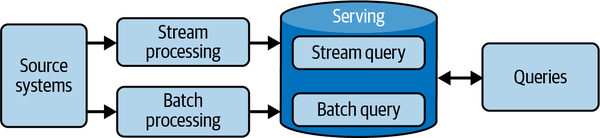{height="340px" fig-align="center"}
:::
:::

## Ingestión Stream Pura

::: {.columns}
::: {.column width="40%"}
- El stream source envía eventos de forma continua.
- Un **Stream Processor** (Kafka, Flink) procesa en vuelo.
- La **Serving layer** responde queries sobre datos recientes.
- Ideal para CDC continuo y datos de IoT.
:::
::: {.column width="60%"}
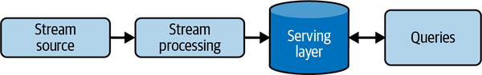{height="320px" fig-align="center"}
:::
:::


# 7. Transformación y SQL

## El Ciclo de Vida de una Query

1. **Parsing:** Verifica que la sintaxis SQL sea correcta y los objetos (tablas/columnas) existan.
2. **Planning & Optimization:** El motor evalúa múltiples planes de ejecución (usando estadísticas) y elige el más eficiente.
3. **Execution:** Los nodos del clúster ejecutan el plan, leyendo el *storage* y procesando los datos.
- **Lección:** El optimizador hace un gran trabajo, pero un mal modelo de datos arruinará el rendimiento.


## SQL: Lenguaje de Transformación

SQL es el estándar en el patrón ELT moderno:

- **DDL:** `CREATE TABLE`, `DROP TABLE` — estructura el modelo de datos.
- **DML:** `SELECT`, `INSERT`, `UPDATE`, `MERGE` — manipula y transforma.
- **DCL:** `GRANT`, `REVOKE` — gobierna el acceso al dato.
- **TCL:** `COMMIT`, `ROLLBACK` — asegura consistencia transaccional.
- **CTEs & Window Functions:** complejidad analítica dentro del warehouse.

## Extracción SQL con Python

```python
import sqlite3, pandas as pd, urllib.request

# 1. Descargar BD (Ej. Chinook)
url = "https://raw.githubusercontent.com/oscar-bustos/javeriana-gestiondatos/main/taller4/chinook.db"
urllib.request.urlretrieve(url, "chinook.db")

# 2. Conectar y leer hacia DataFrame
conn = sqlite3.connect("chinook.db")
df = pd.read_sql_query("SELECT FirstName, Country FROM customers LIMIT 3", conn)
conn.close()
```

## Ejemplos de Queries en Chinook

```python
# 1. Filtrado básico
q1 = "SELECT FirstName, LastName FROM customers WHERE Country = 'Canada'"
df1 = pd.read_sql_query(q1, conn)

# 2. Agregación
q2 = """
SELECT BillingCountry, SUM(Total) as Ventas
FROM invoices GROUP BY BillingCountry
"""
df2 = pd.read_sql_query(q2, conn)
```

## ELT: Transformar donde Viven los Datos

- **ETL clásico:** transformar *antes* de cargar (servidor intermedio).
- **ELT moderno:** cargar primero, transformar *dentro* del warehouse con SQL.
- **dbt (data build tool):** orquesta y versiona transformaciones SQL como código.
- **Materialized Views:** el motor precalcula resultados; los dashboards responden rápido.
- **Partitioning / Clustering:** reduce el volumen escaneado en cada query (pruning).

## Modelado Dimensional (Kimball)

::: {.columns}
::: {.column width="45%"}
- **Granularidad (Grain):** nivel más atómico del hecho.
- **Fact Table:** métricas cuantitativas en el centro.
- **Dimension Tables:** contexto descriptivo (Usuario, Fecha).
- **Star Schema:** dimensiones alrededor de la tabla de hechos.
- **SCD Tipo 2:** nueva fila para historial de cambios.
:::
::: {.column width="55%"}
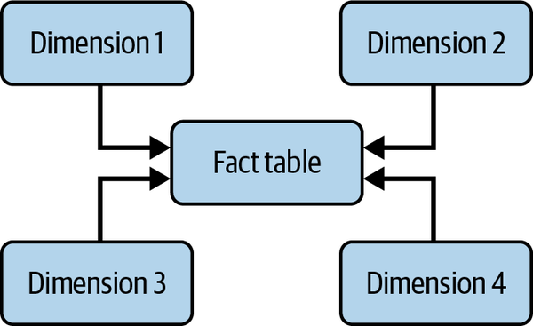{height="360px" fig-align="center"}
:::
:::

## Tablas de Hechos (Fact Tables)

- Almacenan métricas y llaves foráneas (conectan con dimensiones).
- **Append-only:** los registros *solo se agregan*; **nunca** se borran ni actualizan.
- Optimizadas masivamente para **lectura y agregación rápida**.

::: {.smaller-text}
| OrderID | CustomerKey | DateKey | GrossSalesAmt |
|:---|:---|:---|:---|
| 100 | 5 | 20220301 | 100.00 |
| 101 | 7 | 20220301 | 75.00 |
| 102 | 7 | 20220301 | 50.00 |

*Fuente: @reis2022fundamentals*
:::

## Tablas de Dimensión

- Proveen contexto y atributos a las tablas de hechos.
- Típicamente **anchas y cortas**, y desnormalizadas.
- Responden al *qué, dónde y cuándo* de los eventos.
- **Ejemplo:** Dimensión Fecha (agregación por trimestre o día).

::: {.tiny-text}
| DateKey | Date-ISO | Year | Quarter | Month | Day-of-week |
|:---|:---|:---|:---|:---|:---|
| 20220301 | 2022-03-01 | 2022 | 1 | 3 | Tuesday |
| 20220302 | 2022-03-02 | 2022 | 1 | 3 | Wednesday |

*Fuente: @reis2022fundamentals*
:::

## Dimensiones Lentamente Cambiantes (SCD 2)

- Conserva el historial creando **nuevos registros** (sin sobrescribir).
- Se controla mediante fechas de efectividad (`StartDate` y `EndDate`).

::: {.tiny-text}
| CustomerKey | FirstName | LastName | ZipCode | EFF_StartDate | EFF_EndDate |
|:---|:---|:---|:---|:---|:---|
| 7 | Matt | Housley | 84101 | 2020-05-04 | 2021-09-19 |
| 7 | Matt | Housley | 84123 | 2021-09-19 | 9999-01-01 |

*Fuente: @reis2022fundamentals*
:::

# 8. Serving

## Serving: Analytics y BI

- El dato transformado llega a **analistas y decisores de negocio**.
- **Business Intelligence:** describe el pasado y el presente con reportes y dashboards.
- **Operational Analytics:** vista en tiempo real de operaciones (inventario, salud de app).
- **Self-service Analytics:** acceso democrático sin intervención de IT.
- **Embedded Analytics:** analítica expuesta a clientes dentro de una aplicación SaaS.

## Serving: Machine Learning y Feature Store

](assets/mlops-continuous-delivery-and-automation-pipelines-in-machine-learning-3-ml-automation-ct.svg){height="420px" fig-align="center"}

## Serving: Reverse ETL

::: {.columns}
::: {.column width="45%"}
- El dato analítico **regresa a los sistemas operacionales**.
- Activa acciones directamente en el negocio.
- **Ejemplos:** Puntajes al CRM, pujas a Google Ads.
- **Herramientas:** Hightouch, Census.
- Cierra el ciclo: fuente → análisis → fuente.
:::
::: {.column width="55%"}
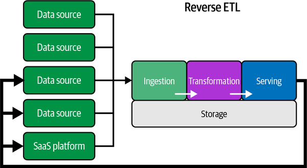{height="360px" fig-align="center"}
:::
:::

# Recursos

## Referencias

::: {#refs}
:::
