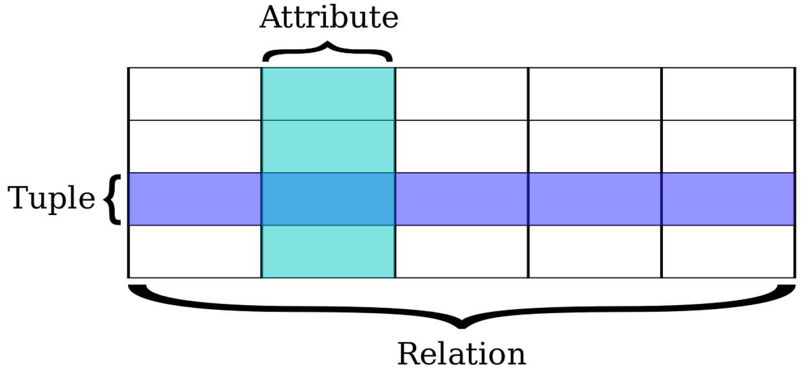
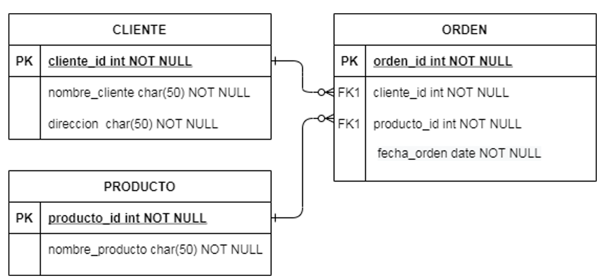
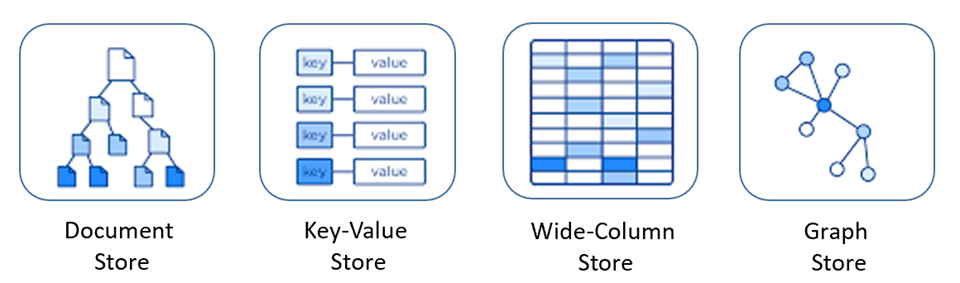
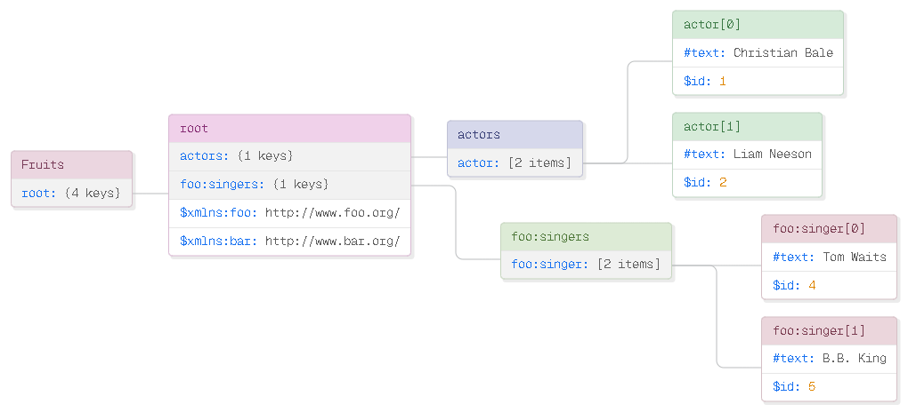
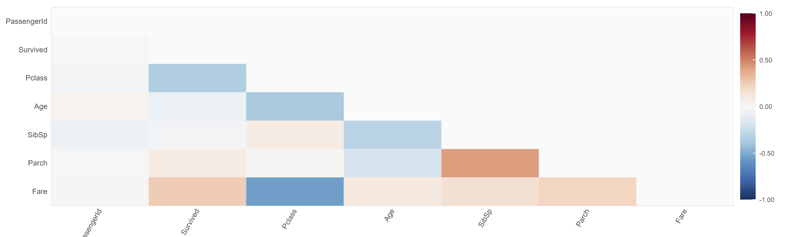
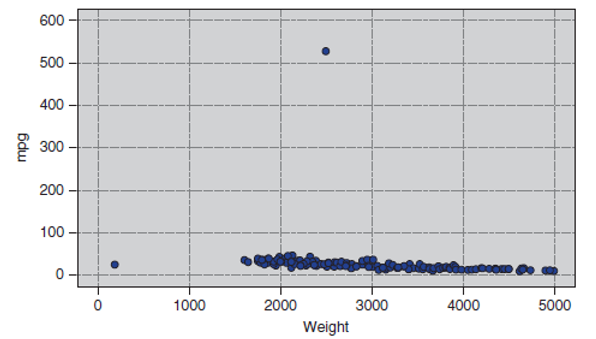
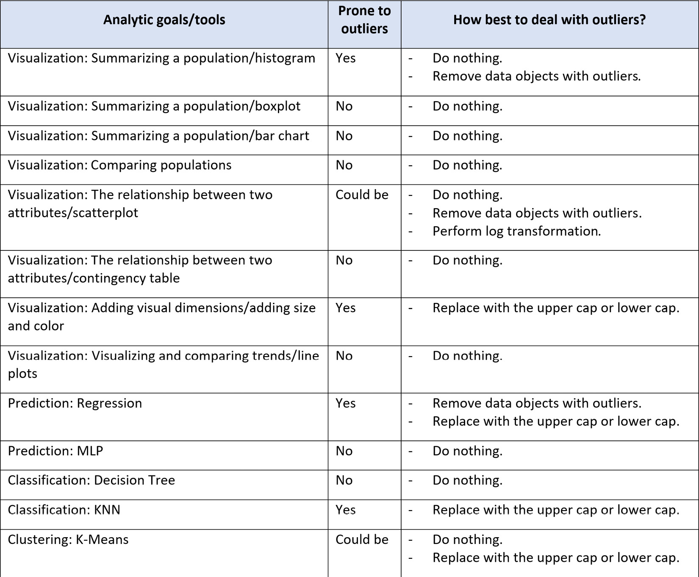
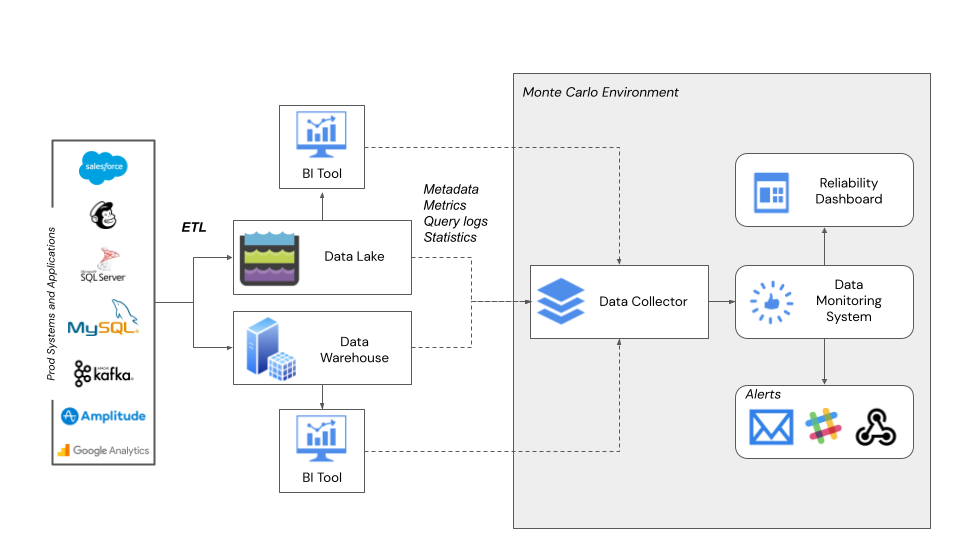

# Repaso


## Repaso


:::: {.columns}


::: {.column width="50%"}
Bases de datos relacionales
- Codd - 1970
- Basado en el álgebra relacional
- Datos lógicamente organizados en tablas
- Compuestas por filas y columnas
:::


::: {.column width="40%"}
{width="100%"}
:::

::::


## Tablas en modelo relacional


:::: {.columns}


::: {.column width="52%"}

::: {.callout-note}
## Entidad de CLIENTE


| cliente\_id | nombre\_cliente | direccion |
| --- | --- | --- |
| 1 | Pablo | cra 1 \# 2 -3 |
| 2 | María | calle 2 \# 1 -3 |
| 3 | Camila | cra 3 \# 4 -6 |

:::

:::


::: {.column width="45%"}

::: {.callout-note}
## Entidad de PRODUCTO


| producto\_id | nombre\_producto |
| --- | --- |
| 10 | Escoba |
| 11 | Lápiz |
| 12 | Borrador |

:::

:::

::::


::: {.callout-note}
## Tabla de ORDEN


| orden\_id | cliente\_id | producto\_id | fecha\_orden |
| --- | --- | --- | --- |
| AA01 | 2 | 10 | 10/10/2020 |
| AA02 | 3 | 11 | 11/10/2020 |
| AA03 | 1 | 12 | 12/10/2020 |

:::


## Modelo Entidad Relación

{width="60%"}


## Ventajas del Modelo Relacional

- **Integración perfecta:** Se conectan de forma nativa con casi cualquier herramienta de BI (Tableau, PowerBI) y librerías de ciencia de datos (Pandas, dplyr).
- **Datos limpios desde el origen:** Su estructura estricta evita duplicados y errores lógicos, lo que nos ahorra muchísimo tiempo en la fase de limpieza de datos.
- **Extracción rápida y universal:** SQL es el estándar de la industria. Permite filtrar, agrupar y preparar *datasets* rápidamente antes de pasarlos al modelo.
- **Alta concurrencia:** Soportan a múltiples analistas, científicos de datos y sistemas que consultan la información al mismo tiempo de forma segura.


## Desventajas del Modelo Relacional

- **Poca flexibilidad para experimentar:** Si durante un proyecto descubres que necesitas añadir nuevas variables o atributos constantemente, alterar el esquema es lento y doloroso.
- **Cuello de botella con Big Data:** Cuando el volumen de datos crece drásticamente (millones de registros históricos), las consultas complejas y los cruces masivos (*JOINs*) se vuelven muy lentos.
- **Mala gestión de datos no estructurados:** No son la herramienta adecuada si tu modelo necesita procesar grandes volúmenes de texto libre para NLP, imágenes, audio o archivos JSON anidados.
- **Ineficiencia con estructuras complejas:** Forzar relaciones jerárquicas, grafos o matrices muy dispersas (*sparse data*) en tablas planas complica el análisis y hace mucho más pesado el *feature engineering*.


# No SQL


## Tipos de Base de datos

{width="65%"}


Tomado de: [https://learn.microsoft.com/es-es/dotnet/architecture/cloud-native/relational-vs-nosql-data](https://learn.microsoft.com/es-es/dotnet/architecture/cloud-native/relational-vs-nosql-data)


## Tipos de Base de datos {.smaller}

\begin{table}[]
 % Reducimos un poco el tamaño de fuente para que encaje mejor

| **Modelo** | **Características** | **Ejemplo** |
| --- | --- | --- |
| Almacén de documentos | Los datos y los metadatos se almacenan jerárquicamente en documentos basados en JSON dentro de la base de datos. | MongoDB |
| Almacén de clave-valor | La más sencilla de las bases de datos NoSQL, los datos se representan como una colección de pares clave-valor. | AWS DynamoDB,   Redis |
| Almacén de columna ancha | Los datos relacionados se almacenan como un conjunto de pares clave-valor anidados dentro de una sola columna. | Google BigTable |
| Almacén de grafos | Los datos se almacenan en una estructura de grafo como propiedades de nodo, borde y datos. | AWS Neptune, Neo4j |

\end{table}


# Formatos Jerárquicos


## Características del Formato XML

- **Legible para humanos y máquinas:** Su formato basado en texto puro facilita la comprensión tanto para desarrolladores como para sistemas automatizados.
- **Extensible:** No tiene un vocabulario predefinido; permite definir etiquetas propias según las necesidades del dominio.
- **Estructura jerárquica:** Organiza los datos en forma de árbol, partiendo de un elemento raíz y llegando a múltiples nodos hijos.
- **Independiente del lenguaje/plataforma:** Puede ser procesado por cualquier sistema operativo y lenguaje de programación.


## Características del Formato XML

- **Autocontenido:** Los datos llevan consigo su propia descripción y contexto semántico mediante las etiquetas que los envuelven.
- **Lenguaje de consulta (XPath):** Permite navegar y extraer fragmentos específicos de información dentro del documento de manera eficiente.
- **Validación estructural (Extra):** Permite una validación estricta mediante esquemas (como XSD o DTD) para garantizar que los datos cumplen un formato acordado.
- **Uso en estándares (Extra):** Es la tecnología base para servicios web tradicionales (SOAP) y para formatos como SVG o RSS.


## Ejemplo de Documento XML


\begin{verbatim}
<root xmlns:foo="http://www.foo.org/"
xmlns:bar="http://www.bar.org/">
<actors>
<actor id="1">Christian Bale</actor>
<actor id="2">Liam Neeson</actor>
<actor id="3">Michael Caine</actor>
</actors>
<foo:singers>
<foo:singer id="4">Tom Waits</foo:singer>
<foo:singer id="5">B.B. King</foo:singer>
<foo:singer id="6">Ray Charles</foo:singer>
</foo:singers>
</root>
\end{verbatim}


## Modelo Jerárquico

{width="80%"}

Tomado de [https://todiagram.com/editor](https://todiagram.com/editor)


## Lenguaje de Consulta XPath {.smaller}

:::: {.columns}

::: {.column width="55%"}
::: {.callout-note}
## Expresiones XPath
\resizebox{\textwidth}{!}{
| **Expresión** | **Descripción** |
| --- | --- |
| `/` | Nodo raíz del documento. |
| `/root/actors/actor` | Hijos directos de 'actors'. |
| `//foo:singer` | Elementos 'singer' en cualquier parte. |
| `//actor[1]` | Selecciona el primer 'actor'. |
| `//actor[@id='3']` | Actor con id igual a '3'. |
}
:::
:::

::: {.column width="45%"}
XML de Ejemplo:
\begin{verbatim}
<root>
  <actors>
    <actor id="1">Christian Bale</actor>
    <actor id="3">Michael Caine</actor>
  </actors>
  <foo:singers>
    <foo:singer id="4">Tom Waits</foo:singer>
  </foo:singers>
</root>
\end{verbatim}
:::

::::


## Ejemplo de Código: Procesamiento de XML con Pandas

```python
import pandas as pd

xml_data = """
<empleados>
<empleado id="101"><nombre>Ana</nombre><area>Ventas</area></empleado>
<empleado id="102"><nombre>Luis</nombre><area>IT</area></empleado>
<empleado id="103"><nombre>Marta</nombre><area>Legal</area></empleado>
</empleados>
"""

df = pd.read_xml(xml_data)

print(df)
```


## Motivación


{width="60%"}

¿Qué problemas pueden encontrar en este DataSet?


## Motivación


:::: {.columns}


::: {.column width="50%"}
Objetivos de la Preparación de datos

- Obtención de la mayor cantidad de **datos útiles** para el proyecto de analítica (1)
- Corregir el mayor número de **datos erróneos** o inconsistentes e irrelevantes (2,3)
- **Presentación de los datos** de una manera apropiada para los modelos. (4)

:::


::: {.column width="40%"}
{width="100%"}
:::

::::


# Actividades limpieza de datos


## Actividades limpieza de datos

**Atributos (Columnas)**
- Detección y tratamiento de atributos con valores únicos.
- Detección y tratamiento de atributos discretos con valores diferentes para cada registro.
- Detección de atributos sinónimos con la variable objetivo.
- Detección y tratamiento de atributos redundantes.

**Datos (Filas)**
- Detección y tratamiento de datos perdidos.
- Detección y tratamiento de datos con valores inconsistentes o atípicos.
- Detección y tratamiento de datos redundantes.


## Atributos con valores únicos


:::: {.columns}


::: {.column width="40%"}

- **Caso**: Todos los datos tienen el mismo valor
  - Ejemplo: Nacionalidad (todos son colombianos)<br>
- **Caso**: Casi todos los valores son nulos
  - Ejemplo: Cabina (77.1 \%)<br>
- **Acción**: Eliminar la columna

:::


::: {.column width="60%"}
{width="100%"}
:::

::::


## Atributos discretos con valores diferentes 


:::: {.columns}


::: {.column width="40%"}
- **Caso**: Datos con valores diferentes para cada registro (Alta Cardinalidad)
  - Ejemplo: Dirección proveedor, número de teléfono
  - Ejemplo: Id del Pasajero, Nombre del Pasajero
- **Acción**: Eliminar la columna
- **Acción**: Hacer Ingeniería de Características
  - Ejemplo: Barrio, Localidad, Ciudad a partir de la Dirección
:::


::: {.column width="60%"}
{width="100%"}
:::

::::


## Atributos sinónimos con variable objetivo 

- **Caso**: Datos sinónimos con la variable objetivo (técnicas supervisadas) o atributos no observables al momento de la predicción
  - Ejemplo:   Fecha de reparación cuando se desea predecir si requiere reparación.
  - Ejemplo: Promedio de la deserción para predecir deserción.
  - Ejemplo: Número de asesinatos para predecir si habrá fallecidos
  - Ejemplo: TieneDiabetes, Edad en la que contrajo Diabetes
- **Acción**: Eliminar la columna


## Atributos Redundantes: Concepto

**Colinealidad:** Ocurre cuando dos o más variables independientes están altamente correlacionadas.

**Método: Coeficiente de Correlación de Pearson**
- Fórmula:
  \[
  r = \frac{\sum (x_i - \bar{x})(y_i - \bar{y})}{\sqrt{\sum (x_i - \bar{x})^2 \sum (y_i - \bar{y})^2}}
  \]

---

## Atributos Redundantes: Coeficiente de Pearson

- El coeficiente \( r \) toma valores entre -1 y 1:
  - \( r \approx 1 \): Alta correlación positiva.
  - \( r \approx -1 \): Alta correlación negativa.
  - \( r \approx 0 \): Sin correlación.

- **Criterio de Colinealidad:**
  \[
  |r| > 0.5 \quad \text{indica alta colinealidad.}
  \]


## Atributos Redundantes


- **Caso**: Atributos colineales entre sí.
- **Forma de detección:** Coeficiente de correlación.
- **Acción:** Eliminar uno de los dos atributos.

{width="60%"}


## Datos perdidos

:::: {.columns}

::: {.column width="45%"}
- **Caso**: Datos perdidos (Missing Values): Ocurren cuando no se almacena ningún valor para una variable en una observación.
  - Ejemplo: Representados como “?”, “NA”, 0 o celdas vacías.
:::

::: {.column width="50%"}
{width="100%"}
:::

::::


## Datos perdidos: Eliminación e Imputación Simple

- **Diagnóstico:** Evaluar cada caso con expertos del negocio.
- **Eliminación:**
  - Borrar registros con campos perdidos.
  - Eliminar columna si la proporción de nulos es extrema.
- **Reemplazo Simple:**
  - Sustituir por una constante global.
  - Reemplazar por la media (simétrica) o mediana (asimétrica).
  - Reemplazar por la moda en datos categóricos.

---

## Datos perdidos: Imputación Avanzada

- **Reemplazo por Clase:** Usar media o mediana del campo por grupo/clase.
- **Deducción:** Inferir el valor a partir de otros atributos relacionados.
- **Imputación Predictiva:** Estimar el valor faltante mediante modelos.
- **Sin Alteración:** Dejarlo como valor faltante (si el modelo lo soporta).


## Datos Atípicos


**Concepto:** Los datos atípicos son observaciones que se desvían significativamente del comportamiento general de los datos.

- **Detección**
  - A través de herramientas Visuales

{width="50%"}


## Datos Atípicos: Rango Intercuartílico (IQR)

- **Cálculo del IQR:** \( \text{IQR} = Q_3 - Q_1 \)
- **Límites de aceptación:**
  - Límite inferior: \( Q_1 - 1.5 \times \text{IQR} \)
  - Límite superior: \( Q_3 + 1.5 \times \text{IQR} \)

**Condición de outliers:**
\[
x < Q_1 - 1.5 \times \text{IQR} \quad \text{o} \quad x > Q_3 + 1.5 \times \text{IQR}
\]


## Datos Atípicos


:::: {.columns}


::: {.column width="30%"}
Reglas sugeridas por [@jafari2022hands]
{width="60%"}
:::


::: {.column width="60%"}
{width="100%"}
:::

::::


## Datos Atípicos

- **Soluciones:**
  - Ignorarlos (si la técnica es robusta).
  - Filtrarlos (eliminar fila o columna).
  - Reemplazarlos (por nulo, límites, media o predicción).
  - Discretizar la columna.

{width="50%"}


# Librerías en Python


## Métodos para manejo de datos faltantes {.smaller}

\begin{table}[htbp]


| **Método** | **Descripción** |
| --- | --- |
| `dropna` | Filtra las etiquetas de los ejes en función de si los valores correspondientes tienen datos faltantes. |
| `fillna` | Rellena los datos faltantes con algún valor o utilizando un método de interpolación, como "ffill" o "bfill". |
| `isna` | Devuelve valores booleanos que indican cuáles valores están faltantes/NA. |
| `notna` | Negación de `isna`, devuelve `True` para valores no NA y `False` para valores NA. |

\end{table}


## Métodos para manejo de datos duplicados {.smaller}

\begin{table}[htbp]
| **Método** | **Descripción** |
| --- | --- |
| `drop_duplicates()` | Elimina filas duplicadas (conserva primera/última). |
| `replace()` | Reemplaza valores específicos o basados en patrones. |
| `quantile()` | Devuelve el cuantil dado (ej. Q1 al 0.25, Q3 al 0.75). |
| `corr()` | Calcula correlaciones (Pearson, Spearman, etc.). |
\end{table}


# Herramientas de industria


## Arquitectura de Data Observability


**Concepto:** Permiten monitorear, analizar y comprender la calidad y el rendimiento de los datos, ayudando a diagnosticar y resolver incidentes de manera rápida y eficiente.


{width="70%"}


## Dashboards de Data Observability


{width="90%"}


## Comparación de Herramientas {.smaller}

\begin{table}[h!]
\resizebox{\textwidth}{!}{
| **Herramienta** | **Ventajas** | **Desventajas** | **Precio** |
| --- | --- | --- | --- |
| [Monte Carlo](https://www.montecarlodata.com/) | Integración fácil, alertas en tiempo real, observabilidad completa. | Costosa, configuración inicial compleja. | Alto |
| [Great Expectations](https://greatexpectations.io/) | Open-source, personalizable, validaciones robustas. | Curva de aprendizaje alta, sin alertas nativas. | Gratis |
| [Databand](https://www.ibm.com/es-es/products/databand) | Buen monitoreo/alertas, se integra con Airflow. | Menos funciones que Monte Carlo, comunidad menor. | Moderado |
| [Bigeye](https://www.bigeye.com/) | Configuración rápida, métricas de calidad simples. | Poca personalización, limitada a ciertos datos. | Alto |
}
\caption{Comparación de herramientas de Data Observability}
\end{table}


## References

::: {#refs}
:::


