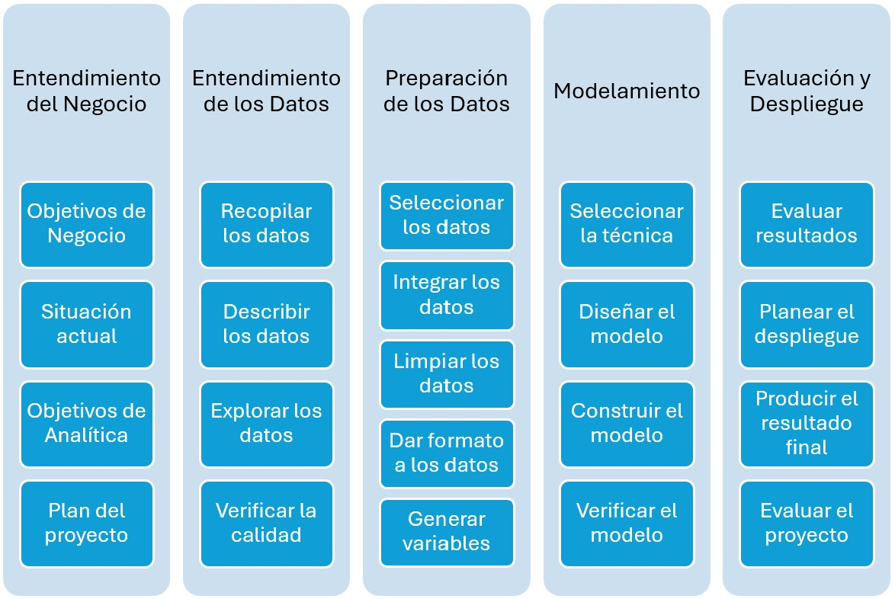
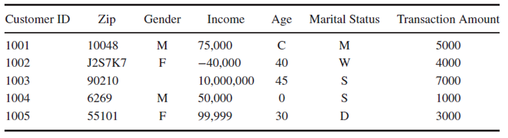
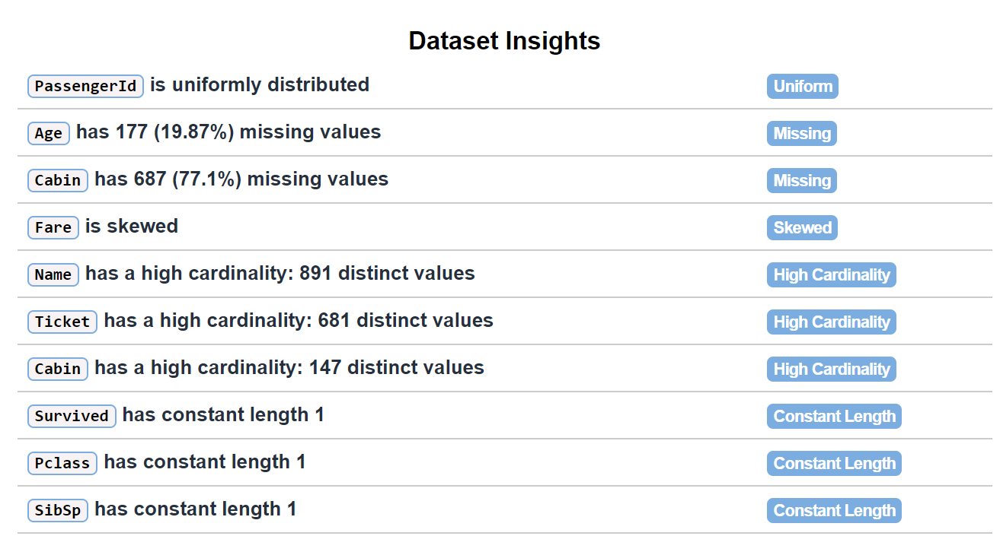
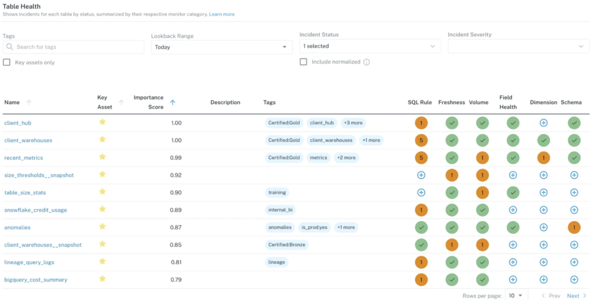

# Repaso

## Recordando...

- ¿Qué metodologías existen para los proyectos de minería de datos o de analítica de datos?
- ¿Por qué es necesario preparar los datos?
- ¿Por qué los datos tienen problemas?
- ¿Qué sucede si no se preparan los datos?
- ¿Qué actividades tiene el macro-proceso de preparación de datos?

# Generalidades

## Metodología CRISP-DM

{width="60%"}

Actividades del proceso CRISP-DM

## Motivación

{width="90%"}

¿Qué problemas pueden encontrar en este DataSet?

## Motivación

:::: {.columns}

::: {.column width="50%"}
Objetivos de la Preparación de datos

- Obtención de la mayor cantidad de **datos útiles** para el proyecto de analítica (1)
- Corregir el mayor número de **datos erróneos** o inconsistentes e irrelevantes (2,3)
- **Presentación de los datos** de una manera apropiada para los modelos. (4)

:::

::: {.column width="40%"}
{width="100%"}
:::

::::

# Actividades limpieza de datos

## Actividades limpieza de datos

**Atributos (Columnas)**
- Detección y tratamiento de atributos con valores únicos.
- Detección y tratamiento de atributos discretos con valores diferentes para cada registro.
- Detección de atributos sinónimos con la variable objetivo.
- Detección y tratamiento de atributos redundantes.

**Datos (Filas)**
- Detección y tratamiento de datos perdidos.
- Detección y tratamiento de datos con valores inconsistentes o atípicos.
- Detección y tratamiento de datos redundantes.

## Atributos con valores únicos

:::: {.columns}

::: {.column width="40%"}

- **Caso**: Todos los datos tienen el mismo valor
  - Ejemplo: Nacionalidad (todos son colombianos) 
- **Caso**: Casi todos los valores son nulos
  - Ejemplo: Cabina (77.1 \%) 
- **Acción**: Eliminar la columna

:::

::: {.column width="60%"}
{width="100%"}
:::

::::

## Atributos discretos con valores diferentes 

:::: {.columns}

::: {.column width="40%"}
- **Caso**: Datos con valores diferentes para cada registro (Alta Cardinalidad)
  - Ejemplo: Dirección proveedor, número de teléfono
  - Ejemplo: Id del Pasajero, Nombre del Pasajero
- **Acción**: Eliminar la columna
- **Acción**: Hacer Ingeniería de Características
  - Ejemplo: Barrio, Localidad, Ciudad a partir de la Dirección
:::

::: {.column width="60%"}
{width="100%"}
:::

::::

## Atributos sinónimos con variable objetivo 

- **Caso**: Datos sinónimos con la variable objetivo (técnicas supervisadas) o atributos no observables al momento de la predicción
  - Ejemplo:   Fecha de reparación cuando se desea predecir si requiere reparación.
  - Ejemplo: Promedio de la deserción para predecir deserción.
  - Ejemplo: Número de asesinatos para predecir si habrá fallecidos
  - Ejemplo: TieneDiabetes, Edad en la que contrajo Diabetes
- **Acción**: Eliminar la columna

## Atributos Redundantes

**Concepto:** La colinealidad ocurre cuando dos o más variables independientes están altamente correlacionadas.

**Método: Coeficiente de Correlación de Pearson**
- Formula:
  \[
  r = \frac{\sum (x_i - \bar{x})(y_i - \bar{y})}{\sqrt{\sum (x_i - \bar{x})^2 \sum (y_i - \bar{y})^2}}
  \]
- \( r \) toma valores entre -1 y 1:
  - \( r \approx 1 \): Alta correlación positiva
  - \( r \approx -1 \): Alta correlación negativa
  - \( r \approx 0 \): Sin correlación

**Colinealidad:**
\[
|r| > 0.5 \quad \text{indica alta colinealidad.}
\]

## Atributos Redundantes

- **Caso**: Atributos colineales entre si
- **Forma de detección**: Coeficiente de correlación
- **Acción**: Eliminar uno de los dos atributos

{width="90%"}

## Datos perdidos

:::: {.columns}

::: {.column width="40%"}
- **Caso**: Datos perdidos (Missing Values) : Los valores perdidos ocurren cuando no se almacena ningún valor para una variable en una observación.
  - Ejemplo: Pueden ser representados como “?”, “NA”, 0 o solo un celda vacía.
:::

::: {.column width="60%"}
{width="100%"}
:::

::::

## Datos perdidos

**Acciones:**
- Examinar uno a uno y asignar un valor razonable con el experto del negocio.
- Eliminar los valores perdidos
  - Borrar los registros con campos perdidos.
  - Borrar una columna si son muchos (todos son iguales)

- Remplazar el valor perdido

  - Reemplazar por una constante global. Niño 7 años – vacio campo fumar
  - Reemplazar por la media del campo (simétrico), mediana (No simétrico).
  - Reemplazar por la moda.

- Reemplazar por la media o mediana del campo por clase (únicamente si los registros están clasificados).
- Deducirlo de otro atributo
- Imputación: Predecir el valor de campo a través de un modelo de minería predictiva.
- Dejarlo como valor faltante.

## Datos Atípicos

**Concepto:** Los datos atípicos son observaciones que se desvían significativamente del comportamiento general de los datos.

- **Detección**
  - A través de herramientas Visuales

{width="50%"}

## Datos Atípicos

**Concepto:** Los datos atípicos son observaciones que se desvían significativamente del comportamiento general de los datos.

**Método: Rango Intercuartílico (IQR)**
- *IQR* = \( Q_3 - Q_1 \)
- Límite inferior: \( Q_1 - 1.5 \times \text{IQR} \)
- Límite superior: \( Q_3 + 1.5 \times \text{IQR} \)

**Condición de outliers:**
\[
x < Q_1 - 1.5 \times \text{IQR} \quad \text{o} \quad x > Q_3 + 1.5 \times \text{IQR}
\]

## Datos Atípicos

:::: {.columns}

::: {.column width="30%"}
Reglas sugeridas por [@jafari2022hands]
{width="60%"}
:::

::: {.column width="60%"}
{width="100%"}
:::

::::

## Datos Atípicos

- **Soluciones**
  - Ignorarlos: cuando la técnica es robusta ante ellos
  - Filtrarlos: eliminar la columna o fila
  - Reemplazarlo: por nulo, min o max, media, predecirlo.
  - Discretizar la columna.

{width="70%"}

# Librerías en Python

## Métodos para manejo de datos faltantes

\begin{table}[htbp]

| **Método** | **Descripción** |
| --- | --- |
| `dropna` | Filtra las etiquetas de los ejes en función de si los valores correspondientes tienen datos faltantes. |
| `fillna` | Rellena los datos faltantes con algún valor o utilizando un método de interpolación, como "ffill" o "bfill". |
| `isna` | Devuelve valores booleanos que indican cuáles valores están faltantes/NA. |
| `notna` | Negación de `isna`, devuelve `True` para valores no NA y `False` para valores NA. |

\end{table}

## Métodos para manejo de datos duplicados

\begin{table}[htbp]

| **Método** | **Descripción** |
| --- | --- |
| `drop\_duplicates()` | Elimina filas duplicadas en el DataFrame, conservando la primera aparición o la última, según los parámetros especificados. |
| `replace()` | Reemplaza valores en el DataFrame de acuerdo con un criterio. Puede ser utilizado para reemplazar valores específicos o realizar sustituciones basadas en patrones. |
| `quantile()` | Devuelve el cuantil correspondiente a un porcentaje dado. Los cuantiles dividen los datos en partes iguales; por ejemplo, el cuantil 0.25 devuelve el primer cuartil (Q1) y el cuantil 0.75 devuelve el tercer cuartil (Q3). |
| `corr()` | Calcula la correlación entre las columnas del DataFrame, devolviendo una matriz de correlaciones. Los coeficientes de correlación pueden calcularse usando métodos como Pearson, Spearman o Kendall. |

\end{table}

# Herramientas de industria

## Arquitectura de Data Observability

**Concepto:** Permiten monitorear, analizar y comprender la calidad y el rendimiento de los datos, ayudando a diagnosticar y resolver incidentes de manera rápida y eficiente.

{width="70%"}

## Dashboards de Data Observability

{width="90%"}

## Comparación de Herramientas 

 % Hacemos todo el texto de la tabla más pequeño
\begin{table}[h!]

| **Herramienta** | **Ventajas** | **Desventajas** | **Precio** |
| --- | --- | --- | --- |
| [**Monte Carlo](https://www.montecarlodata.com/)** |  |
| Fácil integración con plataformas de datos, alertas en tiempo real, cobertura completa de observabilidad. |  |
| Costoso para pequeñas empresas, complejidad inicial de configuración. | Alto |
| [**Great Expectations](https://greatexpectations.io/)** |  |
| Open-source, altamente personalizable, buen soporte para validaciones de datos. |  |
| Curva de aprendizaje pronunciada, falta de alertas en tiempo real. | Gratis/Open-source |
| [**Databand](https://www.ibm.com/es-es/products/databand)** |  |
| Buenas capacidades de monitoreo y alertas, integración con Apache Airflow. |  |
| Menos funcionalidades comparado con Monte Carlo, comunidad menos madura. | Moderado |
| [**Bigeye](https://www.bigeye.com/)** |  |
| Configuración sencilla y rápida, buenas métricas de calidad de datos. |  |
| Menos opciones de personalización, enfoque limitado en ciertos tipos de datos. | Alto |

\caption{Comparación de herramientas de Data Observability}
\end{table}

## References

::: {#refs}
:::

