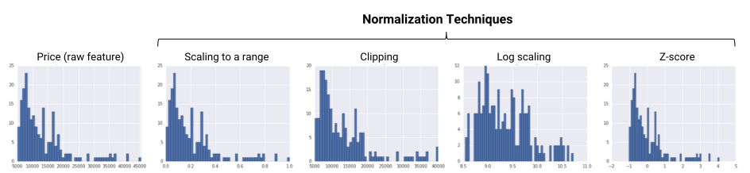
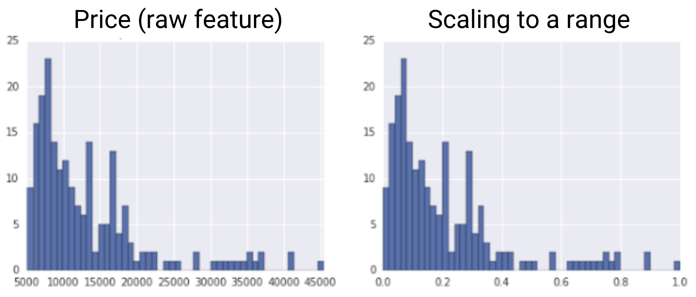
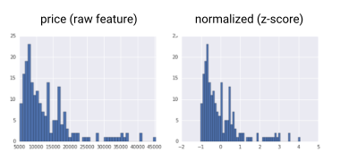

# Repaso

## Recordando...

- ¿Qué metodologías existen para los proyectos de minería de datos o analítica de datos?
- ¿Por qué es necesario preparar los datos?
- ¿Qué actividades de limpieza de atributos hay?
- ¿Qué actividades de limpieza de datos hay?

## Motivación

:::: {.columns}

::: {.column width="50%"}
Objetivos de la Preparación de datos

- Obtención de la mayor cantidad de **datos útiles** para el proyecto de analítica (1)
- Corregir el mayor número de **datos erróneos** o inconsistentes e irrelevantes (2,3)
- **Presentación de los datos** de una manera apropiada para los modelos. (4)

:::

::: {.column width="40%"}
{width="100%"}
:::

::::

# Vista Minable

## Definición

- Es una vista de datos materializada que recoge toda la información necesaria para realizar una tarea  de Analítica.
- Prepare los datos lo mejor posible para reducir y facilitar el trabajo que debe hacer el algoritmo de minería.

## Proceso de Creación de Vista

- Normalización
- Discretización
- Numerización
- Ingeniería de Características
- OverSampling o Undersampling
- Anonimización

# Normalización

## Normalización

- Consiste en tomar valores de un atributo que abarcan un rango de valores y representarlos en otro rango de valores
- El objetivo de la normalización es transformar los atributos para que estén en una escala similar. Esto mejora el rendimiento y la estabilidad del entrenamiento del modelo.

{width="80%"}

Tomado de: [developers.google.com](https://developers.google.com/machine-learning/data-prep/transform/normalization)

## Normalización Min Max

- Convertir valores de características de punto flotante de su rango natural (por ejemplo, de 100 a 900) a un rango estándar, generalmente 0 y 1 (o, a veces, -1 a +1)
- El objetivo de la normalización es transformar los atributos para que estén en una escala similar.
\begin{figure}

{width="60%"}  \caption{Min Max\footnotemark}
\end{figure}
\footnotetext[1]{Tomado de https://developers.google.com/machine-learning/data-prep/transform/normalization }

## Normalización Min Max

Ecuación:
\begin{equation}
x' = (x - x_{min}) / (x_{max} - x_{min})
\end{equation}

- Hay una relación uno a uno entre el valor de la instancia
  original y el valor normalizado
- Si el primero era el doble del segundo al ser normalizados se mantendrá esta relación
- Escalamiento lineal es viable únicamente si se conocen los máximos y mínimos
- Cuando es posible la existencia de atípicos, El min y el max se toman considerando (Q3 - Q1)

## Normalización Estadística o Z-Score

{width="70%"}

Tomado de: [developers.google.com](https://developers.google.com/machine-learning/data-prep/transform/normalization)

## Normalización Estadística o Z-Score

Ecuación:
\begin{equation}
x' = (x - \mu) / \sigma
\end{equation}
- Es una variación de la escala que representa el número de desviaciones estándar de la media.
- Se usa para asegurarse de que las distribuciones de características tengan media = 0 y std = 1
- Es útil cuando hay algunos valores atípicos, pero no tan extremos como para que sea necesario recortarlos.

## Normalización Logarítmica

{width="70%"}

Tomado de: [developers.google.com](https://developers.google.com/machine-learning/data-prep/transform/normalization)

## Normalización Logarítmica

Ecuación:
\begin{equation}
x' = \log (x)
\end{equation}
- Comprime un rango amplio a un rango estrecho.
- Es útil cuando algunos de sus valores tienen muchos puntos, mientras que la mayoría de los demás valores tienen pocos puntos.

## Ejemplo de Código Python para Z Score

\begin{verbatim}
from sklearn.preprocessing import StandardScaler
data = [[0, 0], [0, 0], [1, 1], [1, 1]]
scaler = StandardScaler()
print(scaler.fit(data))
print(scaler.mean_)
print(scaler.transform(data))
print(scaler.transform([[2, 2]])

\end{verbatim}

## Ejemplo de Código Python para Min Max

\begin{verbatim}
from sklearn.preprocessing import MinMaxScaler
data = [[-1, 2], [-0.5, 6], [0, 10], [1, 18]]
scaler = MinMaxScaler()
print(scaler.fit(data))
print(scaler.data_max_)
print(scaler.transform(data))
print(scaler.transform([[2, 2]]))
\end{verbatim}

# Normalización

## References

::: {#refs}
:::

