<style>
.reveal figcaption {
  text-align: center !important;
}
.smaller-text {
  font-size: 0.75em !important;
}
</style>

# Repaso y Fundamentos

## ¿Dónde estamos en CRISP-DM?

:::: {.columns}

::: {.column width="45%"}
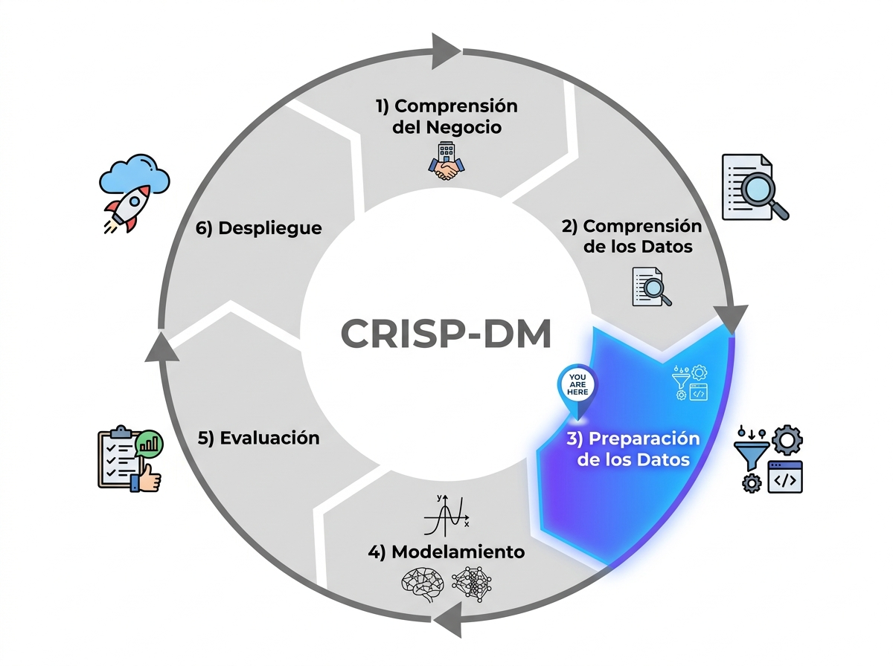{height="380px" fig-align="center"}
:::

::: {.column width="55%"}
- **Sesión 1:** Entendimiento y exploración (EDA).
- **Sesión 2:** Limpieza Niveles I, II y III.
- **Sesión 3:** Integración de fuentes.
- **Hoy:** Preparación de la *Vista Minable*.
:::

::::

## ¿Por qué no basta con limpiar?

:::: {.columns}

::: {.column width="55%"}
**Dataset limpio pero insuficiente:**

- **Formato:** Modelos algebraicos fallan con texto (`'Bogotá'`).
- **Escala:** Salarios de \$5M anulan la edad ($\Delta=5$) en distancias.
- **Expresividad:** Fechas crudas no aportan sin extraer variables.
:::

::: {.column width="45%"}
::: {.callout-tip}
### Lo que falta
- **Necesidad:** Formatos.
- **Corrección:** Escalas.
- **Data Massaging:** Valor predictivo.
:::
:::

::::

## Tres Razones para Transformar

::: {.callout-note}
### Razones Fundamentales @jafari2022hands
- **Necesidad:** Algoritmos que solo operan con ciertos tipos de datos.
- **Corrección:** Evitar que escalas dispares distorsionen métricas.
- **Efectividad:** Optimizar la capacidad predictiva (*Data Massaging*).
:::

## ¿Qué es la Vista Minable?

:::: {.columns}

::: {.column width="45%"}
- **Artefacto final** entre Preparación y Modelamiento.
- Tabla enriquecida tras limpieza y transformación.
- Homologa tipos de datos al algoritmo.
:::

::: {.column width="55%"}
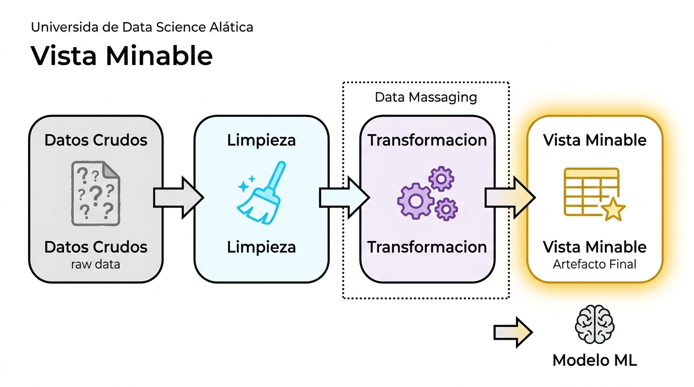{height="320px" fig-align="center"}
:::

::::

## Objetivos de la Preparación

:::: {.columns}

::: {.column width="50%"}
- **Datos útiles:** Maximizar información de valor.
- **Calidad:** Tratar inconsistencias y vacíos.
- **Representación:** Formato tabular óptimo.
:::

::: {.column width="50%"}
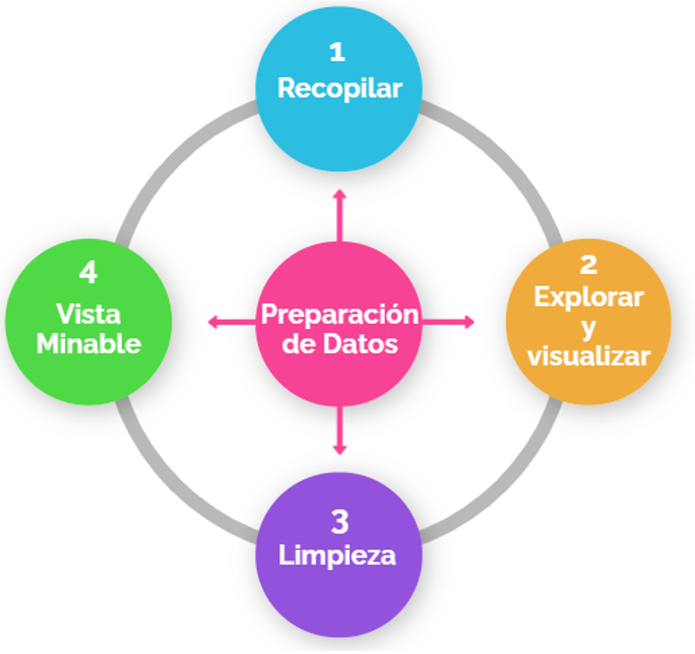{height="350px" fig-align="center"}

::: {.smaller-text style="text-align: center; font-size: 0.6em; color: gray;"}
Fuente: Adaptado de @jafari2022hands
:::
:::

::::

## Transformación vs. Data Massaging

- **Data Transformation:** Término general para cualquier cambio técnico.
- **Data Massaging:** Transformaciones orientadas a **efectividad**.
- Su meta es *"hacer más para obtener más"* del algoritmo.
- Abarca: ingeniería de características, transformaciones no lineales y reducción de ruido.

## Proceso de Creación de Vista

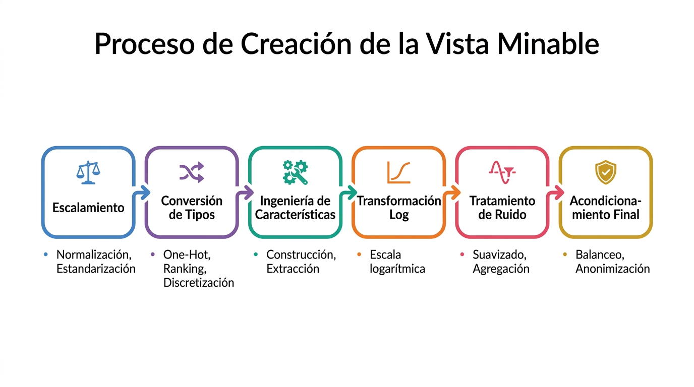{height="400px" fig-align="center"}

# Escalamiento de Atributos

## El Efecto de las Magnitudes

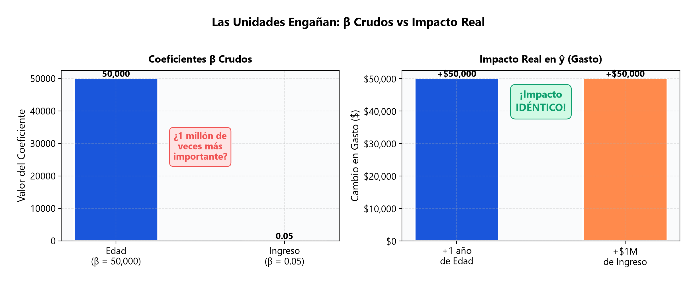{height="400px" fig-align="center"}

## Magnitudes: La Paradoja de $\beta$

Modelo para estimar **Gasto Mensual**:
$$\hat{y} = \beta_0 + 50.000 \cdot \text{Edad} + 0.05 \cdot \text{Ingreso}$$

::: {.callout-note title="Pregunta a la clase"}
¿Influye la **Edad** ($\beta=50.000$) un millón de veces más que el **Ingreso** ($\beta=0.05$)?
:::

::: {.fragment .fade-in}
**Respuesta**: ¡No! $+1$ año $\to +\$50\text{k}$ y $+\$1\text{M}$ $\to +\$50\text{k}$. Tienen **idéntico impacto real**.
:::

## ¿Por qué Escalar en Modelos?

:::: {.columns}

::: {.column width="50%"}
- **Interpretabilidad:** Comparar peso real de $\beta$.
- **Regularización:** Evita penalizar injustamente.
- **Gradiente:** Convierte elípticas en circulares.
- **Distancia:** KNN, K-Means sin sesgo.
:::

::: {.column width="50%"}
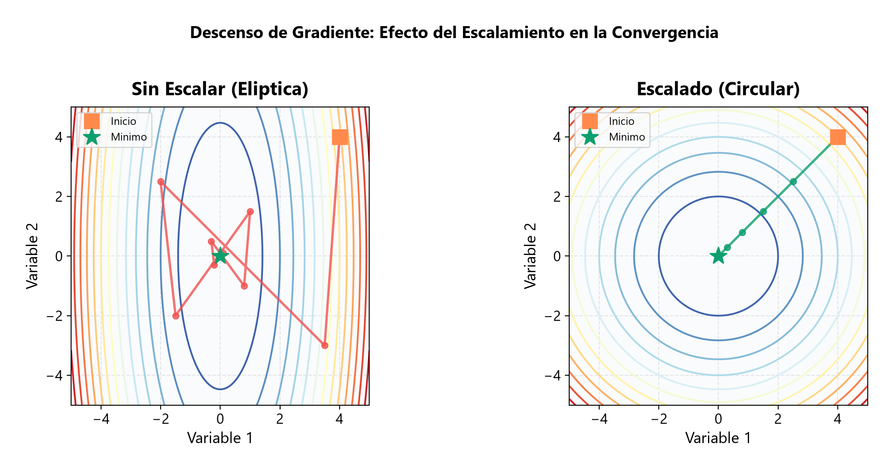{height="320px" fig-align="center"}
:::

::::

## Panorama de Normalización

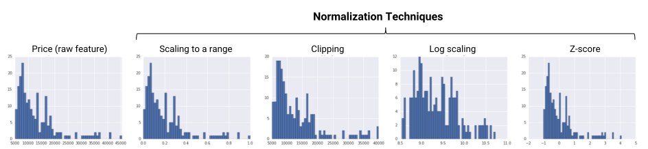{height="380px" fig-align="center"}

::: {.smaller-text style="text-align: center; font-size: 0.6em; color: gray;"}
Fuente: [Google Developers - Machine Learning Crash Course](https://developers.google.com/machine-learning/crash-course/numerical-data/feature-vectors)
:::

## Normalización Min-Max

:::: {.columns}

::: {.column width="45%"}
- Rango original a $[0, 1]$.
- Preserva proporciones exactas.

$$x' = \frac{x - x_{min}}{x_{max} - x_{min}}$$

- **Sensible** a valores atípicos.
:::

::: {.column width="55%"}
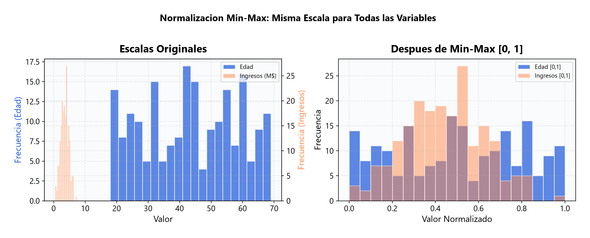{height="300px" fig-align="center"}
:::

::::

## El Caso del Atípico Extremo

:::: {.columns}

::: {.column width="48%"}
::: {.callout-note title="Pregunta a la clase"}
Salarios entre \$1M y \$5M. Ingresa un registro con \$50,000M. ¿Qué ocurre con Min-Max?
:::

::: {.fragment .fade-in}
**Respuesta**: Todos aplastados entre $0.00002$ y $0.0001$.
:::
:::

::: {.column width="52%"}
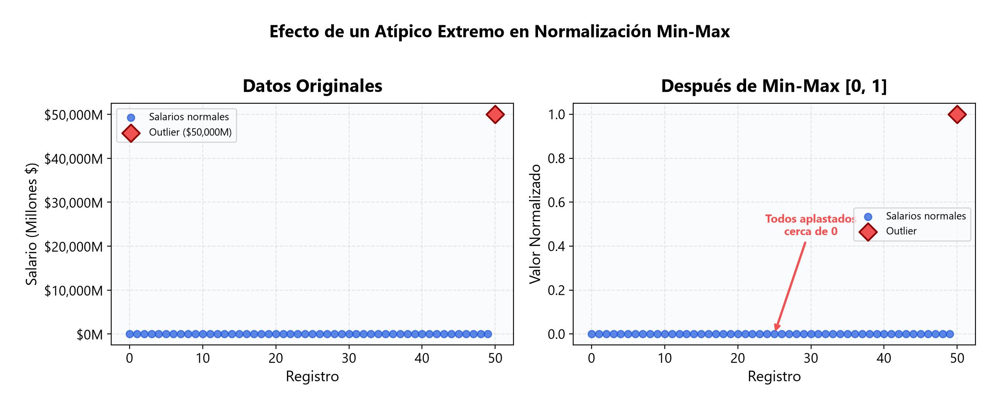{height="320px" fig-align="center"}
:::

::::

## Estandarización (Z-Score)

:::: {.columns}

::: {.column width="45%"}
- Centra $\mu = 0$, escala $\sigma = 1$.

$$z = \frac{x - \mu}{\sigma}$$

- Robusto ante outliers moderados.
- Ideal para PCA, SVM, regresión.
:::

::: {.column width="55%"}
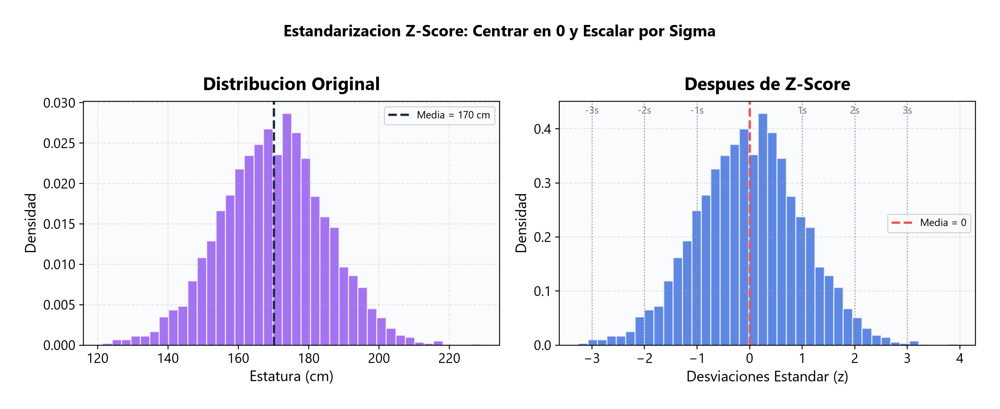{height="300px" fig-align="center"}
:::

::::

## Normalización vs. Estandarización

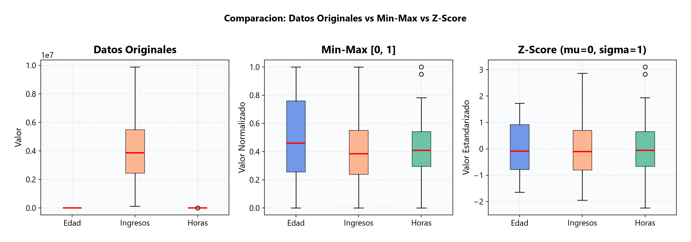{height="320px" fig-align="center"}

- Ambos buscan **corrección**, no efectividad (*massaging*).

## Similitudes Prácticas y Tuning

- **Efecto cruzado:** Normalizar acerca las desviaciones; estandarizar acerca los rangos.
- En la literatura suelen usarse como métodos intercambiables.
- **Recomendación:** Probar ambos como hiperparámetro en validación cruzada.

## Escalamiento en Scikit-Learn

```python
from sklearn.preprocessing import MinMaxScaler, StandardScaler, RobustScaler

# Normalización Min-Max [0, 1] y Z-Score (media 0, varianza 1)
X_norm = MinMaxScaler().fit_transform(df[['edad', 'ingresos']])
X_std  = StandardScaler().fit_transform(df[['edad', 'ingresos']])

# Escalado robusto con Mediana e IQR (resistente a outliers)
X_rob  = RobustScaler().fit_transform(df[['edad', 'ingresos']])
```

# Conversión Categórico-Numérico

## Tipos de Variables Categóricas

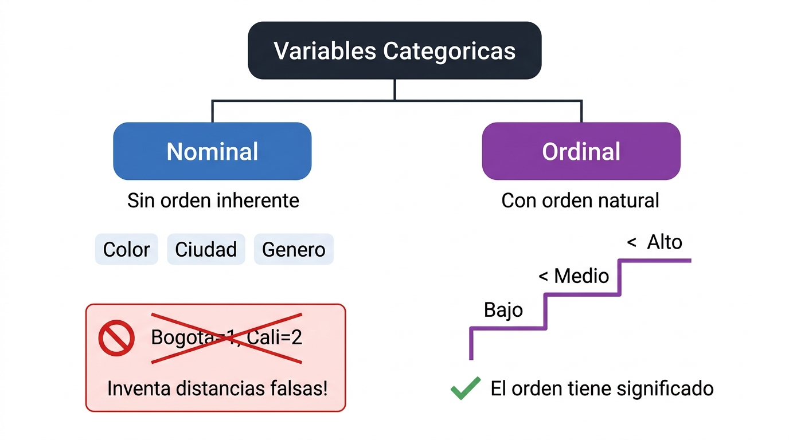{height="420px" fig-align="center"}

## Mapa de Conversión de Tipos

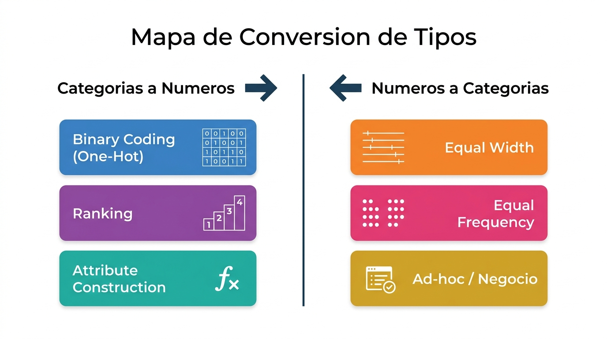{height="420px" fig-align="center"}

## Binary Coding (One-Hot)

:::: {.columns}

::: {.column width="48%"}
- Genera $K$ columnas ($0$ o $1$).
- `handle_unknown='ignore'` previene errores en producción.

```python
from sklearn.preprocessing import OneHotEncoder

ohe = OneHotEncoder(
    sparse_output=False,
    handle_unknown='ignore'
)
X_cat = ohe.fit_transform(df[['ciudad']])
```
:::

::: {.column width="52%"}
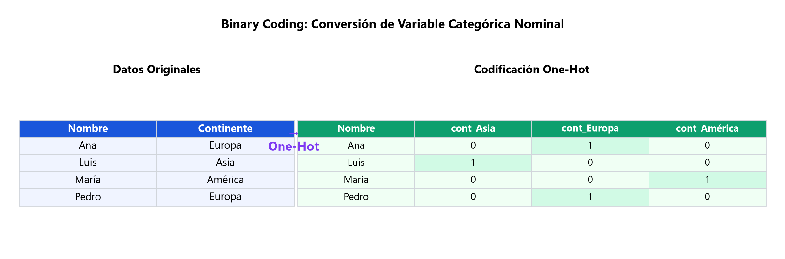{height="250px" fig-align="center"}
:::

::::

## El Desafío de la Cardinalidad

:::: {.columns}

::: {.column width="48%"}
::: {.callout-note title="Pregunta a la clase"}
Columna `Municipio` con 1,100 valores en Colombia. ¿Qué ocurre con One-Hot?
:::

::: {.fragment .fade-in}
**Problema:** Genera **1,100 columnas** dispersas ($99.9\%$ ceros), dispara la memoria y causa sobreajuste masivo.
:::
:::

::: {.column width="52%"}
::: {.callout-tip title="Estrategias de Mitigación"}
- **Target Encoding (Sklearn):** Codifica cada municipio en **1 sola columna continua**.
- **Rare Label Encoding:** Agrupa municipios poco frecuentes en `'Otros'`.
:::
:::

::::

## Target Encoding: Transformación

| ID | Municipio | Ingreso | Impago ($y$) | Municipio_Enc | Interpretación del Valor |
|:---:|:---|:---:|:---:|:---:|:---|
| 1 | Bogotá | \$4.5M | **0** | **0.50** | Tasa local Bogotá ($1/2 = 50\%$) |
| 2 | Medellín | \$3.8M | **0** | **0.25** | Tasa local Medellín |
| 3 | Quibdó | \$1.8M | **1** | **0.70** | Tasa local Quibdó |
| 4 | Bogotá | \$2.1M | **1** | **0.50** | Tasa local Bogotá ($1/2 = 50\%$) |
| 5 | Guatapé | \$2.5M | **0** | **0.38\*** | \*$n=1 \to$ Suavizado a media global ($0.40$) |

::: {.smaller-text style="text-align: center; color: gray;"}
Tasa global de impago ($\bar{y}$): $2/5 = 0.40$ (40%). Reemplaza 1,100 columnas dispersas por **1 sola columna continua**.
:::

## TargetEncoder en Scikit-Learn

```python
from sklearn.preprocessing import TargetEncoder
import pandas as pd

# 1,100 municipios condensados en 1 sola columna continua
df = pd.DataFrame({
    'municipio': ['Bogotá', 'Medellín', 'Quibdó', 'Bogotá', 'Guatapé'],
    'ingreso': [4.5, 3.8, 1.8, 2.1, 2.5],
    'impago': [0, 0, 1, 1, 0]
})

te = TargetEncoder(smooth="auto", cv=5, random_state=42)
df['municipio_te'] = te.fit_transform(df[['municipio']], df['impago'])
```

- **`cv=5`:** Previene fuga de datos (*leakage*) en el entrenamiento.
- **`smooth="auto"`:** Aplica contracción bayesiana a categorías raras.

## Ponderación en Modelos de Distancia

- Una variable nominal con $K$ categorías añade $K$ dimensiones.
- Si no se ajusta, sobrepondera la distancia en clustering.
- **Ajuste:** Dividir las columnas codificadas por $K$:

$$X_{bin} = \frac{\text{OneHot}(X)}{K}$$

## El Trilema Ordinal

Evaluamos satisfacción: `['Malo', 'Regular', 'Bueno', 'Excelente']`. Asignamos números $1, 2, 3, 4$.

::: {.callout-note title="Pregunta a la clase"}
¿Es la distancia entre 'Malo' y 'Regular' exactamente igual a la de 'Bueno' y 'Excelente'?
:::

::: {.fragment .fade-in}
**Respuesta**: No necesariamente. El ranking asume distancias unitarias fijas que pueden no existir.
:::

## Estrategias en Atributos Ordinales

- **Binary Coding:** Sin supuestos, pero pierde el orden.
- **OrdinalEncoder (Sklearn):** Fija orden explícito:
  ```python
  from sklearn.preprocessing import OrdinalEncoder
  oe = OrdinalEncoder(categories=[['Bajo', 'Medio', 'Alto']])
  ```
- **TargetEncoder / Dominio:** Asigna magnitudes continuas reales.

## Codificación con Dominio

- Usa conocimiento experto para sustituir rangos arbitrarios.
- **Ejemplo 1:** *Nivel Educativo* $\to$ *Años promedio de estudio*.
- **Ejemplo 2:** *Color nominal* $\to$ *Coordenadas numéricas RGB*.
- Transforma categorías en magnitudes continuas reales (*Data Massaging*).

## De Numérico a Categórico

:::: {.columns}

::: {.column width="45%"}
- Convierte continuas en bins.
- Facilita interpretación ($>40$h).
- Permite tablas cruzadas y reglas.
:::

::: {.column width="55%"}
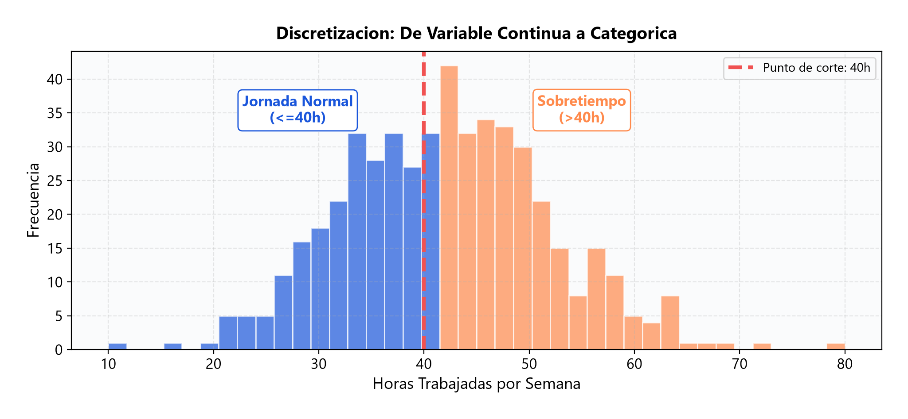{height="320px" fig-align="center"}
:::

::::

## Desafío en Discretización

:::: {.columns}

::: {.column width="48%"}
::: {.callout-note title="Pregunta a la clase"}
¿Qué ocurre si divides el salario en 4 intervalos de igual ancho (*Equal Width*)?
:::

::: {.fragment .fade-in}
**Respuesta**: El primer bin acumula casi el 95% de los datos y los demás quedan vacíos.
:::
:::

::: {.column width="52%"}
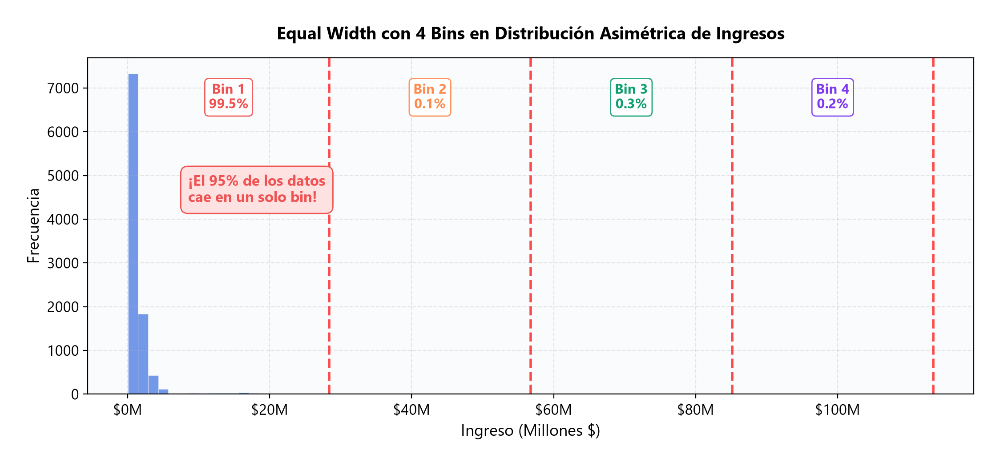{height="300px" fig-align="center"}
:::

::::

## Tipos de Discretización

:::: {.columns}

::: {.column width="52%"}
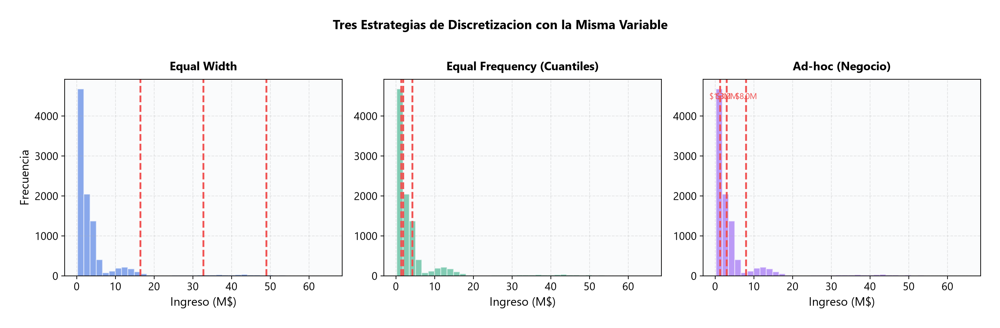{height="280px" fig-align="center"}
:::

::: {.column width="48%"}
- **Uniform:** Equal Width.
- **Quantile:** Equal Frequency.
- Ajusta cortes en train, aplica en test.

```python
from sklearn.preprocessing import KBinsDiscretizer

kbd = KBinsDiscretizer(
    n_bins=4,
    encode='ordinal',
    strategy='quantile'
)
X_bin = kbd.fit_transform(df[['edad']])
```
:::

::::

## Puntos de Corte en Discretización

- $k$ puntos de corte generan $k+1$ categorías resultantes.
- Pocos cortes simplifican en exceso; demasiados fragmentan.
- **Guías prácticas:**
  - Examinar el histograma previo de la variable.
  - Aplicar estándares de la industria o del negocio.
  - Mantener interpretabilidad directa.

# Ingeniería de Características

## Construcción vs. Extracción

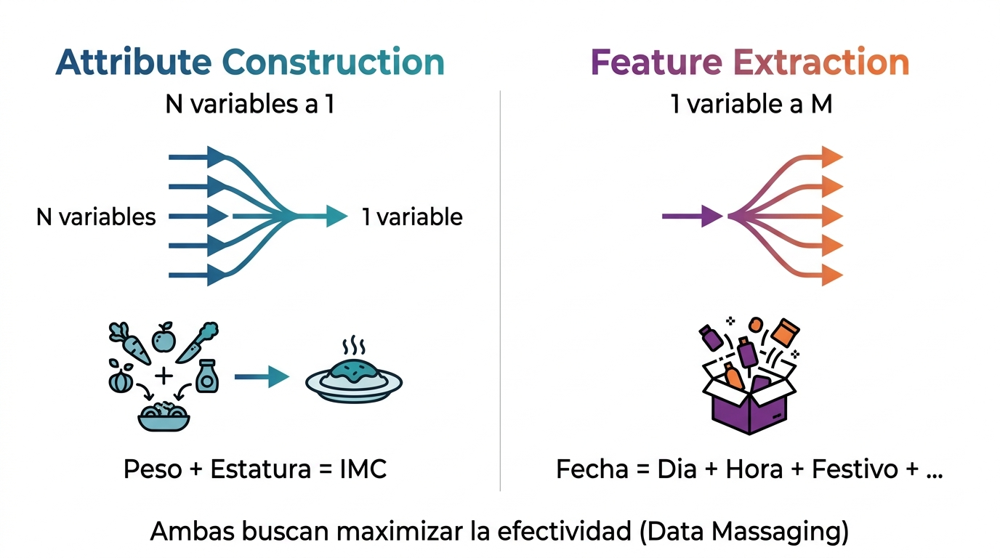{height="380px" fig-align="center"}

::: {.smaller-text style="text-align: center; color: gray;"}
Ambas técnicas buscan maximizar la **efectividad** (*Data Massaging*).
:::

## Variables de Negocio

:::: {.columns}

::: {.column width="48%"}
::: {.callout-note title="Pregunta a la clase"}
Para predecir impago: ¿qué variable sintética combina `Ingreso` y `Cuota`?
:::

::: {.fragment .fade-in}
**Respuesta**: **Debt-to-Income** = `Cuota / Ingreso`.
:::
:::

::: {.column width="52%"}
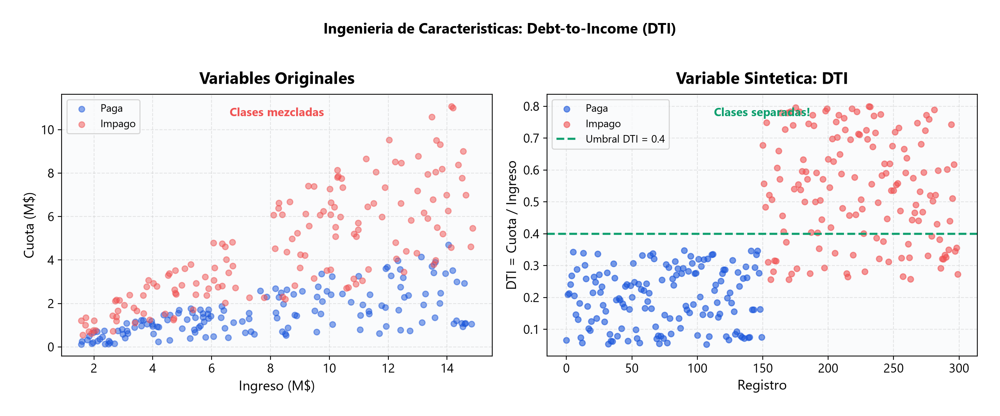{height="320px" fig-align="center"}
:::

::::

## Attribute Construction: Casos

- Transforma datos crudos en indicadores de alto valor explicativo.
- **Índice de Masa Corporal (IMC):**

$$IMC = \frac{\text{Peso (kg)}}{(\text{Estatura (m)})^2}$$

- **Ratios Financieros:** Margen de ganancia, liquidez corriente.
- **Métricas:** Goles por partido, clics por impresión.

## Transformación Polinómica

:::: {.columns}

::: {.column width="45%"}
- **Problema:** Datos no separables linealmente (ej. clases concéntricas / dona).
- **Idea:** Proyectar a un espacio de mayor dimensión: $(x_1, x_2) \to (x_1^2, x_2^2)$.
- **Ventaja:** Modelos lineales simples resuelven patrones no lineales.
:::

::: {.column width="55%"}
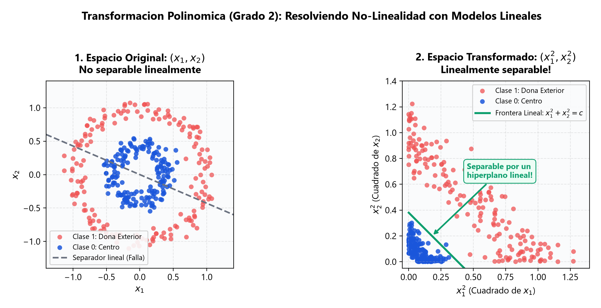{height="320px" fig-align="center"}
:::

::::

## Generación de Features (Sklearn)

:::: {.columns}

::: {.column width="48%"}
- **`PolynomialFeatures`:** Crea potencias e interacciones ($x_1^2, x_1 x_2, x_2^2$).
- **`SplineTransformer`:** Modela no linealidades suaves por tramos.
- **Riesgo:** Explosión dimensional $\binom{n+d}{d}$.
:::

::: {.column width="52%"}
```python
from sklearn.preprocessing import PolynomialFeatures

# Grado 2: [x1, x2] -> [x1, x2, x1^2, x1*x2, x2^2]
poly = PolynomialFeatures(
    degree=2, include_bias=False
)
X_poly = poly.fit_transform(df[['x1', 'x2']])
```
:::

::::

## Señales en Marcas de Tiempo

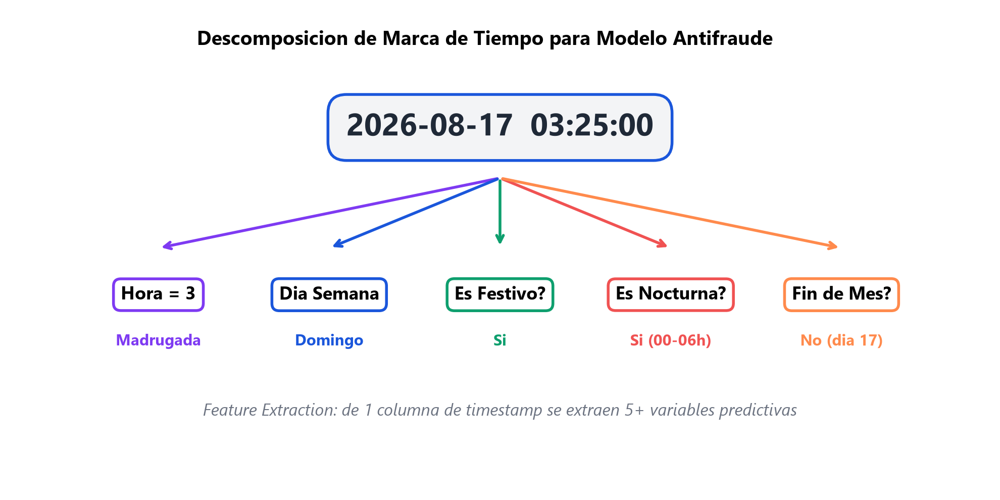{height="380px" fig-align="center"}

## Extracción Temporal en Código

:::: {.columns}

::: {.column width="48%"}
- **`DatetimeFeatures`:** Extrae componentes temporales en Pipelines.
- **Codificación Cíclica:** $\sin / \cos$ conecta las 23:59 con las 00:00.
- **`holidays`:** Festivos locales (Colombia).
:::

::: {.column width="52%"}
```python
from feature_engine.datetime import DatetimeFeatures
import holidays

# 1. Componentes en Pipeline
dt_f = DatetimeFeatures(
    variables=['fecha'],
    features_to_extract=['hour', 'day_of_week', 'is_weekend']
)

# 2. Festivos en Colombia
co_cal = holidays.Colombia()
df['festivo'] = df['fecha'].isin(co_cal).astype(int)
```
:::

::::

## Feature Extraction: Casos

- **Emails / URLs:** Dominio corporativo, extensión país (`.co`, `.edu`).
- **Fechas / Horas:** Día de la semana, hora, si es festivo.
- **Texto:** Frecuencia de palabras clave o embeddings.
- **Series Temporales:** Picos, valles y oscilaciones.

## Extracción Morfológica

:::: {.columns}

::: {.column width="45%"}
- Analiza forma de la señal.
- Métricas: picos, valles, amplitud.
- Clave en series temporales y ECG/EEG.
:::

::: {.column width="55%"}
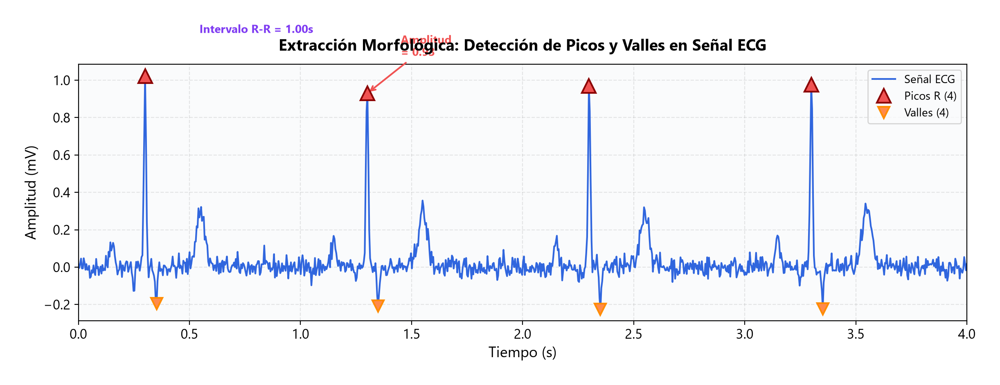{height="320px" fig-align="center"}
:::

::::

## Reducción como Extracción

:::: {.columns}

::: {.column width="45%"}
- **Texto:** Contar términos clave es extracción.
- **PCA:** Extrae componentes no correlacionados.
- Fusión de reducción y transformación.
:::

::: {.column width="55%"}
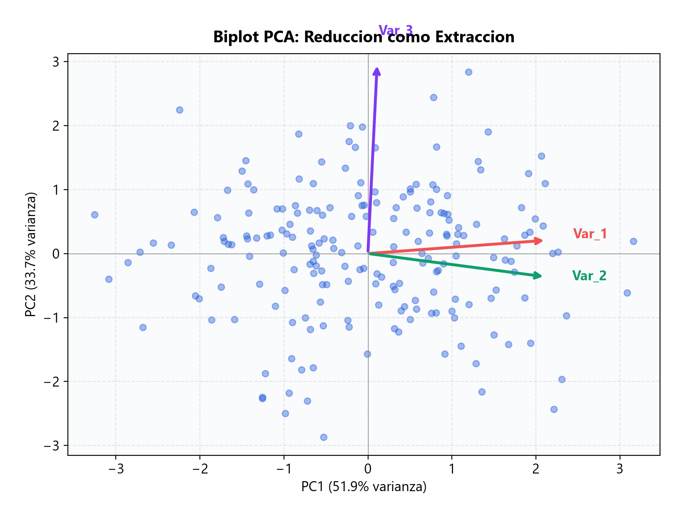{height="320px" fig-align="center"}
:::

::::

# Transformación Log y Ruido

## Distribuciones con Cola Larga

:::: {.columns}

::: {.column width="48%"}
::: {.callout-note title="Pregunta a la clase"}
¿Por qué aplicar $\log(\text{precio})$ beneficia a un modelo lineal?
:::

::: {.fragment .fade-in}
**Respuesta**: Convierte efectos multiplicativos en aditivos y estabiliza la varianza.
:::
:::

::: {.column width="52%"}
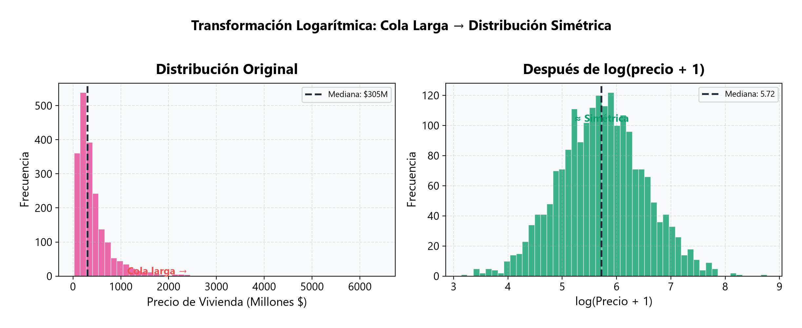{height="320px" fig-align="center"}
:::

::::

## Transformación Logarítmica

:::: {.columns}

::: {.column width="48%"}
- Comprime extremos en colas pesadas.
- Linealiza relaciones no lineales.

```python
from sklearn.preprocessing import FunctionTransformer
import numpy as np

log_tf = FunctionTransformer(
    np.log1p, validate=True
)
X_log = log_tf.fit_transform(df[['precio']])
```
:::

::: {.column width="52%"}
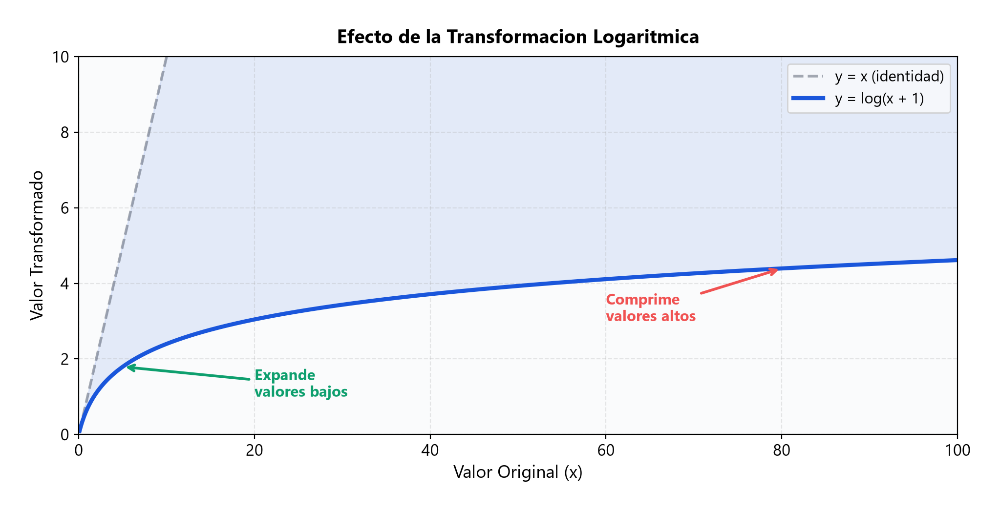{height="290px" fig-align="center"}
:::

::::

## Detección de Ruido en Sensores

:::: {.columns}

::: {.column width="48%"}
::: {.callout-note title="Pregunta a la clase"}
¿Es una alerta real o simple ruido eléctrico?
:::

::: {.fragment .fade-in}
**Respuesta**: Comparar con la ventana temporal vecina (**suavizado** o **agregación**).
:::
:::

::: {.column width="52%"}
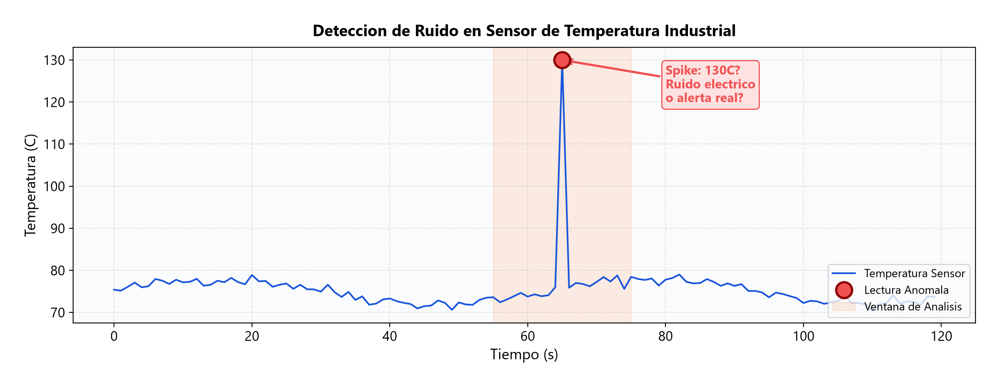{height="320px" fig-align="center"}
:::

::::

## Técnicas de Tratamiento de Ruido

- **Smoothing (Suavizado):** Por ventana móvil o funcional.
- **Aggregation (Agregación):** Cambio de escala temporal.
- **Binning:** Agrupamiento de valores continuos.
- El orden temporal permite separar la señal de fluctuaciones aleatorias.

## Suavizado Funcional vs. Ventana

:::: {.columns}

::: {.column width="55%"}
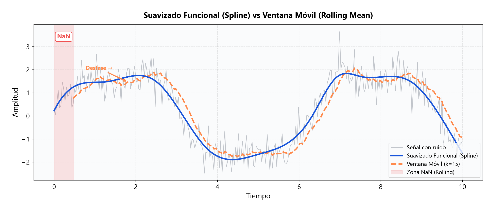{height="300px" fig-align="center"}
:::

::: {.column width="45%"}
- **Funcional (Spline):** Sin desfase, modela la curva global.
- **Ventana Móvil:** Promedios locales con desfase y `NaN`.
:::

::::

## Suavizado por Ventana Móvil

```python
# Media móvil con ventana de tamaño 5
df['suavizado'] = df['senal'].rolling(window=5).mean()

# Suavizado exponencial ponderado
df['suavizado_exp'] = df['senal'].ewm(alpha=0.2).mean()
```

- Las primeras $k-1$ observaciones resultan en `NaN`.
- Se equilibra reducción de ruido contra pérdida de reactividad.

## Agregación Temporal

:::: {.columns}

::: {.column width="55%"}
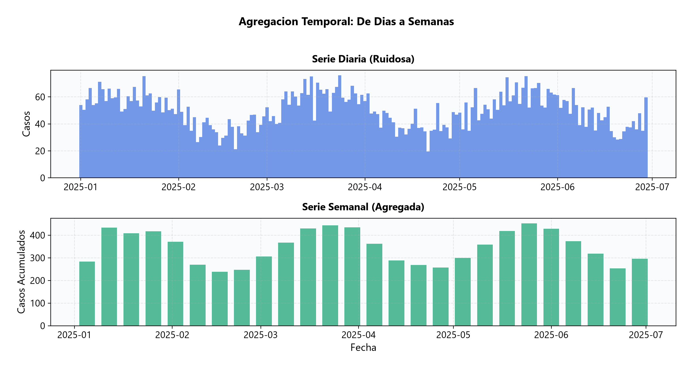{height="300px" fig-align="center"}
:::

::: {.column width="45%"}
- Cambia resolución temporal (días $\to$ semanas).
- Filtra ruido de alta frecuencia.

```python
df_sem = df.resample(
    'W', on='fecha'
).agg({'casos': 'sum'})
```
:::

::::

# Balanceo y Privacidad

## La Paradoja del Fraude

:::: {.columns}

::: {.column width="48%"}
::: {.callout-note title="Pregunta a la clase"}
Si un modelo predice SIEMPRE 'No Fraude', ¿cuál es su Accuracy?
:::

::: {.fragment .fade-in}
**Respuesta**: ¡99.95%! Pero completamente inútil para el negocio.
:::
:::

::: {.column width="52%"}
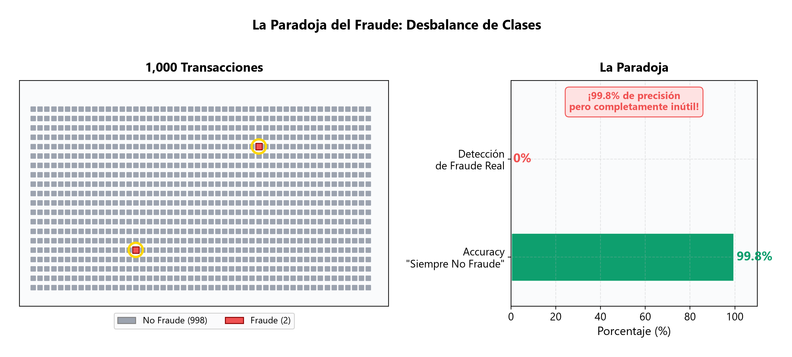{height="320px" fig-align="center"}
:::

::::

## Balanceo de Clases (Sampling)

:::: {.columns}

::: {.column width="48%"}
- **Undersampling:** Reducir mayoritaria.
- **Oversampling (SMOTE):** Sintetizar minoritaria.

```python
from imblearn.over_sampling import SMOTE

sm = SMOTE(random_state=42)
X_res, y_res = sm.fit_resample(X, y)
```
:::

::: {.column width="52%"}
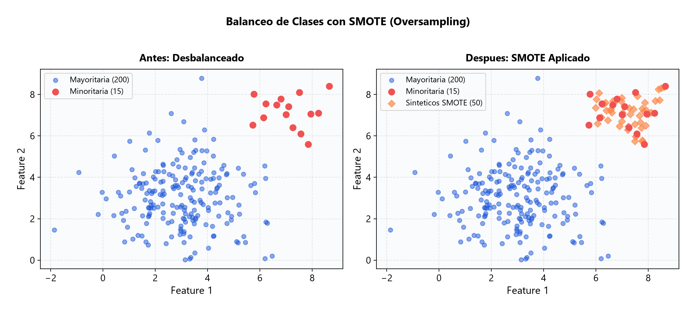{height="290px" fig-align="center"}
:::

::::

## El Reto de la Privacidad

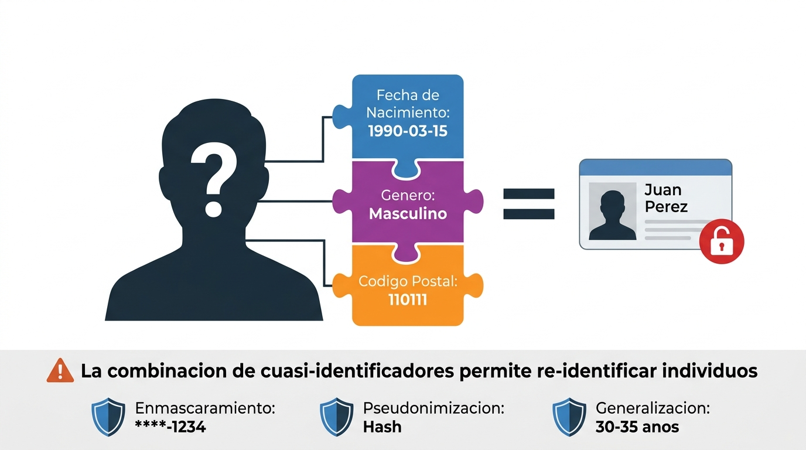{height="380px" fig-align="center"}

## Anonimización y Privacidad

::: {.callout-important}
### Cumplimiento Ético y Legal
- **Enmascaramiento:** Ocultar dígitos (ej. `****-****-1234`).
- **Pseudonimización:** Sustituir identificadores por hashes.
- **Generalización:** Convertir fechas exactas a rangos de edad.
:::

# Integración y Pipelines

## Preprocesamiento con Pipelines

:::: {.columns}

::: {.column width="48%"}
- **Evita *Data Leakage*:** `fit` solo en datos de entrenamiento.
- **`ColumnTransformer`:** Preprocesamiento por tipo de columna.
- **Salida DataFrame:** `.set_output(transform="pandas")`.
:::

::: {.column width="52%"}
```python
from sklearn.pipeline import Pipeline
from sklearn.compose import ColumnTransformer
from sklearn.preprocessing import StandardScaler, OneHotEncoder

pre = ColumnTransformer([
    ('num', StandardScaler(), ['edad']),
    ('cat', OneHotEncoder(), ['ciudad'])
]).set_output(transform="pandas")

pipe = Pipeline([
    ('prep', pre),
    ('model', LogisticRegression())
])
pipe.fit(X_train, y_train)
```
:::

::::

## Más Allá de Scikit-Learn

:::: {.columns}

::: {.column width="50%"}
**Librerías especializadas:**

- **Feature-engine:** Retorna DataFrames, codifica categorías raras y aplica *Winsorization* (outliers).
- **Category Encoders:** Target encoding, Weight of Evidence (WoE) y CatBoost.
- **Imbalanced-learn:** Pipelines con balanceo (`imblearn.pipeline.Pipeline`).
:::

::: {.column width="50%"}
```python
from feature_engine.encoding import RareLabelEncoder
from feature_engine.outliers import Winsorizer

# Agrupa categorías con < 5% frec.
rare_enc = RareLabelEncoder(
    tol=0.05, n_categories=3
)

# Trunca atípicos automáticamente
winsor = Winsorizer(
    capping_method='iqr', tail='both'
)
```
:::

::::

## Checklist: Vista Minable
 
- [ ] ¿Variables en formato adecuado (numéricas o categóricas)?
- [ ] ¿Escalas corregidas (Normalización o Z-Score)?
- [ ] ¿Variables con colas pesadas transformadas ($\log$)?
- [ ] ¿Ruido y desbalance de clases mitigados?
- [ ] ¿Datos sensibles y cuasi-identificadores protegidos?

## Tarea / Asignación

1. Leer el Capítulo 14 del libro *Hands-On Data Preprocessing in Python* @jafari2022hands.
2. Consultar la [Guía Oficial de Preprocesamiento de Scikit-Learn](https://scikit-learn.org/stable/modules/preprocessing.html).
3. Explorar el [Cuaderno de Google NotebookLM](https://notebook.google.com/notebook/e2719493-ad99-4abe-8f05-030eca72a7f9):
   - Revisar la infografía de apoyo.
   - Completar los quices interactivos y podcast resumen.

## Agradecimientos

- Material conceptual y visual adaptado de:
  - [Google ML Crash Course: Numerical Data](https://developers.google.com/machine-learning/crash-course/numerical-data/feature-vectors)
  - Recursos educativos de *Google Developers*.
- Agradecimientos especiales a la comunidad docente.

## Referencias

::: {#refs}
:::
